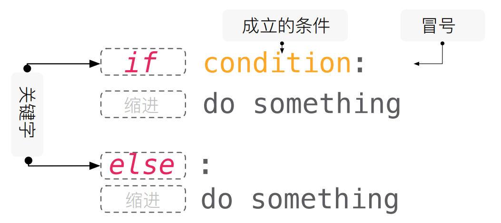
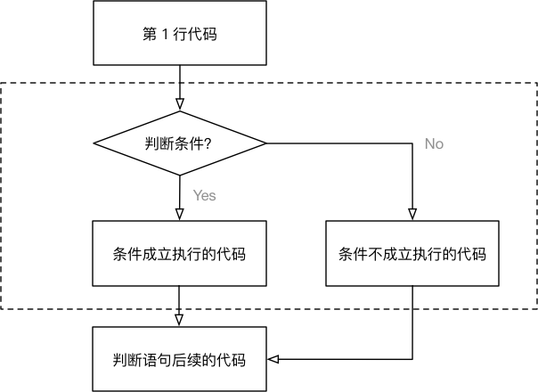
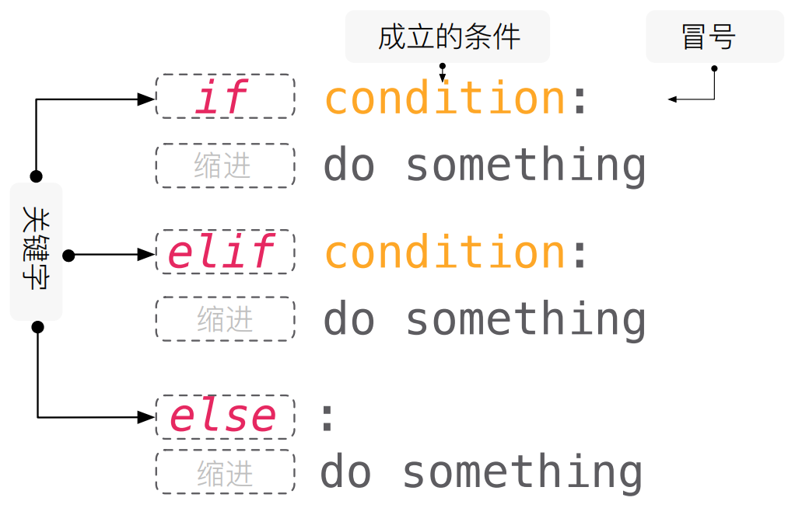
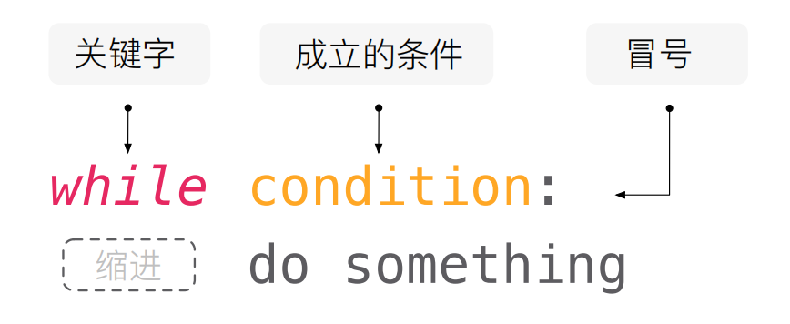

## 2、 流程控制

**控制流程**（也称为**流程控制**）是[计算机运算](https://zh.wikipedia.org/wiki/%E9%9B%BB%E8%85%A6%E9%81%8B%E7%AE%97)领域的用语，意指在[程序](https://zh.wikipedia.org/wiki/%E7%A8%8B%E5%BC%8F)运行时，个别的指令（或是[陈述](https://zh.wikipedia.org/wiki/%E9%99%B3%E8%BF%B0_(%E7%A8%8B%E5%BC%8F))、[子程序](https://zh.wikipedia.org/wiki/%E5%AD%90%E7%A8%8B%E5%BA%8F)）运行或[求值](https://zh.wikipedia.org/w/index.php?title=%E6%B1%82%E5%80%BC&action=edit&redlink=1)的顺序。

- 在程序开发中，一共有三种流程方式：

  - **顺序** —— **从上向下**，顺序执行代码
  - **分支** —— 根据条件判断，决定执行代码的 **分支**
  - **循环** —— 让 **特定代码 重复** 执行

  

> 不管是多么复杂的程序，都是由这些很多简单的流程控制构建起来的。


### 2.1 if 判断语句

if 语句是最简单的选择结构。如果满足条件就执行设定好的操作，不满足条件就执行其他其他操作。

**判断的定义**

- 如果 **条件满足**，才能做某件事情，
- 如果 **条件不满足**，就做另外一件事情，或者什么也不做

> 判断语句又被称为 “分支语句”

#### if 判断




**语法**

1：冒号和缩进是一种语法，一个tab键相当于四个空格，然而在if条件语句满足条件下，后面的英文冒号后，直接enter键，会自动缩进，不需要手动缩进，感觉很nice

2：赋值满足条件，则print执行下一步

3：赋值不满足条件，则跳过，如果只有一条，则输出内容无；如果有2条，则跳过第一条，执行第二条，即else

if...else... 语句，当 if 的条件为 True 时执行 if 下的语句块，否则执行 else 下语句块。

```python
if 要判断的条件:
    条件成立时，要做的事情
    ……
else:
    条件不成立时，要做的事情
    ……
```

**注意**：

- `if` 和 `else` 语句以及各自的缩进部分共同是一个 **完整的代码块**

```python
"""
经过一个红绿灯，如果是红灯就立马停车，如果是绿灯就继续前行
"""

light = "红灯"

## if 语句以及缩进部分的代码也是一个完整的代码块0
if light == "红灯":
    print("立马停车")

## else 语句以及缩进部分的代码是一个完整的代码块
else:
    print("继续前行")

```




#### if 多条件判断



- 在开发中，使用 `if` 可以 **判断条件**
- 使用 `else` 可以处理 **条件不成立** 的情况
- 但是，如果希望 **再增加一些条件**，**条件不同，需要执行的代码也不同** 时，就可以使用 `elif` 
- 语法格式如下：

```python
if 条件1:
    条件1满足执行的代码
    ……
elif 条件2:
    条件2满足时，执行的代码
    ……
elif 条件3:
    条件3满足时，执行的代码
    ……
else:
    以上条件都不满足时，执行的代码
    ……
```

```python
light = "红灯"

if light == "红灯":
    print("立马停车")

elif light == "黄灯":
    print("立马停车")

else:
    print("继续前行")

```

**注意**

1. `elif` 和 `else` 都必须和 `if` 联合使用，而不能单独使用
2. 可以将 `if`、`elif` 和 `else` 以及各自缩进的代码，看成一个 **完整的代码块**

> **elif** 的应用场景是：**同时** 判断 **多个条件**，所有的条件是 **平级** 的

#### if 的嵌套

在开发中，使用 `if` 进行条件判断，如果希望 **在条件成立的执行语句中** 再 **增加条件判断**，就可以使用 **if 的嵌套** 

**if 的嵌套** 的应用场景就是：**在之前条件满足的前提下，再增加额外的判断** 

**if 的嵌套** 的语法格式，**除了缩进之外** 和之前的没有区别

语法格式如下：

```python
if 条件 1:
    条件 1 满足执行的代码
    ……
    
    if 条件 1 基础上的条件 2:
        条件 2 满足时，执行的代码
        ……    
        
    # 条件 2 不满足的处理
    else:
        条件 2 不满足时，执行的代码
        
## 条件 1 不满足的处理
else:
    条件1 不满足时，执行的代码
    ……
```


```python
"""
微博信息采集与推送流程

注册账号后先采集姓名，然后再采集用户的兴趣，最后给用户推送可能感兴趣的内容
"""
sex = int(input("请输入你的性别："))

if sex == "男":
    print("给你推荐男生可能喜欢的话题")
    hobby = int(input("请输入你的兴趣："))
    # 推荐男频小说的类别
    if hobby == '小说':
        print('给你推荐小说相关的话题')
    elif hobby == '科技':
        print('给你推荐科技相关的话题')
    else:
        print('给你推荐大部分男生喜欢的内容')
elif sex == "女":
    print("给你推荐女生可能喜欢的话题")

elif sex == "保密":
    print('随便推送内容')

else:
    print("其他情况")

```


#### 总结

**if 的三种形式**

1、if

```python
if 条件1:
    条件1满足执行的代码
```

> 不满足条件时没有任何提示

2、if ... else

```python
if 条件1:
    条件1满足执行的代码
else:
    以上条件都不满足时，执行的代码
    ……
```

2、if ... elif ... elif ... else

> 多条件选择使用

```python
if 条件1:
    条件1满足执行的代码
    ……
elif 条件2:
    条件2满足时，执行的代码
    ……
elif 条件3:
    条件3满足时，执行的代码
    ……
else:
    以上条件都不满足时，执行的代码
    ……
```

4、if嵌套

```python
if 条件1:
    if 条件 1 基础上的条件 2:
        条件 2 满足时，执行的代码
        ……    
    # 条件 2 不满足的处理
    else:
        条件 2 不满足时，执行的代码
else:
    以上条件都不满足时，执行的代码
    ……
```


**练习：比较两个数字大小，并按顺序输出**

使用 `input` 输入两个数，根据其大小先后输出

1. 输入两个数
2. 判断大小
3. 输出大的数字

```python
a = input("请输入a：")
b = input("请输入b：")
max_number = 0

if a > b:
    max_number = a
else:
    max_number = b

print(max_number)
```


### 2.2 while 循环

> while是计算机的一种基本循环模式。当满足条件时进入循环，进入循环后，当条件不满足时，跳出循环。while语句的一般表达式为：while（表达式）{循环体}。

循环的作用就是让 **指定的代码** 重复的执行

`while` 循环最常用的应用场景就是 **让执行的代码** 按照 **指定的次数** **重复** 执行

#### 基本语法



##### 案例：重复执行五次

需求 —— 打印 5 遍 `我喜欢 Python`

思考 —— 如果要求打印 100 遍怎么办？

> 注意：`while` 语句以及缩进部分是一个 **完整的代码块**

```
## while 循环
i = 0  # 限制条件
while i < 5:  # 循环申明 判断条件
    print('我喜欢 Python !')  # 程序执行的内容
    i += 1  # 限制条件
```


##### 死循环

由于程序员的原因，**忘记** 在循环内部 **修改循环的判断条件**，导致循环持续执行，程序无法终止！


#### 循环计算

##### 打印小星星

在控制台连续输出五行 `*`，每一行星号的数量依次递增

```
*
**
***
****
*****
```

使用字符串 * 打印

```python
# 1. 定义一个计数器变量，从数字1开始，循环会比较方便
row = 1

while row <= 5:
    
    print("*" * row)
    
    row += 1
```


##### 循环打印小星星

**假设** `Python` **没有提供** 字符串的 `*` 操作 **拼接字符串** 

在控制台连续输出五行 `*`，每一行星号的数量依次递增

```
*
**
***
****
*****
```


**开发步骤**

1. 完成 5 行内容的简单输出
2. 分析每行内部的 `*` 应该如何处理？

每行显示的星星和当前所在的行数是一致的

嵌套一个小的循环，专门处理每一行中 `列` 的星星显示  

```python
row = 1

while row <= 5:

    # 假设 python 没有提供字符串 * 操作
    # 在循环内部，再增加一个循环，实现每一行的 星星 打印
    col = 1

    while col <= row:
        print("*", end="")

        col += 1

    # 每一行星号输出完成后，再增加一个换行
    print("")

    row += 1

```

##### 九九乘法表

**需求** 输出 九九乘法表，格式如下：

```
1 * 1 = 1	
1 * 2 = 2	2 * 2 = 4	
1 * 3 = 3	2 * 3 = 6	3 * 3 = 9	
1 * 4 = 4	2 * 4 = 8	3 * 4 = 12	4 * 4 = 16	
1 * 5 = 5	2 * 5 = 10	3 * 5 = 15	4 * 5 = 20	5 * 5 = 25	
1 * 6 = 6	2 * 6 = 12	3 * 6 = 18	4 * 6 = 24	5 * 6 = 30	6 * 6 = 36	
1 * 7 = 7	2 * 7 = 14	3 * 7 = 21	4 * 7 = 28	5 * 7 = 35	6 * 7 = 42	7 * 7 = 49	
1 * 8 = 8	2 * 8 = 16	3 * 8 = 24	4 * 8 = 32	5 * 8 = 40	6 * 8 = 48	7 * 8 = 56	8 * 8 = 64	
1 * 9 = 9	2 * 9 = 18	3 * 9 = 27	4 * 9 = 36	5 * 9 = 45	6 * 9 = 54	7 * 9 = 63	8 * 9 = 72	9 * 9 = 81

```

**开发步骤**

1. 打印 9 行小星星

```
*
**
***
****
*****
******
*******
********
*********
```

2. 将每一个 `*` 替换成对应的行与列相乘

```python
# 定义起始行
row = 1

# 最大打印 9 行
while row <= 9:
    # 定义起始列
    col = 1

    # 最大打印 row 列
    while col <= row:

        # end = ""，表示输出结束后，不换行
        # "\t" 可以在控制台输出一个制表符，协助在输出文本时对齐
        print("%d * %d = %d" % (col, row, row * col), end="\t")

        # 列数 + 1
        col += 1

    # 一行打印完成的换行
    print("")

    # 行数 + 1
    row += 1

```


### 2.3 for 遍历

#### for 语句

在计算机科学里，遍历的一种，指的是按照某种规则，不重复地访问某个对象的所有内容的过程。


**语法**

```python
for item in 'hello world !':
	print(item)
```

**for i in range(10)**

```python
In [15]: for i in range(10):
    ...:     print(i)
    ...:
0
1
2
...
```

#### range

range() 函数可创建一个整数列表，一般用在 for 循环中。

函数语法:

```
range(start, stop[, step])
```

参数说明：

- start: 计数从 start 开始。默认是从 0 开始。例如range（5）等价于range（0， 5）;
- stop: 计数到 stop 结束，但不包括 stop。例如：range（0， 5） 是[0, 1, 2, 3, 4]没有5
- step：步长，默认为1。例如：range（0， 5） 等价于 range(0, 5, 1)

```python
In [18]: list(range(10))
Out[18]: [0, 1, 2, 3, 4, 5, 6, 7, 8, 9]

In [21]: tuple(range(10))
Out[21]: (0, 1, 2, 3, 4, 5, 6, 7, 8, 9)
```


#### for遍历可迭代对象

for可以迭代所有可迭代对象（字符串、列表、元组、集合、字典）

```python
for num in list(range(1000)):
	print(num)
```


案例：用 for 迭代获取所有水仙花数

```python
for num in range(1000):
	
	print(num)
```

案例：用for循环实现九九乘法表

```python
for row in range(1, 10):
    
    for col in range(1, row + 1):
        
        print("%d * %d = %d" % (col, row, row * col), end="\t")
        
    print()
```


### 2.4 break 和 continue

> `break` 和 `continue` 是专门在循环中使用的关键字


`break` **某一条件满足时**，退出循环，不再执行后续重复的代码

`continue` **某一条件满足时**，不执行后续重复的代码

`break` 和 `continue` 只针对 **当前所在循环** 有效


#### break

从内部中断循环，**在循环过程中**，如果 **某一个条件满足后**，不再希望 **循环继续执行**，可以使用 `break` 退出循环


**案例：登录账号**

循环一直输入账号密码，输入成功之后跳出循环

```python
while True:

    password = input("请输入密码")
    if password == '123456':
        # 当满足条件时 中断循环
        print('密码输入正确，跳出循环')
        break

    # 重复执行的代码
    print("输入的密码错误，请重新输入")
```


#### continue

中断本次循环的后面部分

在循环过程中，如果某一个条件满足后，不希望执行循环代码，但是又不希望退出循环，可以使用 `continue` 

也就是：在整个循环中，只有某些条件，不需要执行循环代码，而其他条件都需要执行

```python
while True:

    password = input("请输入密码")
    if password == '123456':
        # 当满足条件时 终止后续的操作
        print('密码输入正确，终止后续的操作')
        continue

    print("输入的密码错误，请重新输入")
```

需要注意：使用 `continue` 时，**条件处理部分的代码，需要特别注意**，不小心会出现 **死循环** 

> `continue` 只针对当前所在循环有效


#### else 语句（了解）

else 可以在while和for循环中运用，else和while或for搭配使用，不再是条件判断的含义。而是与while与for组成了一个新的语句。正常结束就执行，不正常就是就不执行。

**else与while一起使用**

而是当while条件不成立时，直接跳出while循环，执行else输出如：

```python
i = 1
while i < 5:
    i += 1
else:
    print('正常结束')
```

**else与for一起使用** 

```python
for i in range(5):
    pass
else:
    print('正常结束')
```


### 2.5 拓展

#### 三元表达式

程序设计中，往往有一些巧妙的程序语言，能够使得程序看起来简练干净：

```python
a = int(input("请输入a："))
b = int(input("请输入b："))
max_number = 0

if a > b:
    max_number = a
else:
    max_number = b

print(max_number)

"""三元表达式"""
max_number = a if a > b else b
print(max_number)
```

