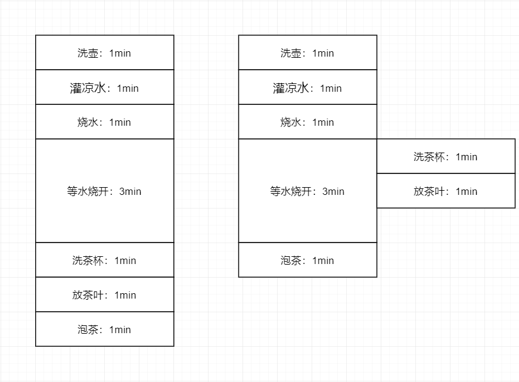
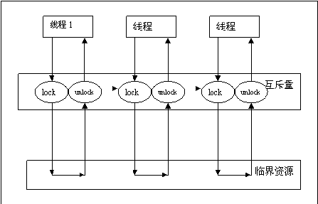
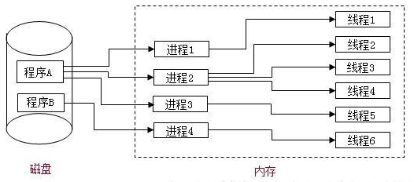
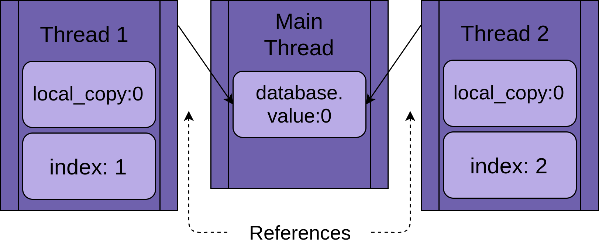
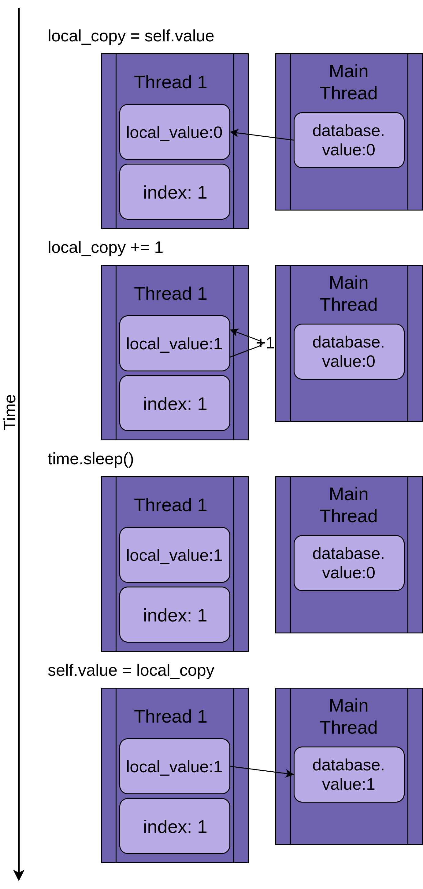
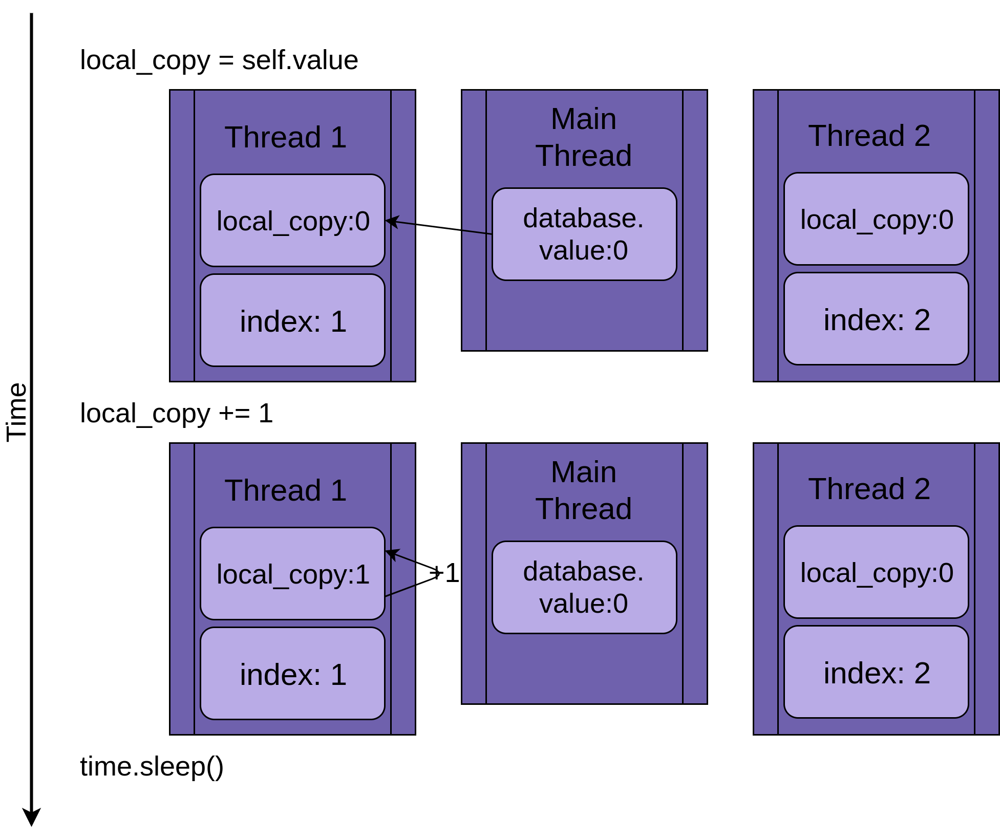
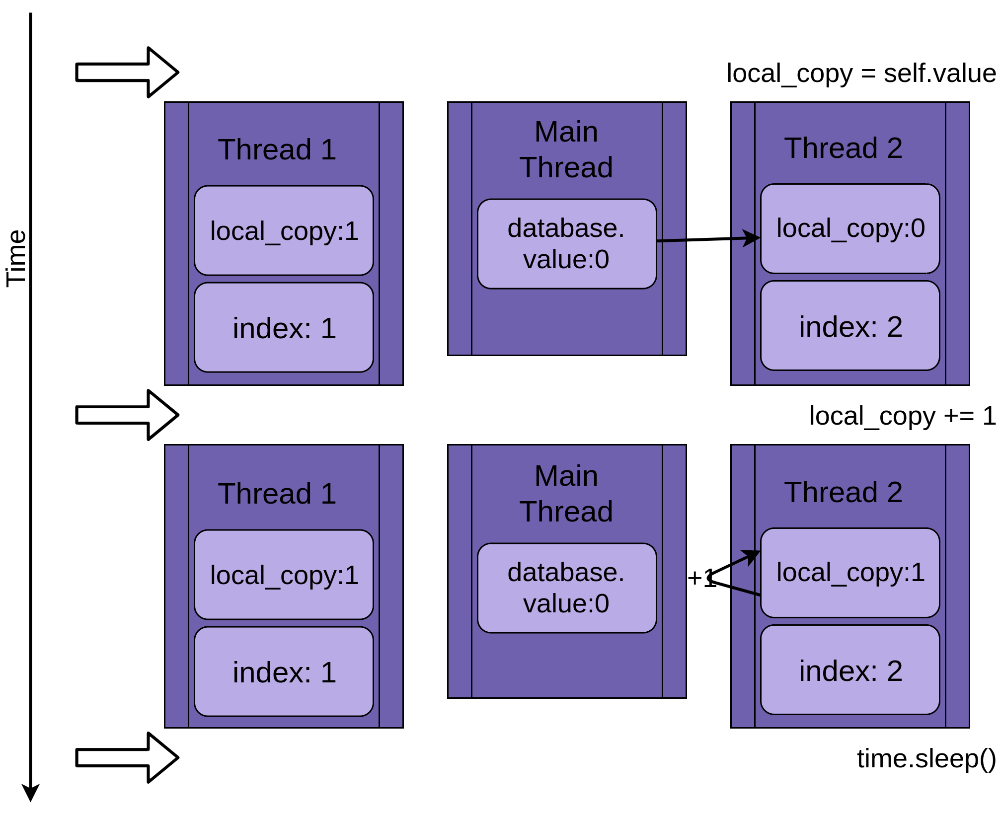
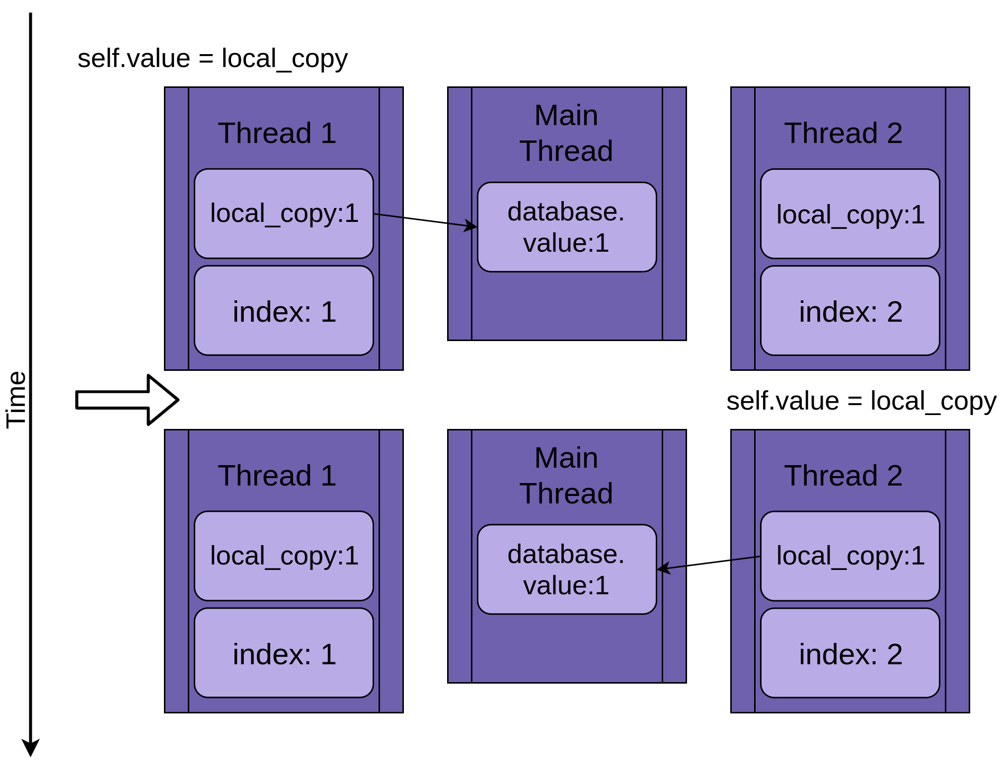

## 线程

线程是一个单独的执行流程，这意味着程序将同时发生两件事。但是对于大多数 Python3 实现，不同的线程实际上并不是同时执行的：它们只是看起来像。

### 顺序执行逻辑

在默认的情况下，代码的执行逻辑是从上到下，从左到右。并且一次只能做一件事情，即使是阻塞操作，也会停止不动。

以烧水泡茶为例，它需要做 7 项工作，即洗壶，灌凉水，烧水，洗茶杯，放茶叶，冲开水泡茶。

要完成这几项工作，可以有以下几种程序：

  １.洗好开水壶，灌上凉水，放在火上，等待水开；水开后，再洗茶杯，准备茶叶，冲水泡茶。

  ２.先洗好水壶，洗好茶杯，放好茶叶，一切就绪，再放水烧水，水开后再冲水饮茶；

  ３.洗净开水壶，灌水烧水；烧水过程中，洗茶杯，放茶叶，水开后泡茶喝。



**顺序执行逻辑** 

```python
import time

start_time = time.time()
print('1. 洗壶：1min')
time.sleep(1)
print('2. 灌凉水：1min')
time.sleep(1)
print('3. 烧水：1min')
time.sleep(1)
print('4. 等水烧开：3min')
time.sleep(1)
time.sleep(1)
time.sleep(1)
print('5. 洗茶杯：1min')
time.sleep(1)
print('6. 放茶叶：1min')
time.sleep(1)
print('7. 泡茶：1min')
time.sleep(1)
print('总运行时间', time.time() - start_time)

```

### 多线程异步执行

在默认的情况下，像等水烧开这种耗时的操作计算机也会在等着事情做完之后才会去做下一件事情，程序员可以指定给计算机安排任务。让计算机遇到耗时的事情之后，可以在等待的同时去做其他的事情。

```python
import time
import threading


def work():
    """只有函数对象才能使用多线程"""
    print('5. 洗茶杯：1min')
    time.sleep(1)
    print('6. 放茶叶：1min')
    time.sleep(1)


start_time = time.time()

print('1. 洗壶：1min')
time.sleep(1)
print('2. 灌凉水：1min')
time.sleep(1)
print('3. 烧水：1min')
time.sleep(1)
print('4. 等水烧开：3min')
work_thread = threading.Thread(target=work)
work_thread.start()
time.sleep(1)  # 5. 洗茶杯：1min
time.sleep(1)  # 6. 放茶叶：1min
time.sleep(1)
# 5 6 需要请一个帮手帮我们去做
# print('5. 洗茶杯：1min')
# time.sleep(1)
# print('6. 放茶叶：1min')
# time.sleep(1)
# 多线程必须要是一个函数对象

print('7. 泡茶：1min')
time.sleep(1)

print('总共花了：', time.time() - start_time)

```


## 创建线程

现在您已经了解了线程是什么，让我们学习如何创建一个线程。Python标准库提供 [`threading`](https://docs.python.org/3/library/threading.html) 。 `Thread` 在这个模块中，很好地封装了线程，提供了一个干净的界面来使用它们。

要启动一个单独的线程，您需要创建一个`Thread`实例，然后告诉它`.start()`：

```python
import time
import threading


def download():
    print("开始下载文件...")
    time.sleep(1)
    print("完成下载文件...")


def upload():
    print("开始上传文件...")
    time.sleep(1)
    print("完成上传文件...")


download()
upload()
```

注意

- 很显然刚刚的程序并没有完成上传和下载同时进行的要求
- 如果想要实现“上传与下载”同时进行，那么就需要一个新的方法，叫做：**多任务** 

### 使用 threading 模块

> python 的 thread 模块是底层的模块，python 的 threading 模块是对 thread 做了一些包装的，可以更加方便的被使用

当一个进程启动之后，会默认产生一个主线程，因为线程是程序执行流的最小单元，当设置多线程时，主线程会创建多个子线程，在python中，默认情况下（其实就是setDaemon(False)），主线程执行完自己的任务以后，就退出了，此时子线程会继续执行自己的任务，直到自己的任务结束。

```python
import time
import threading


def download():
    print("开始下载文件...")
    time.sleep(1)
    print("完成下载文件...")


def upload():
    print("开始上传文件...")
    time.sleep(1)
    print("完成上传文件...")


download_thread = threading.Thread(target=download)
download_thread.start()
upload_thread = threading.Thread(target=upload)
upload_thread.start()
```


### 带参数的线程

```python
# -*- coding: utf-8 -*-
import threading
import time

urls = [
    'https://maoyan.com/board/4?offset=0',
    'https://maoyan.com/board/4?offset=10',
    'https://maoyan.com/board/4?offset=20',
    'https://maoyan.com/board/4?offset=30',
    'https://maoyan.com/board/4?offset=40',
    'https://maoyan.com/board/4?offset=50',
    'https://maoyan.com/board/4?offset=60',
    'https://maoyan.com/board/4?offset=70',
    'https://maoyan.com/board/4?offset=80',
    'https://maoyan.com/board/4?offset=90',
]


def download(url):
    print('下载文件开始...')
    print(url)
    # 延时从操作
    time.sleep(1)
    print('下载文件完毕...')


if __name__ == '__main__':
    for url in urls:
        # download(url=url)
        # target： 线程执行的函数名
        # args： 表示以元组的方式给函数传参
        # kwargs: 表示以字典的方式给函数传参
        t = threading.Thread(target=download, args=(url,))
        t.start()

```


## 多线程的执行顺序

### 守护线程

计算机科学中，守护线程（`daemon`） 是在后台运行的过程。

Python `threading` 具有更具体的含义 `daemon`。程序退出时 `daemon` 线程将立即关闭。考虑这些定义的一种方法是将 `daemon` 线程设置为在后台运行的线程，而不必担心将其关闭。

当我们使用 `setDaemon(True)` 方法，设置子线程为守护线程时，主线程一旦执行结束，则全部线程全部被终止执行，可能出现的情况就是，子线程的任务还没有完全执行结束，就被迫停止。

```python
# coding=utf-8
import threading
import time


def upload():
    print("开始上传文件...")
    time.sleep(1)
    print("完成上传文件...")


def download(num):
    print("开始下载文件...")
    time.sleep(1)
    print("完成下载文件...")


if __name__ == '__main__':
    num = 10
    thread1 = threading.Thread(target=upload)
    thread2 = threading.Thread(target=download)
    # 设置为守护线程 当主线程运行完时 子线程被 kill 掉
    thread1.setDaemon(True)
    thread2.setDaemon(True)
    thread1.start()
    thread2.start()

    
    # 默认情况下 主线程退出与时 子线程不会被 kill 掉
	print("主线程结束")
```

### 案例-多线程执行没有顺序


## 无锁不安全

先来看一个案例

```python
import threading

number = 0


def add_one():
    global number
    # 运行一百次加 1 运算
    for i in range(100):
        number += 1


if __name__ == '__main__':
    # 两个线程都进行加法运算
    for i in range(2):
        thread = threading.Thread(target=add_one)
        thread.start()
    
    # 当所有线程运行完毕之后
    while len(threading.enumerate()) > 1:
        pass
    
    print(number)

```

如果将 add_one 方法内的 100 改成 1000000 运行试试，为何得到的结果不是预料之中的结果？


### 无锁不安全的原因

dis 库是 python (默认的 `CPython` )自带的一个库,可以用来分析字节码

如果多个线程同时对同一个变量操作，会出现资源竞争问题，从而数据结果会不正确


在考虑竞争条件时，要记住两件事：

1. 即使是像操作一样的操作也 `x += 1` 需要多处理器。这些步骤中的每一步都是对处理器的单独指令。
2. 操作系统可以换哪个线程运行 *在任何时间* 。在任何这些小指令之后，可以换出一个线程。这意味着，一个线程可以被置于睡眠状态，让在另一个线程运行*中*一个Python语句。

让我们详细看看下面这个函数，它接受一个参数并递增它：

```python
# 没有锁
def add1(a):
    a += 1

"""add
1. load a  a = 0
2. load 1  1
3. +    1
4. 赋值给a a=1
"""

import dis
dis.dis(add1)
```

运行结果

```
 37           0 LOAD_FAST                0 (a)
              2 LOAD_CONST               1 (1)
              4 INPLACE_ADD
              6 STORE_FAST               0 (a)
              8 LOAD_CONST               0 (None)
             10 RETURN_VALUE
```

程序执行的过程

1. 执行`LOAD_FAST`数据值`x`

2. 执行a `LOAD_CONST 1`

3. 将`INPLACE_ADD`这些值添加到一起。

我们因特定原因停在这里。这是强制线程切换的`.update()`上述要点`time.sleep()`。完全有可能的是，每隔一段时间，操作系统就会在该确切点切换线程，即使没有`sleep()`，但是`sleep()`每次调用都会使它发生。

### 锁

有许多方法可以避免或解决竞争条件。你不会在这里看到所有这些，但有一些经常使用。让我们开始学习 `Lock`。

要解决上面的竞争条件，您需要找到一种方法，一次只允许一个线程进入代码的读 - 修改 - 写部分。最常见的方法是`Lock`在Python中调用。

 `Lock` 是一个像通行证一样的物体。一次只能有一个线程 `Lock`。任何其他想要通过 `Lock` 的线程，必须等到`Lock` 的所有者释放它。

执行此操作的基本功能是`.acquire()`和`.release()`。如果锁已经被保持，则调用线程将一直等到它被释放。这里有一个重点。如果一个线程获得锁定但从未将其返回，则程序将被卡住。就会造成死锁。

幸运的是，Python `Lock`也将作为上下文管理器运行，因此您可以在`with`语句中使用它，并且当`with`块因任何原因退出时它会自动释放。

让我们来看看 `Lock` 。调用函数保持不变：

```python
...

def add_one():
    global number
    # 运行一百次加 1 运算
    for i in range(1000000):
        lock.acquire()
        number += 1
        lock.release()
...
```

`._lock` 在解锁状态下初始化，并由 `with` 语句锁定和释放。

值得注意的是，运行此函数的线程将保持该`Lock`状态，直到完全更新数据库为止。在这种情况下，这意味着它将保留`Lock`复制，更新，休眠，然后将值写回数据库。




threading模块中定义了Lock类，可以方便的处理锁定：

```python
# 创建锁
lock = threading.Lock()

# 锁定
lock.acquire()

# 释放
lock.release()
```

**注意：** 

- 如果这个锁之前是没有上锁的，那么acquire不会堵塞
- 如果在调用acquire对这个锁上锁之前 它已经被 其他线程上了锁，那么此时acquire会堵塞，直到这个锁被解锁为止

### 对敏感代码加锁

```python
import threading

lock = threading.Lock()


def add1():
    for i in range(1000000):
        global num
        # 获取一把锁
        lock.acquire()
        num += 1
        # 释放一把锁
        lock.release()
    print('add1', num)


def add2():
    for i in range(1000000):
        global num
        lock.acquire()
        num += 1
        lock.release()
    print('add2', num)


if __name__ == '__main__':
    num = 0
    thread1 = threading.Thread(target=add1)
    thread2 = threading.Thread(target=add2)
    thread1.start()
    thread2.start()

```

### 死锁

在继续之前，您应该在使用时查看常见问题 `Locks`。如您所见，如果`Lock`已经获取，则第二次调用`.acquire()`将等待持有`Lock`调用的线程`.release()`。运行此代码时，您认为会发生什么：

```python
import threading

l = threading.Lock()
print("第一次获取锁")
l.acquire()
print("第二次获取锁")
l.acquire()
```

当程序 `l.acquire()` 第二次调用时，它会挂起等待`Lock`释放。在此示例中，您可以通过删除第二个调用来修复死锁，但死锁通常发生在两个微妙的事情之一：

1.  `Lock`未正确发布的实现错误
2.  一个设计问题，其中实用程序函数需要由可能已经或可能没有的函数调用 `Lock`

第一种情况有时会发生，但使用`Lock`上下文管理器会大大减少频率。建议尽可能编写代码以使用上下文管理器，因为它们有助于避免异常跳过`.release()`调用的情况。

在某些语言中，设计问题可能有点棘手。值得庆幸的是，Python线程有一个名为的第二个对象，`RLock`专门针对这种情况而设计。它允许一个线程`.acquire()`的`RLock`多次调用之前`.release()`。该线程仍然需要调用`.release()`它调用的相同次数`.acquire()`，但无论如何它应该这样做。

`Lock`并且`RLock`是用于线程编程以防止竞争条件的两个基本工具。还有一些其他方式以不同的方式工作。在你看之前，让我们转向一个稍微不同的问题域。

此时已经进入到了死锁状态

**总结** 

锁的好处：

- 确保了某段关键代码只能由一个线程从头到尾完整地执行

锁的坏处：

- 阻止了多线程并发执行，包含锁的某段代码实际上只能以单线程模式执行，效率就大大地下降了
- 由于可以存在多个锁，不同的线程持有不同的锁，并试图获取对方持有的锁时，可能会造成死锁


## 附录

线程是一个单独的执行流程，这意味着程序将同时发生两件事。但是对于大多数 Python3 实现，不同的线程实际上并不是同时执行的：它们只是看起来像。

很容易将线程视为在程序上运行两个（或更多）不同的处理器，每个处理器同时执行一项独立的任务。这几乎是正确的。线程可能在不同的处理器上运行，但它们一次只运行一个。

同时运行多个任务需要非标准的 Python 实现，用不同的语言编写一些代码，或者使用 `multiprocessing` 带来一些额外开销的代码。

由于 CPython 实现 Python 的工作方式，线程可能无法加速所有任务。这是因为与 GIL 的交互基本上限制了一次运行一个 Python 线程。

花费大量时间等待外部事件的任务通常是使用线程的良好选择。需要大量 CPU 计算并且花费很少时间等待外部事件的问题可能根本不会运行得更快。

这适用于用Python编写并在标准 CPython 实现上运行的代码。如果您的线程是用 C语言编写的，那么它们就能够释放GIL并同时运行。如果您正在运行不同的 Python 实现，请查看文档，了解它如何处理线程。

如果您正在运行标准的Python实现，只使用 Python 编写，并且遇到 CPU 限制问题，那么您应该检查`multiprocessing`模块。

构建程序以使用线程也可以提高程序的运行速度。您将在本教程中学习的大多数示例都不一定会运行得更快，因为它们使用线程。在其中使用线程有助于使设计更清晰，更容易推理。



### 线程能加速的原理

#### 单线程

在使用两个线程深入研究此问题之前，让我们回过头来讨论一下单线程如何工作的一些细节。

你不会深入了解这里的所有细节，因为这在这个级别并不重要。我们还将以一种技术上不准确的方式简化一些事情，但会让您对正在发生的事情有正确的认识。

当使用 `ThreadPoolExecutor` 运行每个线程时，我们使用 `executor.submit(database.update, index)` 指定运行的函数以及传递给它的参数。

结果是池中的每个线程都将调用 `database.update(index)` 。请注意，它`database`是对`FakeDatabase`创建的一个对象的引用`__main__`。调用`.update()`该对象会调用该对象上的[实例方法](https://realpython.com/instance-class-and-static-methods-demystified/)。

每个线程都将引用同一个 `FakeDatabase` 的实例对象 `database` 。每个线程也将具有唯一值。



当线程开始运行时 `.update()`，它有自己的函数本地数据版本。在这种情况下`.update()`，这是`local_copy`。这绝对是件好事。否则，运行相同功能的两个线程将始终相互混淆。这意味着对函数作用域（或本地）的所有变量都是 **线程安全的**。

现在，您可以开始了解如果您使用单个线程和单个调用运行上面的程序会发生什么`.update()`。

`.update()`如果只运行一个线程，下面的图像将逐步执行。该语句显示在左侧，后面是一个图表，显示了线程`local_value`和共享中的值`database.value`：




图表的布局使得从上到下移动时间会增加。它在`Thread 1`创建时开始，在终止时结束。

当 `Thread 1` 启动时，`FakeDatabase.value` 是零。方法中的第一行代码 `local_copy = self.value` 将值零复制到局部变量。接下来，它会 `local_copy` 使用 `local_copy += 1` 语句增加值。你可以看到 `.value` 在 `Thread 1` 越来越设置为1。

下一步调用 `time.sleep()`，使当前线程暂停并允许其他线程运行。由于此示例中只有一个线程，因此无效。

当 `Thread 1` 从醒来，并继续，它复制了新的价值 `local_copy` 来 `FakeDatabase.value` ，然后线程完成。您可以看到 `database.value` 设置为1。

到现在为止还挺好。你跑了 `.update()` 一次然后 `FakeDatabase.value` 增加到一次。

#### 两个线程

回到竞争状态，两个线程将同时运行但不会同时运行。他们每个都有自己的版本，`local_copy`并且每个都指向相同的版本`database`。正是这个共享`database`对象会导致问题。

该程序以`Thread 1`运行开始`.update()`：



当 `Thread 1` 启动 `time.sleep()` 时，它允许其他线程开始运行。这是事情变得有趣的地方。

`Thread 2` 启动并执行相同的操作。它也复制 `database.value` 到它的私有 `local_copy` ，这个共享`database.value` 还没有更新：




当`Thread 2`最终进入睡眠状态时，共享`database.value`在零时仍未修改，并且两个私有版本都`local_copy`具有值1。

`Thread 1`现在醒来并保存其版本`local_copy`然后终止，`Thread 2`最后运行机会。`Thread 2`不知道在睡觉时`Thread 1`跑步和更新`database.value`。它存储*的*版本`local_copy`为`database.value`，也将其设置为一个：



这两个线程具有对单个共享对象的交叉访问权限，从而覆盖彼此的结果。当一个线程在另一个线程完成访问之前释放内存或关闭文件句柄时，可能会出现类似的竞争条件。

