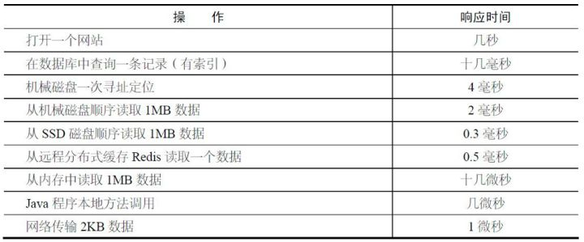

## GIL（全局解释器锁）

在非 python 环境中，单核情况下，同时只能有一个任务执行。多核时可以支持多个线程同时执行。但是在 python 中，无论有多少核，同时只能执行一个线程。究其原因，这就是由于GIL的存在导致的。

GIL的全称是 Global Interpreter Lock (全局解释器锁)，来源是python设计之初的考虑，为了数据安全所做的决定。某个线程想要执行，必须先拿到GIL，我们可以把 GIL 看作是“通行证”，并且在一个 python 进程中，GIL 只有一个。拿不到通行证的线程，就不允许进入CPU执行。GIL只在 cpython 中才有，因为 cpython 调用的是c语言的原生线程，所以他不能直接操作cpu，只能利用 GIL 保证同一时间只能有一个线程拿到数据。而在pypy和jpython中是没有 GIL 的。

**Python多线程的工作过程：** 

python在使用多线程的时候，调用的是c语言的原生线程。

1. 拿到公共数据
2. 申请 gil 
3. python 解释器调用 os 原生线程
4. os 操作 cpu 执行运算
5. 当该线程执行时间到后，无论运算是否已经执行完，gil 都被要求释放
6. 进而由其他进程重复上面的过程
7. 等其他进程执行完后，又会切换到之前的线程（从他记录的上下文继续执行）整个过程是每个线程执行自己的运算，当执行时间到就进行切换（context switch）。


**python针对不同类型的代码执行效率也是不同的：**

1、CPU密集型代码(各种循环处理、计算等等)，在这种情况下，由于计算工作多，ticks计数很快就会达到阈值，然后触发GIL的释放与再竞争（多个线程来回切换当然是需要消耗资源的），所以python下的多线程对CPU密集型代码并不友好。
2、IO密集型代码(文件处理、网络爬虫等涉及文件读写的操作)，多线程能够有效提升效率(单线程下有IO操作会进行IO等待，造成不必要的时间浪费，而开启多线程能在线程A等待时，自动切换到线程B，可以不浪费CPU的资源，从而能提升程序执行效率)。所以python的多线程对IO密集型代码比较友好。

**使用建议？**

python下想要充分利用多核CPU，就用多进程。因为每个进程有各自独立的GIL，互不干扰，这样就可以真正意义上的并行执行，在python中，多进程的执行效率优于多线程(仅仅针对多核CPU而言)。

GIL在python中的版本差异：

1、在python2.x里，GIL的释放逻辑是当前线程遇见`IO操作`或者`ticks计数达到100`时进行释放。（ticks可以看作是python自身的一个计数器，专门做用于GIL，每次释放后归零，这个计数可以通过sys.setcheckinterval 来调整）。而每次释放GIL锁，线程进行锁竞争、切换线程，会消耗资源。并且由于GIL锁存在，python里一个进程永远只能同时执行一个线程(拿到GIL的线程才能执行)，这就是为什么在多核CPU上，python的多线程效率并不高。
2、在python3.x中，GIL不使用ticks计数，改为使用计时器（执行时间达到阈值后，当前线程释放GIL），这样对CPU密集型程序更加友好，但依然没有解决GIL导致的同一时间只能执行一个线程的问题，所以效率依然不尽如人意。

## 进程以及状态

当运行一个程序时，操作系统会创建一个**进程**。它会使用系统资源（CPU、内存和磁盘空间）和操作系统**内核**中的数据结构（文件、网络连接、用量统计等）。进程之间是互相隔离的，即一个进程既无法访问其他进程的内容，也无法操作其他进程。

操作系统会跟踪所有正在运行的进程，给每个进程一小段运行时间，然后切换到其他进程，这样既可以做到公平又可以响应用户操作。你可以在图形界面中查看进程状态，在 Mac OS X 上可以使用活动监视器，在 Windows 上可以使用任务管理器。


一个程序的执行实例就是一个 **进程** 。每一个进程提供执行程序所需的所有资源。（进程本质上是资源的集合）

一个进程有一个虚拟的地址空间、可执行的代码、操作系统的接口、安全的上下文（记录启动该进程的用户和权限等等）、唯一的进程ID、环境变量、优先级类、最小和最大的工作空间（内存空间），还要有至少一个线程。

每一个进程启动时都会最先产生一个线程，即主线程。然后主线程会再创建其他的子线程。

**进程的状态** 

工作中，任务数往往大于 `cpu` 的核数，即一定有一些任务正在执行，而另外一些任务在等待 `cpu` 进行执行，因此导致了有了不同的状态


- 就绪态：运行的条件都已经满去，正在等在cpu执行
- 执行态：cpu正在执行其功能
- 等待态：等待某些条件满足，例如一个程序sleep了，此时就处于等待态

而网络IO主要延时由： 服务器响应延时 + 带宽限制 + 网络延时 + 跳转路由延时 + 本地接收延时决定。（一般为几十到几千毫秒，受环境干扰极大）



原文地址：[点击这里](https://python-parallel-programmning-cookbook.readthedocs.io/zh_CN/latest/chapter4/02_Using_the_concurrent.futures_Python_modules.html) 

## 进程的创建

> multiprocessing

multiprocessing 是 Python 的标准模块，它既可以用来编写多进程，也可以用来编写多线程。multiprocessing  提供了一个 Process 类来代表一个进程对象，这个对象可以理解为是一个独立的进程，可以执行另外的事情

### 并行执行

```python
# -*- coding: utf-8 -*-
import multiprocessing
import time


def upload():
    print("开始上传文件...")
    time.sleep(1)
    print("完成上传文件...")


def download():
    print("开始下载文件...")
    time.sleep(1)
    print("完成下载文件...")


def main():
    multiprocessing.Process(target=upload).start()
    multiprocessing.Process(target=download).start()


if __name__ == '__main__':
    main()

```

说明：

创建子进程时，只需要传入一个执行函数和函数的参数，创建一个 Process 实例，用 start() 方法启动

### 进程对象

**Process 介绍：** 

构造方法：

- Process([group [, target [, name [, args [, kwargs]]]]])
- group: 线程组，目前还没有实现，库引用中提示必须是 None；
- target: 要执行的方法；
- name: 进程名；
- args/kwargs: 要传入方法的参数。

实例方法：

- is_alive()：返回进程是否在运行。
- join([timeout])：阻塞当前上下文环境的进程程，直到调用此方法的进程终止或到达指定的 timeout（可选参数）。
- start()：进程准备就绪，等待 CPU 调度。
- run()：strat() 调用 run 方法，如果实例进程时未制定传入 target，start 执行默认 run() 方法。
- terminate()：不管任务是否完成，立即停止工作进程。

属性：

- authkey
- daemon：和线程的 setDeamon 功能一样（将父进程设置为守护进程，当父进程结束时，子进程也结束）。
- exitcode：(进程在运行时为 None、如果为 –N，表示被信号 N 结束）。
- name：进程名字。
- pid：进程号。


### 传递参数

```python
# -*- coding: utf-8 -*-
import multiprocessing


# 多进程多进程传参
def run_process(n, a, name, age):

    print(n, a, name, age)


if __name__ == '__main__':
    # 可以利用换行是代码看起来更简洁
    multiprocessing.Process(target=run_process,
                            args=(18, 1),
                            kwargs={'name': '张三', 'age': 18}).start()
```


### 进程不同享全局变量

因为属于不同的进程，进程与进程之间的变量不共享

```python
# -*- coding: utf-8 -*-
import multiprocessing
import threading

# 主进程
l = [1, 2, 3, 4, 5]


def list_append(p):
    print(l.pop())
    print(l.pop())
    print(l.pop())
    print('进程{}修改的内容'.format(p), l)


def list_append2(p):
    print(l.pop())
    print(l.pop())
    print('进程{}修改的内容'.format(p), l)


if __name__ == '__main__':
    # t1 = threading.Thread(target=list_append, args=('p1',))
    # t1.start()
    # t2 = threading.Thread(target=list_append2, args=('p2',))
    # t2.start()
    p2 = multiprocessing.Process(target=list_append2, args=('p2',))
    p2.start()
    p1 = multiprocessing.Process(target=list_append, args=('p1',))
    p1.start()

```

## Queue的使用

Process 之间有时需要通信，操作系统提供了很多机制来实现进程间的通信。

可以使用 multiprocessing 模块的 Queue 实现多进程之间的数据传递，Queue 本身是一个消息列队程序，首先用一个小实例来演示一下 Queue 的工作原理：

```python
# coding=utf-8
from multiprocessing import Queue

q = Queue(3)  # 初始化一个Queue对象，最多可接收三条put消息
q.put("消息1")
q.put("消息2")
q.put("消息3")

# 因为消息列队已满下面的try都会抛出异常，第一个try会等待2秒后再抛出异常，第二个Try会立刻抛出异常
try:
    q.put("消息4", True, 2)
except:
    print("消息列队已满，现有消息数量:%s" % q.qsize())

try:
    q.put_nowait("消息4")
except:
    print("消息列队已满，现有消息数量:%s" % q.qsize())

# 推荐的方式，先判断消息列队是否已满，再写入
if not q.full():
    q.put_nowait("消息4")

# 读取消息时，先判断消息列队是否为空，再读取
if not q.empty():
    for i in range(q.qsize()):
        print(q.get_nowait())
```

运行结果:

```python

消息列队已满，现有消息数量:3

消息列队已满，现有消息数量:3
消息1
消息2
消息3
```

**说明** 

初始化Queue()对象时（例如：q=Queue()），若括号中没有指定最大可接收的消息数量，或数量为负值，那么就代表可接受的消息数量没有上限（直到内存的尽头）；

- Queue.qsize()：返回当前队列包含的消息数量；
- Queue.empty()：如果队列为空，返回True，反之False ；
- Queue.full()：如果队列满了，返回True,反之False；
- Queue.get([block[, timeout]])：获取队列中的一条消息，然后将其从列队中移除，block默认值为True；
  - 如果block使用默认值，且没有设置timeout（单位秒），消息列队如果为空，此时程序将被阻塞（停在读取状态），直到从消息列队读到消息为止，如果设置了timeout，则会等待timeout秒，若还没读取到任何消息，则抛出"Queue.Empty"异常；
  - 如果block值为False，消息列队如果为空，则会立刻抛出"Queue.Empty"异常；
- Queue.get_nowait()：相当Queue.get(False)；
- Queue.put(item,[block[, timeout]])：将item消息写入队列，block默认值为True；
  - 如果block使用默认值，且没有设置timeout（单位秒），消息列队如果已经没有空间可写入，此时程序将被阻塞（停在写入状态），直到从消息列队腾出空间为止，如果设置了timeout，则会等待timeout秒，若还没空间，则抛出"Queue.Full"异常；
  - 如果block值为False，消息列队如果没有空间可写入，则会立刻抛出"Queue.Full"异常；
- Queue.put_nowait(item)：相当Queue.put(item, False)；


## 并发速度对比

单线程、多线程、多进程效果对比

### IO密集型对比

```python
# -*- coding: utf-8 -*-
import concurrent.futures
import time
import random

urls = [
    f'https://maoyan.com/board/4?offset={page}' for page in range(1000)
]


def download(url):
    # print(url)
    # 延时从操作
    time.sleep(0.0000001)


if __name__ == '__main__':
    """单线程"""
    start_time = time.time()
    for url in urls:
        download(url)
    print("单线程执行：" + str(time.time() - start_time), "秒")

    """多线程"""
    start_time_1 = time.time()
    with concurrent.futures.ThreadPoolExecutor(max_workers=5) as executor:
        for url in urls:
            executor.submit(download, url)
    print("线程池计算的时间：" + str(time.time() - start_time_1), "秒")

    """多进程"""
    start_time_1 = time.time()
    with concurrent.futures.ProcessPoolExecutor(max_workers=5) as executor:
        for url in urls:
            executor.submit(download, url)
    print("线程池计算的时间：" + str(time.time() - start_time_1), "秒")

```

运行这个代码，我们可以看到运行时间的输出：

```
单线程执行：1.064488172531128 秒
线程池计算的时间：0.4077413082122803 秒
线程池计算的时间：0.46396422386169434 秒
```

### CPU密集型

```python
# -*- coding: utf-8 -*-
import concurrent.futures
import time

number_list = [1, 2, 3, 4, 5, 6, 7, 8, 9, 10]


def evaluate_item(x):
    """计算总和，这里只是为了消耗时间"""
    a = 0
    for i in range(0, 100):
        # 重复计算 消耗时间 cpu计算能力
        a = a + i
        time.sleep(0.00000001)
    return x


if __name__ == '__main__':
    """单线程"""
    start_time = time.time()
    for item in number_list:
        evaluate_item(item)
    print("单线程执行：" + str(time.time() - start_time), "秒")

    """多线程"""
    start_time_1 = time.time()
    with concurrent.futures.ThreadPoolExecutor(max_workers=5) as executor:
        for item in number_list:
            executor.submit(evaluate_item, item)
    print("线程池计算的时间：" + str(time.time() - start_time_1), "秒")

    """多进程"""
    start_time_2 = time.time()
    with concurrent.futures.ProcessPoolExecutor(max_workers=5) as executor:
        for item in number_list:
            executor.submit(evaluate_item, item)
    print("进程池计算的时间：" + str(time.time() - start_time_2), "秒")

```


## 进程、线程对比

- 进程，能够完成多任务，比如 在一台电脑上能够同时运行多个QQ
- 线程，能够完成多任务，比如 一个QQ中的多个聊天窗口


进程是系统进行资源分配和调度的一个独立单位.

线程是进程的一个实体,是CPU调度和分派的基本单位,它是比进程更小的能独立运行的基本单位.线程自己基本上不拥有系统资源,只拥有一点在运行中必不可少的资源(如程序计数器,一组寄存器和栈),但是它可与同属一个进程的其他的线程共享进程所拥有的全部资源.


区别

- 一个程序至少有一个进程,一个进程至少有一个线程.

- 线程的划分尺度小于进程(资源比进程少)，使得多线程程序的并发性高。

- 进程在执行过程中拥有独立的内存单元，而多个线程共享内存，从而极大地提高了程序的运行效率

  

- 线程不能够独立执行，必须依存在进程中

**优缺点** 

线程和进程在使用上各有优缺点：线程执行开销小，但不利于资源的管理和保护；而进程正相反。

关于多进程和多线程，教科书上最经典的一句话是“进程是资源分配的最小单位，线程是CPU调度的最小单位”。这句话应付考试基本上够了，但如果在工作中遇到类似的选择问题，那就没有那么简单了，选的不好，会让你深受其害。所以他也是面试者最喜欢考察的题目之一。

我们按照多个不同的维度，来看看多进程和多线程的对比（注：都是相对的，不是说一个好得不得了，另一个差的无法忍受）

| 维度           | 多进程                                                       | 多线程                                 | 总结     |
| -------------- | ------------------------------------------------------------ | -------------------------------------- | -------- |
| 数据共享、同步 | 数据是分开的:共享复杂，需要用IPC;同步简单                    | 多线程共享进程数据：共享简单；同步复杂 | 各有优势 |
| 内存、CPU      | 占用内存多，切换复杂，CPU利用率低                            | 占用内存少，切换简单，CPU利用率高      | 线程占优 |
| 创建销毁、切换 | 创建销毁、切换复杂，速度慢                                   | 创建销毁、切换简单，速度快             | 线程占优 |
| 编程调试       | 编程简单，调试简单                                           | 编程复杂，调试复杂                     | 进程占优 |
| 可靠性         | 进程间不会相互影响                                           | 一个线程挂掉将导致整个进程挂掉         | 进程占优 |
| 分布式         | 适应于多核、多机分布 ；如果一台机器不够，扩展到多台机器比较简单 | 适应于多核分布                         | 进程占优 |

然后我们来看下线程和进程间的比较

|          | 多进程                                                       | 多线程                                                       |
| -------- | ------------------------------------------------------------ | ------------------------------------------------------------ |
| 优点     | 内存隔离，单进程已成不会导致整个应用崩溃。方便调试           | 提高系统的并发性，并且开销小                                 |
| 缺点     | 进程间调用，通讯和切换开销均比多线程大                       | 没有内存隔离，单线程的崩溃会导致整个应用的推出，发生内存bug时，定位及其不方便（回调噩梦） |
| 使用场景 | 目标子功能交互少，如果资源和性能许可，请设计由多个子应用程序来组合完成。 | 存在大量IO、网络等耗时操作，或需要与用户交互时，使用多线程有利于提高系统的并行性和用户界面交互的体验。 |


1) 需要频繁创建销毁的优先用线程。
   实例：web服务器。来一个建立一个线程，断了就销毁线程。要是用进程，创建和销毁的代价是很难承受的。

2. 需要进行大量计算的优先使用进程。
   所谓大量计算，当然就是要消耗很多cpu，切换频繁了，这种情况先线程是最合适的。
   实例：图像处理、算法处理

3. 强相关的处理用线程，若相关的处理用进程。
   什么叫强相关、弱相关？理论上很难定义，给个简单的例子就明白了。
   一般的server需要完成如下任务：消息收发和消息处理。消息收发和消息处理就是弱相关的任务，而消息处理里面可能又分为消息解码、业务处理，这两个任务相对来说相关性就要强多了。因此消息收发和消息处理可以分进程设计，消息解码和业务处理可以分线程设计。
4. 可能扩展到多机分布的用进程，多核分布的用线程。
5. 都满足需求的情况下，用你最熟悉、最拿手的方式。

至于”数据共享、同步“、“编程、调试”、“可靠性”这几个维度的所谓的“复杂、简单”应该怎么取舍，只能说：没有明确的选择方法。一般有一个选择原则：如果多进程和多线程都能够满足要求，那么选择你最熟悉、最拿手的那个。

买了一台服务器  2核4线程 部署一个博客项目 2G内存

python开发的应用 一个进程一个线程 同一时刻只能处理一个请求 并发数只有1


并发    项目部署启动 6（2进程*（1+2线程）） 并发数就是6 线程开的越多 会消耗内存

线程并发有先后顺序，并行同时去做

并行数 最大是 2 

并行 同时做多件事情 一起做


### 关系对比

+ 线程是依附在进程里面的，没有进程就没有线程。
+ 一个进程默认提供一条线程，进程可以创建多个线程。


### 优缺点对比

进程优缺点:

+ 优点：可以用多核
+ 缺点：资源开销大

线程优缺点:

+ 优点：资源开销小
+ 缺点：不能使用多核

### 要点总结

1. 进程和线程都是完成多任务的一种方式

2. 多进程要比多线程消耗的资源多，但是多进程开发比单进程多线程开发稳定性要强，某个进程挂掉不会影响其它进程。

3. 多进程可以使用cpu的多核运行，多线程可以共享全局变量。

4. 线程不能单独执行必须依附在进程里面


## 概念问题（面试常问）

在计算机中，如果你的程序在等待，通常是因为以下两个原因。

- I/O **限制**

  这个限制很常见。计算机的 CPU 速度非常快——比计算机内存快几百倍，比硬盘或者网络快几千倍。

- CPU **限制**

  在处理**数字运算**任务时，比如科学计算或者图形计算，很容易遇到这个限制。


以下是和并发相关的两个术语。

- 同步
  一件事接着一件事发生，就像送葬队伍一样。 
- 异步
  任务是互相独立的，就像派对参与者从不同的车上下来一样


当你要用简单的系统和任务来处理现实中的问题时，迟早需要处理并发。假设你有一个网站，必须给用户很快地返回静态和动态网页。一秒是可以接受的，但是如果展示或者交互需要很长时间，用户就会失去耐心。谷歌和亚马逊的测试显示，页面加载速度降低一点就会导致流量大幅下降。

但是，如何处理需要长时间执行的任务呢，比如上传文件、改变图片大小或者查询数据库？显然无法用同步的 Web 客户端代码解决这个问题，因为同步就必然会产生等待。

在一台电脑中，如果你想尽快处理多个任务，就需要让它们互相独立。慢任务不应该阻塞其他任务。


 并发（concurrency）和并行（parallellism）是

+ 并发

  一件事情由多个人同时去做（多线程）

+ 并行

  多个人同时做多件事情（多进程）


处理的模块，让我们可以不受GIL的限制，大大缩短执行时间。

