## HTTP 协议

HTTP (HyperText Transfer Protocol 超文本传输协议) 基于 TCP，使用端口号 80 或 8080。

每当你在浏览器里输入一个网址或点击一个链接时，浏览器就通过 HTTP 协议将网页信息从服务器提取再显示出来，这是现在使用频率最大的应用层协议。

这个原理很简单：

- 点击一个链接后，浏览器向服务器发起 TCP 连接；
- 连接建立后浏览器发送 HTTP 请求报文，然后服务器回复响应报文；
- 浏览器将收到的响应报文内容显示在网页上；
- 报文收发结束，关闭 TCP 连接。

HTTP 报文会被传输层封装为 TCP 报文段，然后再被 IP 层封装为 IP 数据报。

HTTP 请求报文结构：

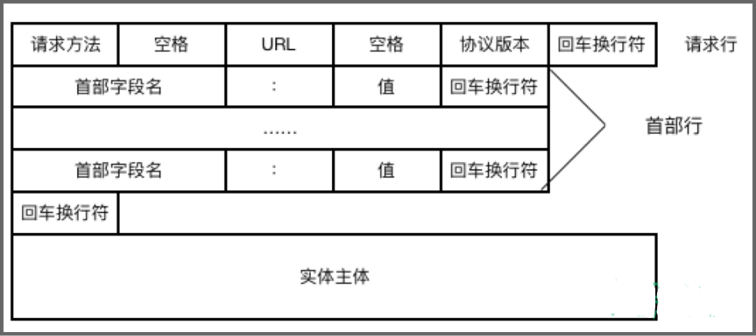

HTTP 响应报文结构：

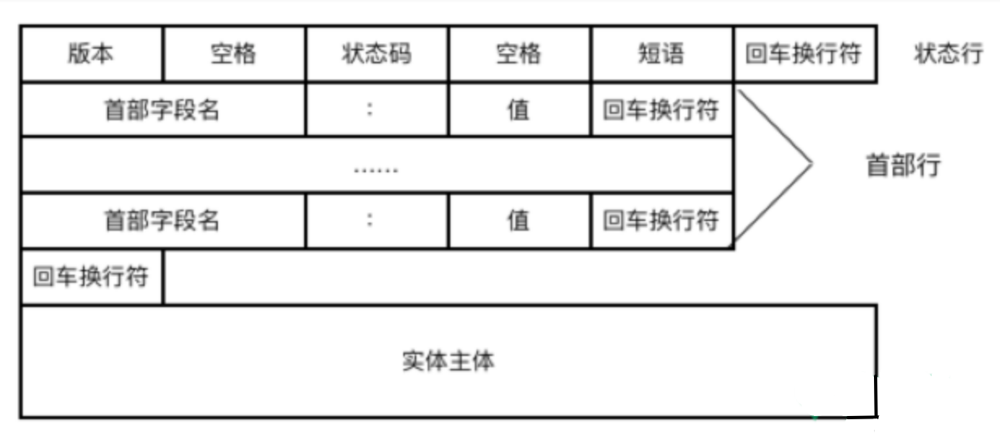

可见报文分为 3 部分：

- 开始行：用于区分是请求报文还是响应报文，请求报文中开始行叫做**请求行**，而响应报文中，开始行叫做**状态行**。在开始行的三个字段之间都用空格分开，结尾处 CRLF 表示回车和换行。
- 首部行：用于说明浏览器、服务器或报文主体的一些信息。
- 实体主体：请求报文中通常不用实体主体。

请求报文的**方法字段**是对所请求对象进行的操作，而响应报文的**状态码**是一个 3 位数字，分为 5 类 33 种：

- **1xx**：通知信息，如收到或正在处理。
- **2xx**：成功接收。
- **3xx**：重定向。
- **4xx**：客户的差错，如 404 表示网页未找到。
- **5xx**：服务器的差错，如常见的 502 Bad Gateway。

  

我们可以通过浏览器的开发者工具来查看状态码，首先使用浏览器访问一个网站，打开浏览器控制台，然后刷新页面，在网络标签里我们可以看到对应资源的获取状态码。

在Web应用中，服务器把网页传给浏览器，实际上就是把网页的HTML代码发送给浏览器，让浏览器显示出来。而浏览器和服务器之间的传输协议是HTTP，所以：

- HTML是一种用来定义网页的文本，会HTML，就可以编写网页；
- HTTP是在网络上传输HTML的协议，用于浏览器和服务器的通信。

Chrome浏览器提供了一套完整地调试工具，非常适合Web开发。

安装好Chrome浏览器后，打开Chrome，在菜单中选择“视图”，“开发者”，“开发者工具”，就可以显示开发者工具：

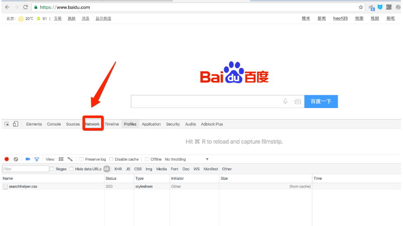

## http协议的分析

目标地址：www.sina.com 

我们随意点击一个记录，然后点击消息头即可看到消息头的信息：

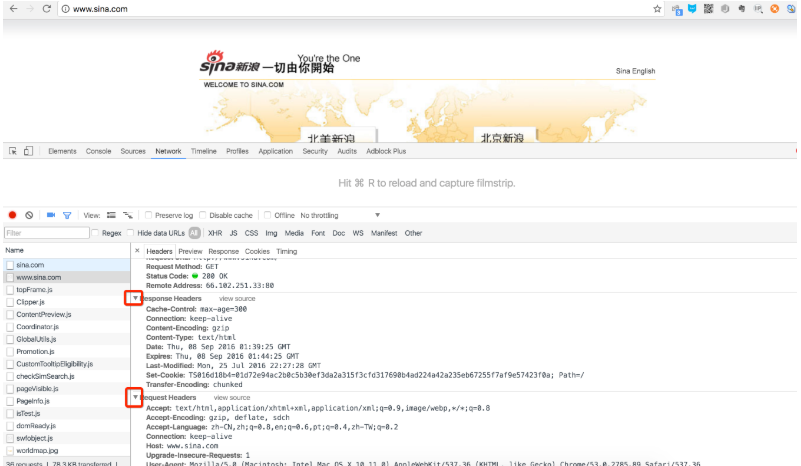

当我们在地址栏输入www.sina.com 时，浏览器将显示新浪的首页。在这个过程中，浏览器都干了哪些事情呢？通过Network的记录，我们就可以知道。在Network中，找到www.sina.com那条记录，点击，右侧将显示Request Headers，点击右侧的view source，我们就可以看到浏览器发给新浪服务器的请求：

###  浏览器请求

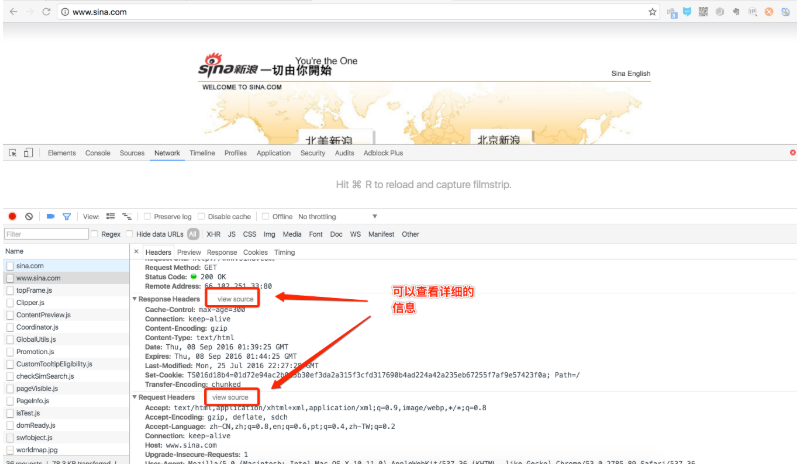

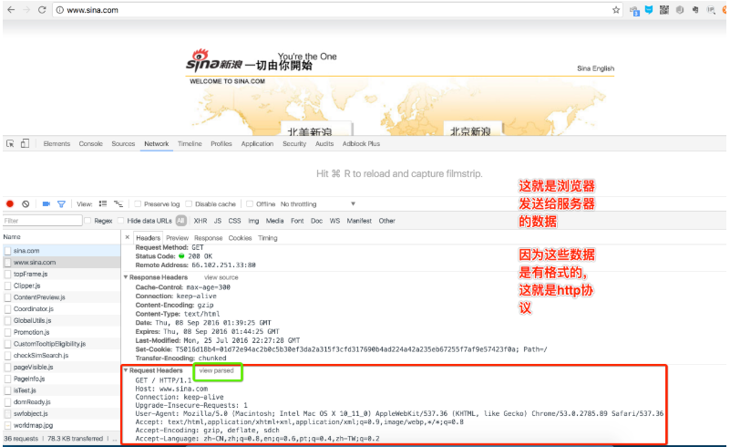


+ HTTP请求报文

HTTP请求报文由3部分组成（请求行+请求头+请求体）：


最主要的头两行分析如下，第一行：

```
    GET / HTTP/1.1
```

GET表示一个读取请求，将从服务器获得网页数据，/表示URL的路径，URL总是以/开头，/就表示首页，最后的HTTP/1.1指示采用的HTTP协议版本是1.1。目前HTTP协议的版本就是1.1，但是大部分服务器也支持1.0版本，主要区别在于1.1版本允许多个HTTP请求复用一个TCP连接，以加快传输速度。

从第二行开始，每一行都类似于Xxx: abcdefg：

```
    Host: www.sina.com
```

表示请求的域名是www.sina.com。如果一台服务器有多个网站，服务器就需要通过Host来区分浏览器请求的是哪个网站。

###  服务器响应

继续往下找到 Response Headers，点击 view source，显示服务器返回的原始响应数据：

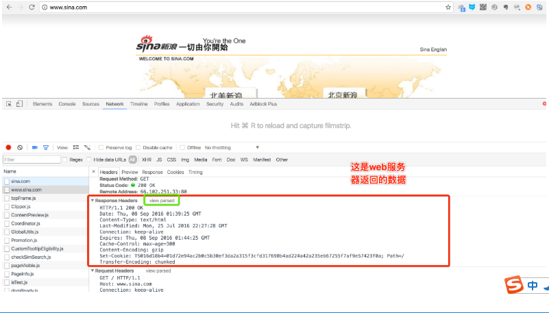

HTTP响应分为Header和Body两部分（Body是可选项），我们在Network中看到的Header最重要的几行如下：

```
    HTTP/1.1 200 OK
```

200表示一个成功的响应，后面的OK是说明。

```
    Content-Type: text/html
```

Content-Type指示响应的内容，这里是text/html表示HTML网页。

> 请注意，浏览器就是依靠Content-Type来判断响应的内容是网页还是图片，是视频还是音乐。浏览器并不靠URL来判断响应的内容，所以，即使URL是`http://www.baidu.com/meimei.jpg`，它也不一定就是图片。

HTTP响应的Body就是HTML源码，我们在菜单栏选择“视图”，“开发者”，“查看网页源码”就可以在浏览器中直接查看HTML源码：

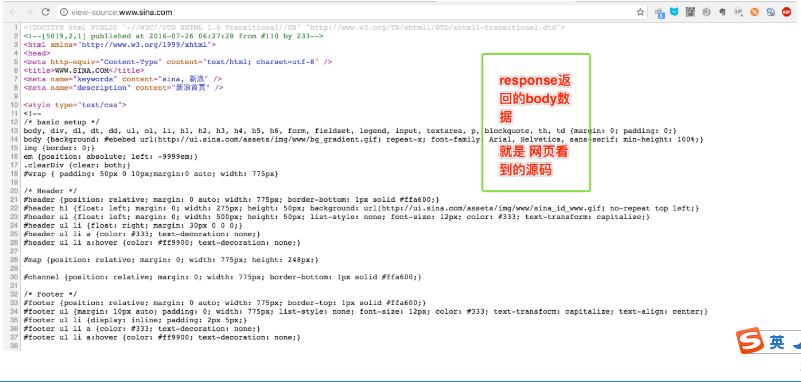

#### 浏览器解析过程

当浏览器读取到新浪首页的HTML源码后，它会解析HTML，显示页面，然后，根据HTML里面的各种链接，再发送HTTP请求给新浪服务器，拿到相应的图片、视频、Flash、JavaScript脚本、CSS等各种资源，最终显示出一个完整的页面。所以我们在Network下面能看到很多额外的HTTP请求。

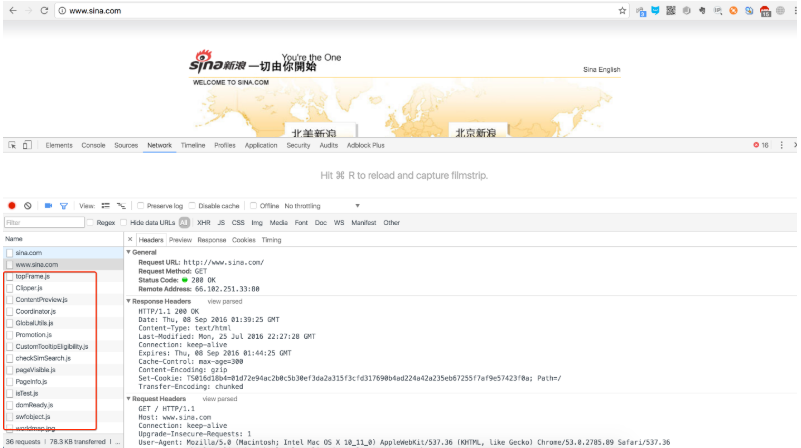


##  http协议总结

###  HTTP请求

跟踪了新浪的首页，我们来总结一下HTTP请求的流程：

####  步骤1：浏览器首先向服务器发送HTTP请求，请求包括：

> 方法：GET还是POST，GET仅请求资源，POST会附带用户数据；
>
> 路径：/full/url/path；
>
> 域名：由Host头指定：Host: www.sina.com
>
> 以及其他相关的Header；
>
> 如果是POST，那么请求还包括一个Body，包含用户数据

####  步骤2：服务器向浏览器返回HTTP响应，响应包括：

> 响应代码：200表示成功，3xx表示重定向，4xx表示客户端发送的请求有错误，5xx表示服务器端处理时发生了错误；
>
> 响应类型：由Content-Type指定；
>
> 以及其他相关的Header；
>
> 通常服务器的HTTP响应会携带内容，也就是有一个Body，包含响应的内容，网页的HTML源码就在Body中。

####  步骤3：如果浏览器还需要继续向服务器请求其他资源，比如图片，就再次发出HTTP请求，重复步骤1、2。

> Web采用的HTTP协议采用了非常简单的请求-响应模式，从而大大简化了开发。当我们编写一个页面时，我们只需要在HTTP请求中把HTML发送出去，不需要考虑如何附带图片、视频等，浏览器如果需要请求图片和视频，它会发送另一个HTTP请求，因此，一个HTTP请求只处理一个资源(此时就可以理解为TCP协议中的短连接，每个链接只获取一个资源，如需要多个就需要建立多个链接)

HTTP协议同时具备极强的扩展性，虽然浏览器请求的是`http://www.sina.com`的首页，但是新浪在HTML中可以链入其他服务器的资源，比如``，从而将请求压力分散到各个服务器上，并且，一个站点可以链接到其他站点，无数个站点互相链接起来，就形成了World Wide Web，简称WWW。

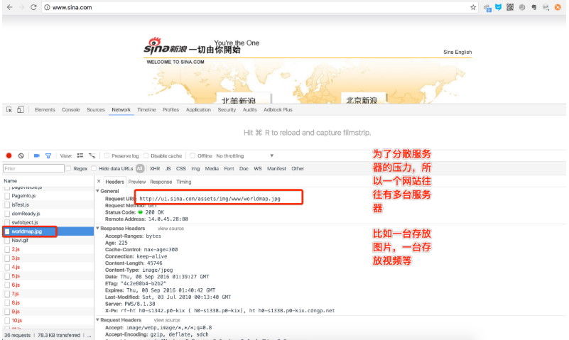

###  HTTP格式

每个HTTP请求和响应都遵循相同的格式，一个HTTP包含Header和Body两部分，其中Body是可选的。

HTTP协议是一种文本协议，所以，它的格式也非常简单。

####  HTTP GET请求的格式：

```
    GET /path HTTP/1.1
    Header1: Value1
    Header2: Value2
    Header3: Value3
```

每个Header一行一个，换行符是\r\n。

####  HTTP POST请求的格式：

```
    POST /path HTTP/1.1
    Header1: Value1
    Header2: Value2
    Header3: Value3

    body data goes here...
```

当遇到连续两个\r\n时，Header部分结束，后面的数据全部是Body。

####  HTTP响应的格式：

````
    200 OK
    Header1: Value1
    Header2: Value2
    Header3: Value3

    body data goes here...


HTTP响应如果包含body，也是通过\r\n\r\n来分隔的。

请再次注意，Body的数据类型由Content-Type头来确定，如果是网页，Body就是文本，如果是图片，Body就是图片的二进制数据。

当存在Content-Encoding时，Body数据是被压缩的，最常见的压缩方式是gzip，所以，看到Content-Encoding: gzip时，需要将Body数据先解压缩，才能得到真正的数据。压缩的目的在于减少Body的大小，加快网络传输。
````


### 案例：http下载器

使用socket向百度发送请求,获取百度首页代码，保存到本地

```python
# coding=utf-8

# 客户端建立socket套接字
# 引入socket模块
import socket

# 实例化一个套接字，2个参数分别是： IPV4、TCP 协议
s = socket.socket(socket.AF_INET, socket.SOCK_STREAM)
# 建立连接，2个参数是： 网址、端口
s.connect(('www.baidu.com', 80))
# 向服务器发送请求,传递的参数是：1.请求方式 2.地址 3.链接方式（open or close）
# 注：‘GET / HTTP’这里的‘/’是跟目录的意思
s.send(b'GET / HTTP/1.1\r\nHost:www.baidu.com\r\nConnection: close\r\n\r\n')

# 开始接受服务器传来的数据
buffer = []  # 新建一个空列表，buffer即缓存的意思
while True:  # 【降一级，防止出现不可控错误？】
    d = s.recv(1024)  # 每次最多接收1k字节
    if d:  # 如果能正常接收到d（即d不为空）
        buffer.append(d)
    else:
        break
data = b''.join(buffer)  # 组合传来的（列表格式的）数据为字符串(b)格式

# 关闭文件
s.close()

# 开始处理数据
# 分离网页头部与html,注：头部信息是网络传输时的标识信息，通常不需要展示出这部分
header, html = data.split(b'\r\n\r\n', 1)
# 以utf-8解码为正常文本
print(header.decode('utf-8'))
# 新建文件，将接收到的数据接入文件内
with open('baidu.html', 'wb')as f:
    f.write(html)
```

## Web静态服务器

### 显示固定的页面

```python
#coding=utf-8
import socket


def handle_client(client_socket):
    """为一个客户端进行服务"""
    recv_data = client_socket.recv(1024).decode("utf-8")
    request_header_lines = recv_data.splitlines()
    for line in request_header_lines:
        print(line)

    # 组织相应 头信息(header)
    response_headers = "HTTP/1.1 200 OK\r\n"  # 200表示找到这个资源
    response_headers += "\r\n"  # 用一个空的行与body进行隔开
    # 组织 内容(body)
    response_body = "hello world"

    response = response_headers + response_body
    client_socket.send(response.encode("utf-8"))
    client_socket.close()


def main():
    """作为程序的主控制入口"""

    server_socket = socket.socket(socket.AF_INET, socket.SOCK_STREAM)
    # 设置当服务器先close 即服务器端4次挥手之后资源能够立即释放，这样就保证了，下次运行程序时 可以立即绑定7788端口
    server_socket.setsockopt(socket.SOL_SOCKET, socket.SO_REUSEADDR, 1)
    server_socket.bind(("", 7788))
    server_socket.listen(128)
    while True:
        client_socket, client_addr = server_socket.accept()
        handle_client(client_socket)


if __name__ == "__main__":
    main()
```

#### 服务器端

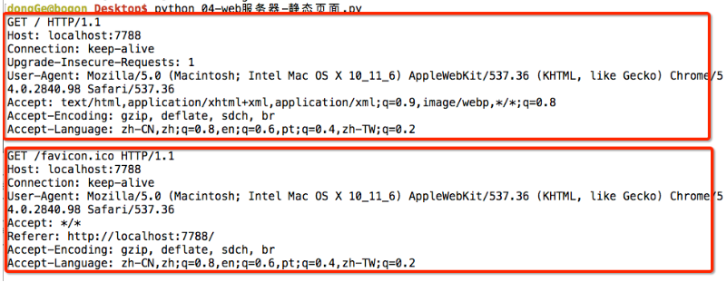

#### 客户端


