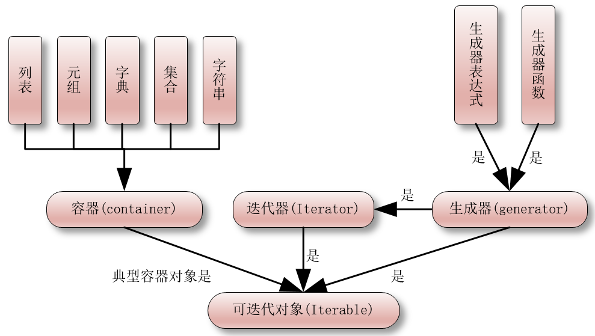

## 基础概念

在讲迭代之前，先搞清楚这些名词：

- 循环（loop），指的是在满足条件的情况下，重复执行同一段代码。比如，while 语句。
- 迭代（iterate），指的是按照某种顺序逐个访问列表中的每一项。比如，for 语句。
- 递归（recursion），指的是一个函数不断调用自身的行为。比如，以编程方式输出著名的斐波纳契数列。
- 遍历（traversal），指的是按照一定的规则访问树形结构中的每个节点，而且每个节点都只访问一次。

```python
arr = ['a', 'b', 'c', 'd']  
  
print('---while 循环---')  
index = 0  
while index < len(arr):  
    print(arr[index])  
    index += 1  
  
print('---for 遍历---')  
for item in arr:  
    print(item)  
  
print('---for 循环---')  
for index in range(len(arr)):  
    print(arr[index])  
  
print('---递归---')  
  
  
def func(arr, index):  
    if index >= len(arr):  
        return  
    print(arr[index])  
    index += 1  
    func(arr, index)  
  
  
func(arr, 0)
```

迭代的话题如果要说起来，会很多，这里介绍比较初级的。


### 可迭代对象（iterable）

> 生成器（英文：generator）是一个非常迷人的东西，也常被认为是 Python 的高级编程技能。

什么是可迭代对象，简单的理解就是可以用作 for 循环上的一些对象就是可迭代对象。常见的可以迭代对象有哪些呢？

列表、元组、字典、集合字符串和 open() 打开的文件

从代码角度来说，对象内部实现了 `__iter__()` 方法或者实现了 `__getitem__()` 的方法。

简单理解：可以被 for 语句遍历的对象都是可迭代对象


### 迭代器(iterator)

迭代器是相对于可迭代对象(iterable)来说的，迭代器是继承了可迭代对象的。它相对于It而able而言，它实现了 `__iter__()` 和 `__next__()` 方法。另外，迭代器不会一次性把所有的元素都加载到内存中，只是在需要的时候才返回结果。可以把一个可迭代对象通过一定的方法转变为迭代器。

```python
pro_lau = ['Python', 'Java', 'C++']  # 列表是一个可迭代对象  
  
a = iter(pro_lau)  # 由可迭代对象的iter方法返回一个迭代器
```


### 生成器(generator)

生成器就是一种特殊的迭代器，可以由关键字 yield 来实现；同时迭代器并不是生成器，因为迭代器并没有生成器的部分功能，如数据传入功能。

总之迭代器和生成器在一定的功能上具有很高的相似性，都能起到节约内存的作用——就这个特点，就值得我们去学习，然后应用到编程中。




## 迭代器

### 判断可以迭代对象

可以使用 `isinstance()` 判断一个对象是否是 `Iterable` 对象：

> `isinstance()` 函数来判断一个对象是否是一个已知的类型，类似 type()。

```python
In [50]: from collections import Iterable

In [51]: isinstance([], Iterable)
Out[51]: True

In [52]: isinstance({}, Iterable)
Out[52]: True

In [53]: isinstance('abc', Iterable)
Out[53]: True

In [54]: isinstance(100, Iterable)
Out[54]: False
```

### iter() 函数与 next() 函数

list、tuple 等都是可迭代对象，我们可以通过 `iter()` 函数获取这些可迭代对象的迭代器。然后我们可以对获取到的迭代器不断使用next()函数来获取下一条数据。`iter()` 函数实际上就是调用了可迭代对象的 `__iter__` 方法。

```python
>>> li = [11, 22, 33, 44, 55]
>>> li_iter = iter(li)
>>> next(li_iter)
11
>>> next(li_iter)
22
>>> next(li_iter)
33
>>> next(li_iter)
44
>>> next(li_iter)
55
>>> next(li_iter)
Traceback (most recent call last):
  File "<stdin>", line 1, in <module>
StopIteration
>>>
```

注意，当我们已经迭代完最后一个数据之后，再次调用 next() 函数会抛出 `StopIteration` 的异常，来告诉我们所有数据都已迭代完成，不用再执行 next() 函数了。

### 迭代对象和迭代器区别

可迭代对象 ：实现了 `__iter__()` 这个魔法方法
迭代器：实现了 `__next__` 和 `__iter__` 这两个魔法方法

​ `__next__` ：返回下一个可用的元素，如果没有元素了，抛出 StopIteration异常
​ `__iter__` ：返回 self，以便在应该使用可迭代对象的地方使用迭代器，例如在 for 循环中。


## 自定义迭代器

迭代器是用来帮助我们 **记录每次迭代访问到的位置** ，当我们对迭代器使用next()函数的时候，迭代器会向我们返回它所记录位置的下一个位置的数据。

实际上，在使用next()函数的时候，调用的就是迭代器对象的 `__next__` 方法。所以，我们要想构造一个迭代器，就要实现它的 `__next__` 方法。但这还不够，python 要求迭代器本身也是可迭代的，所以我们还要为迭代器实现 `__iter__` 方法，而 `__iter__` 方法要返回一个迭代器，迭代器自身正是一个迭代器，所以迭代器的 `__iter__` 方法返回自身即可。

一个实现了 `__iter__` 方法和 `__next__` 方法的对象，就是迭代器。

`list`、`tuple`、`set`、`dict` 对象有 `__iter__()` 方法，标着他们能够迭代。这些类型都是 Python 中固有的，我们能不能自己写一个对象，让它能够迭代呢？

当然呢！要不然 python 怎么强悍呢。

**案例-自定义迭代器** 
```python
"""  
自定义一个 MyRange 类。实现 range 的功能。  
但只接收两个参数，起始值与步长，实现无限增长(for 实现死循环)  
  
__next__  
__iter__  
"""  
  
  
class MyRange:  
    """ range """  
  
    def __init__(self, start=0, step=1):  
        self.start = start  
        self.step = step  
        self.value = 0  
  
    def __iter__(self):  
        return self  
  
    def __next__(self):  
        """ 迭代规则 """        
        self.value = self.start  
        # 没有达到结束值  
        self.start = self.start + self.step  
        return self.value  
  
    def reset(self):  
        self.value = 0  
  
  
my_range = MyRange(5, 2)  
  
for i in my_range:  
    print(i)
```

以上代码的含义，是自己仿写了拥有 `range()` 的对象，这个对象是可迭代的。分析如下：

类 `MyRange` 的初始化方法 `__init__()` 就不再讲解了。

`__iter__()` 是类中的核心，它返回了迭代器本身。一个实现了`__iter__()`方法的对象，即意味着其实可迭代的。

含有 `next()` 的对象，就是迭代器，并且在这个方法中，在没有元素的时候要发起 `StopIteration()` 异常。

如果对以上类的调用换一种方式：

```python
x = MyRange(7)
print(list(x))
print("x.next()==>", x.next())
```

`print(list(x))` 将对象返回值都装进了列表中并打印出来，这个正常运行了。此时指针已经移动到了迭代对象的最后一个，`next()` 方法没有检测也不知道是不是要停止了，它还要继续下去，当继续下一个的时候，才发现没有元素了，于是返回了 `StopIteration()`。

### for循环的本质

`for item in Iterable` 循环的本质就是先通过 `iter()` 函数获取可迭代对象 `Iterable` 的迭代器，然后对获取到的迭代器不断调用 next() 方法来获取下一个值并将其赋值给 item，当遇到 `StopIteration` 的异常后循环结束。

### 迭代器应用场景

迭代器最核心的功能就是可以通过 next() 函数的调用来返回下一个数据值。如果每次返回的数据值不是在一个已有的数据集合中读取的，而是通过程序按照一定的规律计算生成的，那么也就意味着可以不用再依赖一个已有的数据集合，也就是说不用再将所有要迭代的数据都一次性缓存下来供后续依次读取，这样可以节省大量的存储（内存）空间。

举个例子，比如，数学中有个著名的斐波拉契数列（Fibonacci），数列中第一个数为0，第二个数为1，其后的每一个数都可由前两个数相加得到：

0, 1, 1, 2, 3, 5, 8, 13, 21, 34, ...

现在我们想要通过for...in...循环来遍历迭代斐波那契数列中的前n个数。那么这个斐波那契数列我们就可以用迭代器来实现，每次迭代都通过数学计算来生成下一个数。

```python
def fib(n):
    num = 0
    a, b = 0, 1
    while num < n:
        print(a)
        a, b = b, a + b
        num += 1
    print()

fib(8)
```

### 可迭代对象的转化

除了for循环能接收可迭代对象，list、tuple等也能接收。

```python
li = list(FibIterator(15))
print(li)
tp = tuple(FibIterator(6))
print(tp)
```


### 案例-迭代文件

在 python 中, 很多对象都是迭代器, 例如文件对象.

```python
file = open('剑来.txt', encoding='utf-8')  
print(file.__next__())  
print(file.__next__())  
print(file.__next__())  
print(file.__next__())  
print(file.__next__())
```

## 生成器

生成器（英文：generator）是一个非常迷人的东西，也常被认为是 Python 的高级编程技能。

我们在实现一个迭代器时，关于当前迭代到的状态需要我们自己记录，进而才能根据当前状态生成下一个数据。为了达到记录当前状态，并配合 `next()` 函数进行迭代使用，我们可以采用更简便的语法，即 **生成器(generator)。生成器是一类特殊的迭代器**。

###  生成器推导式

```python
>>> my_generator = (x * x for x in range(4))
```

这是不是跟列表解析很类似呢？仔细观察，它不是列表，如果这样的得到的才是列表：

```python
>>> my_list = [x * x for x in range(4)]
```

以上两的区别在于是 `[]` 还是 `()`，虽然是细小的差别，但是结果完全不一样。

创建 my_list 和 my_generator 的区别仅在于最外层的 `[ ]` 和 `( )` ， my_list 是一个列表，而 my_generator 是一个生成器。我们可以直接打印出列表 L 的每一个元素，而对于生成器 my_generator，我们可以按照迭代器的使用方法来使用，即可以通过 `next()` 函数、for循环、list() 等方法使用。

```python
In [19]: next(my_generator)
Out[19]: 0

In [20]: next(my_generator)
Out[20]: 2

In [21]: next(my_generator)
Out[21]: 4

In [22]: next(my_generator)
Out[22]: 6

In [23]: next(my_generator)
Out[23]: 8

In [24]: next(my_generator)
---------------------------------------------------------------------------
StopIteration                             Traceback (most recent call last)
<ipython-input-24-380e167d6934> in <module>()
----> 1 next(my_generator)

StopIteration:

In [25]:
In [26]: my_generator = ( x*2 for x in range(5))

In [27]: for x in my_generator:
   ....:     print(x)
   ....:     
0
2
4
6
8

In [28]:
```

难道生成器就是把列表解析中的 `[]` 换成 `()` 就行了吗？这仅仅是生成器的一种表现形式和使用方法罢了，仿照列表解析式的命名，可以称之为“生成器解析式”（或者：生成器推导式、生成器表达式）。

生成器解析式是有很多用途的，在不少地方替代列表，是一个不错的选择。特别是针对大量值的时候。列表占内存较多，迭代器（生成器是迭代器）的优势就在于少占内存，因此无需将生成器（或者说是迭代器）实例化为一个列表，直接对其进行操作，方显示出其迭代的优势。

### 生成器定义

> 通过生成器解析式得到的生成器，掩盖了生成器的一些细节，并且适用领域也有限。下面就要剖析生成器的内部，深入理解这个魔法工具。

yield 这个词在汉语中有“生产、出产”之意，在 Python 中，它作为一个关键词（你在变量、函数、类的名称中就不能用这个了），是生成器的标志。

```python
>>> def g():
...     yield 0
...     yield 1
...     yield 2
... 
>>> g
<function g at 0xb71f3b8c>
```

建立了一个非常简单的函数，跟以往看到的函数唯一不同的地方是用了三个 yield 语句。然后进行下面的操作：

```python
>>> ge = g()
>>> ge
<generator object g at 0xb7200edc>
>>> type(ge)
<type 'generator'>
```

上面建立的函数返回值是一个生成器(generator)类型的对象。

```python
>>> dir(ge)
['__class__', '__delattr__', '__doc__', '__format__', '__getattribute__', '__hash__', '__init__', '__iter__', '__name__', '__new__', '__reduce__', '__reduce_ex__', '__repr__', '__setattr__', '__sizeof__', '__str__', '__subclasshook__', 'close', 'gi_code', 'gi_frame', 'gi_running', 'next', 'send', 'throw']
```

在这里看到了`__iter__()` 和 `next()`，说明它是迭代器。既然如此，当然可以：

```python
>>> ge.next()
0
>>> ge.next()
1
>>> ge.next()
2
>>> ge.next()
Traceback (most recent call last):
    
  File "<stdin>", line 1, in <module>
StopIteration
```

从这个简单例子中可以看出，那个含有 yield 关键词的函数返回值是一个生成器类型的对象，这个生成器对象就是迭代器。

我们把含有 yield 语句的函数称作生成器。生成器是一种用普通函数语法定义的迭代器。通过上面的例子可以看出，这个生成器（也是迭代器），在定义过程中并没有像上节迭代器那样写 `__inter__()` 和 `next()`，而是只要用了 yield 语句，那个普通函数就神奇般地成为了生成器，也就具备了迭代器的功能特性。

yield 语句的作用，就是在调用的时候返回相应的值。详细剖析一下上面的运行过程：

1. `ge = g()`：除了返回生成器之外，什么也没有操作，任何值也没有被返回。
2. `ge.next()`：直到这时候，生成器才开始执行，遇到了第一个 yield 语句，将值返回，并暂停执行（有的称之为挂起）。
3. `ge.next()`：从上次暂停的位置开始，继续向下执行，遇到 yield 语句，将值返回，又暂停。
4. `ge.next()`：重复上面的操作。
5. `ge.next()`：从上面的挂起位置开始，但是后面没有可执行的了，于是 `next()` 发出异常。

从上面的执行过程中，发现 yield 除了作为生成器的标志之外，还有一个功能就是返回值。那么它跟 return 这个返回值有什么区别呢？


### yield

为了弄清楚 yield 和 return 的区别，我们写两个没有什么用途的函数：

```python
>>> def r_return(n):
...     print("进入了函数.")
...     while n > 0:
...         print("返回内容之前")
...         return n
...         n -= 1
...         print("返回内容之后")
... 
>>> rr = r_return(3)
进入了函数.
返回内容之前
>>> rr
3
```

从函数被调用的过程可以清晰看出，`rr = r_return(3)`，函数体内的语句就开始执行了，遇到 return，将值返回，然后就结束函数体内的执行。所以 return 后面的语句根本没有执行。

下面将 return 改为 yield：

```python
>>> def y_yield(n):
...     print("进入了函数.")
...     while n > 0:
...         print("返回内容之前")
...         yield n
...         n -= 1
...         print("返回内容之后")
... 
>>> yy = y_yield(3)    #没有执行函数体内语句
>>> yy.next()          #开始执行
进入了函数.
返回内容之前
3                      #遇到 yield，返回值，并暂停
>>> yy.next()          #从上次暂停位置开始继续执行
返回内容之后
返回内容之前
2                      #又遇到 yield，返回值，并暂停
>>> yy.next()          #重复上述过程
返回内容之后
返回内容之前
1
>>> yy.next()
返回内容之后            #没有满足条件的值，抛出异常
Traceback (most recent call last):
  File "<stdin>", line 1, in <module>
StopIteration
```

结合注释和前面对执行过程的分析，读者一定能理解 yield 的特点了，也深知与 return 的区别了。

一般的函数，都是止于 return。作为生成器的函数，由于有了 yield，则会遇到它挂起，如果还有 return，遇到它就直接抛出 `SoptIteration` 异常而中止迭代。

经过上面的各种例子，已经明确，一个函数中，只要包含了 yield 语句，它就是生成器，也是迭代器。这种方式显然比前面写迭代器的类要简便多了。但，并不意味着上节的就被抛弃。是生成器还是迭代器，都是根据具体的使用情景而定。

### 生成器接受参数

```python
def simple_coroutine():
    print('生成器启动')
    n = yield
    print('生成器接收到的参数为 %s' % n)

my_coro = simple_coroutine()
next(my_coro)
my_coro.send("hello")
```

当执行到 `my_coro.next()` 的时候，生成器开始执行，在内部遇到了 `yield` 挂起。注意在生成器函数中，`n = yield` 中的 `n = yield` 是一个表达式，并将接收到的结果赋值给 n。

当执行 `my_coro.send("hello")` 的时候，原来已经被挂起的生成器（函数）又被唤醒，开始执行 `n = yield `，也就是讲 send() 方法发送的值返回。这就是在运行后能够为生成器提供值的含义。

如果接下来再执行 `next(my_coro)` 会怎样？

什么也没有，其实就是返回了 None。按照前面的叙述，读者可以看到，这次执行 `r.next()`，由于没有传入任何值，yield 返回的就只能是 None.

> 最后一句，你在编程中，不用生成器也可以。

生成器只会记录规则，不会记录值

**案例:协程计算平均值** 

```python
def averager():
    total = 0.0
    count = 0
    average = None
    while True:
        term = yield average
        total += term
        count += 1
        average = total / count


coro_avg = averager()
next(coro_avg)
print(coro_avg.send(10))
print(coro_avg.send(30))
print(coro_avg.send(5))
```


## 总结

生成器与普通函数的区别：生成器返回的是记录与规则，普通函数返回结果
