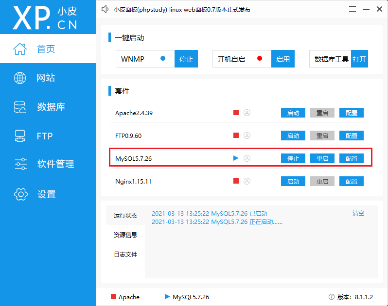
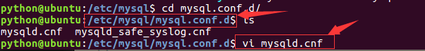
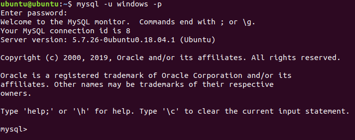

## 数据库安装

### windows 安装

windows 不建议从官方下载安装包进行安装，那种方式安装配置非常复杂。并且服务器一般是在 Linux 环境安装，而 Windows 环境下顶多是作为开发环境或者学习环境，当然是怎么简单怎么来。

在这里我推荐使用 phpstudy 进行安装，只要用鼠标点几下就能按照，需要使用的时候，启动一下即可。

1、下载小皮软件，解压进行安装， https://www.xp.cn/download.html 
2、在软件中启动数据库



3、使用工具链接本地地址与默认的端口，默认的用户密码都为 root ，之后就可以进行操作了。

### Linux 安装

环境前提: Ubunru 18.04 LTS

在 Ubuntu 上安装 MySQL，最简单的方式是在线安装。只需要几行简单的命令（ `#` 号后面是注释）：

```shell
# 安装 MySQL 服务端、核心程序
sudo apt install mysql-server

# 安装 MySQL 客户端
sudo apt-get install mysql-client
```

在安装过程中会提示确认输入 YES，设置 root 用户密码（之后也可以修改）等，稍等片刻便可安装成功。

安装结束后，用命令验证是否安装并启动成功：

```shell
sudo ps -ef | grep mysql 
```

当前使用的ubuntu镜像中已经安装好了mysql服务器端，无需再安装，并且设置成了开机自启动

服务器用于接收客户端的请求、执行 sql 语句、管理数据库

服务器端一般以服务方式管理，名称为 mysql

**MySQL启动与停止与重启**

启动服务

```shell
sudo service mysql start
```

查看进程中是否存在mysql服务

```
ps ajx|grep mysql
```


停止服务

```
sudo service mysql stop
```

重启服务

```
sudo service mysql restart 
```

**配置**

配置文件目录为 /etc/mysql/mysql.cnf 


进入 conf.d 目录，打开 mysql.cnf，发现并没有配置

进入mysql.conf.d目录，打开mysql.cnf，可以看到配置项

```shell
sudo vim /etc/mysql/mysql.conf.d/mysqld.cnf
```



主要配置项如下

```
bind-address 表示服务器绑定的 ip，默认为 127.0.0.1

port 表示端口，默认为3306

datadir 表示数据库目录，默认为 /var/lib/mysql

general_log_file 表示普通日志，默认为 /var/log/mysql/mysql.log

log_error 表示错误日志，默认为 /var/log/mysql/error.log
```

### 命令行连接

在工作中主要使用命令操作方式，要求熟练编写

**1). 打开 MySQL** 

打开终端，运行命令

```
# 启动 MySQL 服务
sudo service mysql start             

# 使用 root 用户登录，然后输入密码
mysql -u root
```

连接成功后如下图



退出登录

```
quit 和 exit
或
ctrl+d
```

登录成功后，输入如下命令查看效果

```
查看版本：select version();
显示当前时间：select now();
```

**2). 查看数据库** 

使用命令 `show databases;`，查看有哪些数据库（注意不要漏掉分号 `;`）：

```sql
show databases;
```

**3). 使用数据库** 

选择连接其中一个数据库，语句格式为 `use <数据库名>`，这里可以不用加分号：

```sql
use 数据库名;
```

查看当前使用的数据库

```sql
select database();
```

**4). 查看表** 

使用命令 `show tables;` 查看数据库中有哪些表（**注意不要漏掉“;”**）：

```sql
show tables;
```

> 查看表结构：

```
desc 表名;
```

**5). 退出**

使用命令 `quit` 或者 `exit` 退出 `MySQL`。

