## 数据库介绍

### 数据存储

远古时期：结绳记事 -> 甲骨 -> 竹简 -> 图书

**传统记录数据的缺点:**

- 不易保存
- 备份困难
- 查找不便

**现代化手段----文件**

- 使用简单，例如 python 中的 open 可以打开文件，用 read/write 对文件进行读写，close 关闭文件
- 对于数据容量较大的数据，不能够很好的满足，而且性能较差
- 不易扩展

**现代化手段----数据库** 

- 持久化存储
- 读写速度极高
- 保证数据的有效性
- 对程序支持性非常好，容易扩展

真实的仓库是这样的:


我们看到的是这个样子的

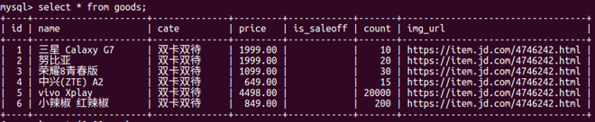

顾客看到的是这个样子的:


#### 数据库

数据库就是一种特殊的文件，其中存储着需要的数据

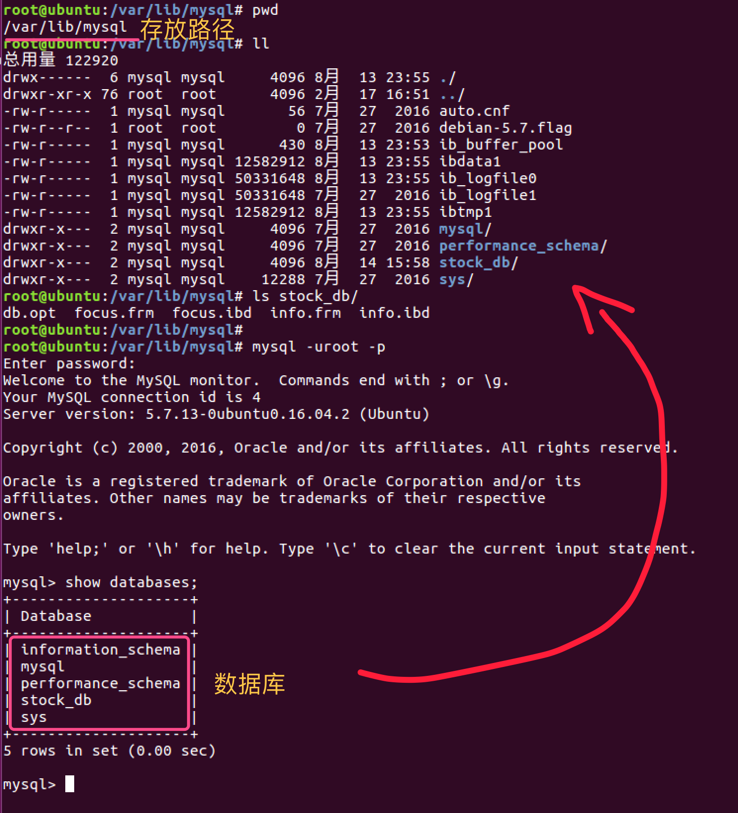

**关系型数据库核心元素**

- 数据行(记录)
- 数据列(字段)
- 数据表(数据行的集合)
- 数据库(数据表的集合)


#### 数据库和 `SQL` 概念

数据库（`Database`）是按照数据结构来组织、存储和管理数据的仓库，它的产生距今已有六十多年。随着信息技术和市场的发展，数据库变得无处不在：它在电子商务、银行系统等众多领域都被广泛使用，且成为其系统的重要组成部分。

数据库用于记录数据，使用数据库记录数据可以表现出各种数据间的联系，也可以很方便地对所记录的数据进行增、删、改、查等操作。

结构化查询语言(`Structured Query Language`)简称 `SQL`，是上世纪 70 年代由 IBM 公司开发，用于对数据库进行操作的语言。更详细地说，`SQL` 是一种数据库查询和程序设计语言，用于存取数据以及查询、更新和管理关系数据库系统，同时也是数据库脚本文件的扩展名。


### SQL

> Structured Query Language

`SQL` 是结构化查询语言，是一种用来操作 `RDBMS` 的数据库语言，当前关系型数据库都支持使用 SQL 语言进行操作,也就是说可以通过 `SQL` 操作 oracle, sql server, mysql, sqlite 等等所有的关系型的数据库

- SQL语句主要分为：
  - **DQL：数据查询语言，用于对数据进行查询，如 select** 
  - **DML：数据操作语言，对数据进行增加、修改、删除，如insert、udpate、delete** 
  - TPL：事务处理语言，对事务进行处理，包括 begin transaction、commit、rollback
  - DCL：数据控制语言，进行授权与权限回收，如 grant、revoke
  - DDL：数据定义语言，进行数据库、表的管理等，如 create、drop
  - CCL：指针控制语言，通过控制指针完成表的操作，如declare cursor
- 对于web程序员来讲，重点是数据的 crud（增删改查），必须熟练编写DQL、DML，能够编写DDL完成数据库、表的操作，其它语言如TPL、DCL、CCL了解即可
- SQL 是一门特殊的语言,专门用来操作关系数据库
- 不区分大小写


#### MySQL 介绍

`MySQL` 是一个 DBMS（数据库管理系统），由瑞典 MySQLAB 公司开发，目前属于 Oracle (甲骨文)公司，`MySQL` 是最流行的关系型数据库管理系统（关系数据库，是建立在关系数据库模型基础上的数据库，借助于集合代数等概念和方法来处理数据库中的数据）。由于其体积小、速度快、总体拥有成本低，尤其是开放源码这一特点，一般中小型网站的开发者都选择 `MySQL` 作为网站数据库。`MySQL` 使用 `SQL` 语言进行操作。

**概念对比**

- DB：数据库，存放数据的容器
- DBMS：数据库管理系统，用于管理DB
- SQL：结构化查询语言，是关系型数据库的通用语言

**常用的DBMS**

- MySQL
- Oracle
- SQL Server

**特点** 

- 点击查看[MySQL官方网站](http://www.mysql.com/) 
- MySQL是一个关系型数据库
- MySQL开源免费
- 支持多种操作系统，如 Linux、Windows、AIX、FreeBSD、HP-UX、MacOS、NovellNetware、OpenBSD、OS/2 Wrap、Solaris等
- 为多种编程语言提供了API，如 C、C++、Python、Java、Perl、PHP、Eiffel、Ruby 等

> 开源 免费 不要钱 使用范围广,跨平台支持性好,提供了多种语言调用的 API
>
> 是学习数据库开发的首选

**学习要求**

- 熟练掌握数据增删改查相关的 SQL 语句编写
- 在 Python代码中操作数据就是通过 SQL 语句来操作数据


## 定义与修改

> `Data Definition Language[DDL]`

本节内容中，我们将学习并实践如何对数据库表和表中的内容做修改，删除，重命名等操作。

**知识点**

- 数据库操作
- 数据表操作
- 更新和删除数据

### 数据库

#### 创建库

**语法：**

```sql
CREATE DATABASE IF NOT EXISTS python CHARACTER SET 'utf8mb4'; -- 设置默认字符集为utf8
```

创建一个数据库，给它一个名字，比如 `python`，以后的几次操作也是对 `python` 这个数据库进行操作。 语句格式为 `CREATE DATABASE <数据库名字>;`，（注意不要漏掉分号 `;`），前面的 CREATE DATABASE 也可以使用小写，具体命令为：

```sql
-- create database 数据库名 charset=utf8;
-- 例：
create database python charset=utf8;
```

创建成功后输入命令 `show databases;` （注意不要漏掉`;`）检查一下：

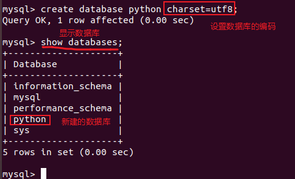

在大多数系统中，SQL 语句都是不区分大小写的，因此以下语句都是合法的：

```
CREATE DATABASE python;
create database python;
CREATE database python;
create DAtabaSE python;
```

但是出于严谨，而且便于区分保留字（**保留字(reserved word)：指在高级语言中已经定义过的字，使用者不能再将这些字作为变量名或过程名使用。**）和变量名，我们把保留字大写，把变量和数据小写。

#### 选择数据库

接下来的操作，就在刚才创建的 `python` 中进行，由于一个系统中可能会有多个数据库，要确定当前是对哪一个数据库操作，使用语句 `use <数据库名字>`：

```
use python;
```

如图显示，则连接成功：

```
mysql> use python;
Database changed
mysql> 
```

输入命令 `show tables;` 可以查看当前数据库里有几张表，现在`mysql_shiyan` 里还是空的：

```
mysql> show tables;
Empty set (0.00 sec)
```

#### 删除库

```mysql
DROP DATABASE IF EXISTS 库名;
```

#### 更改库的字符集

```mysql
ALTER DATABASE 库名 CHARACTER SET gbk;
```

### 数据表

数据表（`table`）简称表，它是数据库最重要的组成部分之一。数据库只是一个框架，表才是实质内容。

而一个数据库中一般会有多张表，这些各自独立的表通过建立关系被联接起来，才成为可以交叉查阅、一目了然的数据库。如下便是一张表：

| ID   | name | math | chinese | english | total |
| ---- | ---- | ---- | ------- | ------- | ----- |
| 01   | 张三 | 60   | 60      | 60      | 180   |
| 02   | 李四 | 60   | 60      | 60      | 180   |
| 03   | 王五 | 60   | 60      | 60      | 180   |

#### 新建数据表

**语法：** 

```mysql
CREATE TABLE 表名 (
    字段名 字段类型【(长度)】【约束】,
    字段名 字段类型【(长度)】【约束】,
    ...
    字段名 字段类型【(长度)】【约束】,
    字段名 字段类型【(长度)】【约束】
);
```

在数据库中新建一张表的语句格式为：

```sql
CREATE TABLE 表的名字(
	列名a 数据类型(数据长度),
    列名b 数据类型(数据长度)
);
```

我们新建一张表 `students`，包含姓名与学生的成绩，所以语句为：

```sql
create table students
(
    id      int primary key auto_increment,
    name    char(50),
    math    int,
    chinese int,
    english int,
    total   int
);
```

这时候再 `show tables;` 一下，可以看到刚才添加的两张表：

```
mysql> show tables;
+------------------+
| python		   |
+------------------+
| students         |
+------------------+
1 rows in set (0.00 sec)
```

#### 数据类型

在刚才新建表的过程中，我们提到了数据类型，`MySQL` 的数据类型和其他编程语言大同小异，下表是一些 `MySQL` 常用数据类型：

| 数据类型 | 大小(字节) | 用途             | 格式              |
| -------- | ---------- | ---------------- | ----------------- |
| INT      | 4          | 整数             |                   |
| FLOAT    | 4          | 单精度浮点数     |                   |
| DOUBLE   | 8          | 双精度浮点数     |                   |
| ENUM     | --         | 单选,比如性别    | ENUM('a','b','c') |
| SET      | --         | 多选             | SET('1','2','3')  |
| DATE     | 3          | 日期             | YYYY-MM-DD        |
| TIME     | 3          | 时间点或持续时间 | HH:MM:SS          |
| YEAR     | 1          | 年份值           | YYYY              |
| CHAR     | 0~255      | 定长字符串       |                   |
| VARCHAR  | 0~255      | 变长字符串       |                   |
| TEXT     | 0~65535    | 长文本数据       |                   |

整数除了 INT 外，还有 `TINYINT`、`SMALLINT`、`MEDIUMINT`、`BIGINT`。

**`CHAR` 和 `VARCHAR` 的区别:** CHAR 的长度是固定的，而 `VARCHAR` 的长度是可以变化的，比如，存储字符串 “abc"，对于 CHAR(10)，表示存储的字符将占 10 个字节(包括 7 个空字符)，而同样的 `VARCHAR(12)` 则只占用4个字节的长度，`增加一个额外字节来存储字符串本身的长度`，12 只是最大值，当你存储的字符小于 12 时，按实际长度存储。

**ENUM和SET的区别:** ENUM 类型的数据的值，必须是定义时枚举的值的其中之一，即单选，而 SET 类型的值则可以多选。

想要了解更多关于 MySQL 数据类型的信息，可以参考下面两篇博客。

- [MySQL 数据类型](http://www.cnblogs.com/bukudekong/archive/2011/06/27/2091590.html) 

##### 数值

- 整数

  - 分类

    - Tinyint，1个字节
    - Smallint，2个字节
    - Mediumint，3个字节
    - Int，4个字节
    - Bigint，8个字节

  - 符号

    - 默认有符号
    - 设置无符号的方法，使用 UNSIGNED 关键字

    ```sql
    CREATE TABLE t (
        t1 INT,
        t2 INT UNSIGNED
    );
    ```
  
- 长度
  
  - 长度表示最大显示宽度，当使用 zerofill 时，不够长度时，用0填空
    - 如果不配合zerofill，则整型的长度没用
  
- 越界
  
  - 如果插入的数值超出范围，则报 out of range 异常，并插入最接近的临界值
  
- 浮点数

  - Float，4个字节
  - Double，8个字节

- 定点数

  - DECIMAL(M,D)
    - M：整数+小数的位数
    - D：小数的位数
    - M默认为10, D默认为0

##### 字符型

- 较短文本
  - char：固定长度，性能高，不能节约空间
  - varchar：可变长度，性能低，能节约空间
  - 长度为最大长度
- 较长文本
  - text
- 二进制
  - binary：类似char，存储的是二进制
  - varbinary：类似varchar，存储的是二进制
  - Blob：存储数据量大的二进制，比如视频，图片

##### 日期型

- date：2018-09-26
- time：17:11:37
- year：2018
- datetime：2018-09-26 17:11:50，与时区无关，8个字节
- timestamp：20180926171211，受MySQL版本影响，与时区有关，4个字节

#### 删除表

```mysql
DROP TABLE IF EXISTS 表名;
```

## 数据表修改

先将 `sql资料`  中的 `change.sql` 运行，在服务器中产生数据。该文件会在 `python` 数据库中建 4 个表（department，employee，project，table_1），然后向其中插入数据。

输入命令开启 MySQL 服务并使用 root 用户登录：

```
# 打开 MySQL 服务
sudo service mysql start

# 使用 root 用户登录
mysql -u root
```

（`change.sql` 可以用 vim查看、编辑里面的文件。）

首先删除 python 数据库：

```
drop database python;
```

加载文件中的数据，需要在 MySQL 控制台中输入命令，完成实验准备：

```
source /home/ubuntu/Desktop/change.sql;
```


#### 表的修改

##### 重命名一张表

重命名一张表的语句有多种形式，以下 3 种格式效果是一样的：

```
RENAME TABLE 原名 TO 新名字;

ALTER TABLE 原名 RENAME 新名;

ALTER TABLE 原名 RENAME TO 新名;
```

进入数据库 python：

```
use python01000000
```

使用命令尝试修改 `table_1` 的名字为 `table_2` ：

```sql
RENAME TABLE table_1 TO table_2;
```

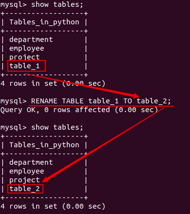

##### 删除一张表

删除一张表的语句，类似于刚才用过的删除数据库的语句，格式是这样的：

```
DROP TABLE 表名字;
```

比如我们把 `table_2` 表删除：

```
DROP TABLE table_2;
```

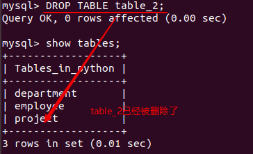

#### 列的修改

> 即对表结构的修改

对表结构的修改，是本节实验的难点，有时候一些小的错误会造成不可挽回的后果，所以请细心操作。另外需要注意，非必要情况不要修改表结构。


##### 增加一列

在表中增加一列的语句格式为：

```sql
ALTER TABLE 表名字 ADD COLUMN 列名字 数据类型 约束;
或：
ALTER TABLE 表名字 ADD 列名字 数据类型 约束;
```

现在 employee 表中有 `id、name、age、salary、phone、in_dpt` 这6个列，我们尝试加入 `height` (身高)一个列并指定DEFAULT 约束：

```sql
ALTER TABLE employee ADD height INT(4) DEFAULT 170;
```

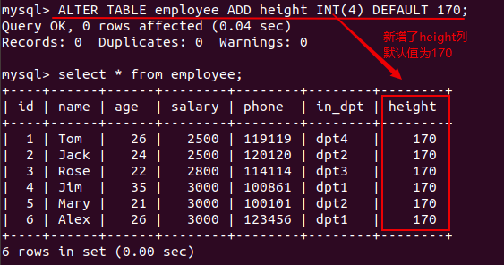

可以发现：新增加的列，被默认放置在这张表的最右边。如果要把增加的列插入在指定位置，则需要在语句的最后使用AFTER关键词(**“AFTER 列1” 表示新增的列被放置在 “列1” 的后面**)。

> 提醒：语句中的 INT(4) 不是表示整数的字节数，而是表示该值的显示宽度，如果设置填充字符为 0，则 170 显示为 0170

比如我们新增一列 `weight`(体重) 放置在 `age`(年龄) 的后面：

```sql
ALTER TABLE employee ADD weight INT(4) DEFAULT 120 AFTER age;
```

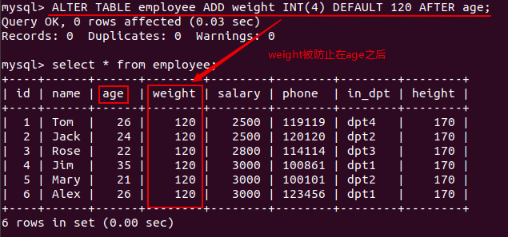

上面的效果是把新增的列加在某位置的后面，如果想放在第一列的位置，则使用 `FIRST`关键词，如语句：

```sql
ALTER TABLE employee ADD test INT(10) DEFAULT 11 FIRST;
```

效果如下：

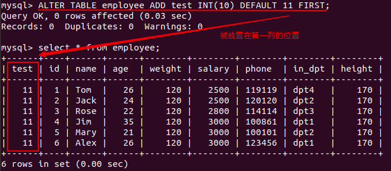

##### 删除一列

删除表中的一列和刚才使用的新增一列的语句格式十分相似，只是把关键词 `ADD` 改为 `DROP` ，语句后面不需要有数据类型、约束或位置信息。具体语句格式：

```sql
ALTER TABLE 表名字 DROP COLUMN 列名字;

或： ALTER TABLE 表名字 DROP 列名字;
```

我们把刚才新增的 `test` 删除：

```sql
ALTER TABLE employee DROP test;
```

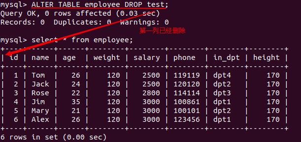

##### 重命名一列

这条语句其实不只可用于重命名一列，准确地说，它是对一个列做修改(CHANGE) ：

```sql
ALTER TABLE 表名字 CHANGE 原列名 新列名 数据类型 约束;
```

> **注意：这条重命名语句后面的 “数据类型” 不能省略，否则重命名失败。**

当**原列名**和**新列名**相同的时候，指定新的**数据类型**或**约束**，就可以用于修改数据类型或约束。需要注意的是，修改数据类型可能会导致数据丢失，所以要慎重使用。

我们用这条语句将 “height” 一列重命名为汉语拼音 “shengao” ，效果如下：

```sql
ALTER TABLE employee CHANGE height shengao INT(4) DEFAULT 170;
```

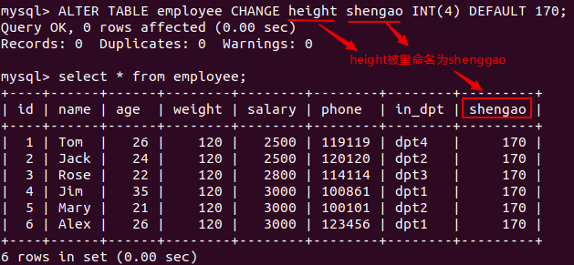

##### 改变数据类型

要修改一列的数据类型，除了使用刚才的 **CHANGE** 语句外，还可以用这样的 **MODIFY** 语句：

```sql
ALTER TABLE 表名字 MODIFY 列名字 新数据类型;
```

再次提醒，修改数据类型必须小心，因为这可能会导致数据丢失。在尝试修改数据类型之前，请慎重考虑。

#### 内容修改

##### 修改表中某个值

大多数时候我们需要做修改的不会是整个数据库或整张表，而是表中的某一个或几个数据，这就需要我们用下面这条命令达到精确的修改：

```sql
UPDATE 表名字 SET 列1=值1,列2=值2 WHERE 条件;
```

比如，我们要把 Tom 的 age 改为 21，salary 改为 3000：

```sql
UPDATE employee SET age=21,salary=3000 WHERE name='Tom';
```

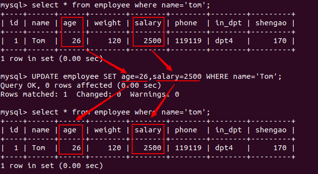

> **注意：一定要有 WHERE 条件，否则会出现你不想看到的后果**

##### 删除一行记录

删除表中的一行数据，也必须加上 WHERE 条件，否则整列的数据都会被删除。删除语句：

```sql
DELETE FROM 表名字 WHERE 条件;
```

我们尝试把 Tom 的数据删除：

```sql
DELETE FROM employee WHERE name='Tom';
```

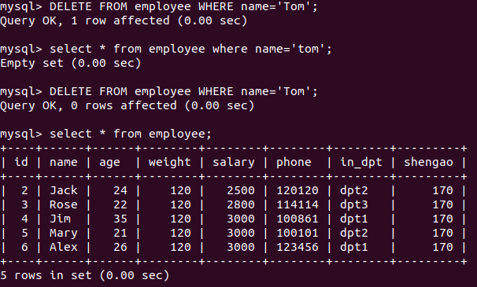

本节实验中我们学习了对数据库、数据库表、数据库表项及记录的修改和删除方法。
