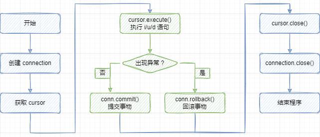

## pymysql

在 py 文件中引入 pymysql 模块

```python
import pymysql
```

pymysql 拥有以下方法:



### 数据库链接对象

#### 连接数据库

链接数据库对象：调用 pymysql.connect() 方法

```python
conn=pymysql.connect(参数列表)
```

**参数:**

- **host** - 数据库服务器所在的主机
- **user** - 登录的用户名
- **password** - 要使用的密码。
- **database** - 要使用的数据库，None不使用特定的数据库。
- **port** - 要使用的MySQL端口，默认通常都可以。（默认值：3306）
- **charset** - 你要使用的Charset。
- **db** - 数据库的别名。（与MySQLdb兼容）
- **passwd** - 密码的别名。（与MySQLdb兼容）
- **connect_timeout** - 连接时抛出异常之前的超时。（默认值：10，最小值：1，最大值：31536000）
- **read_timeout** - 以秒为单位读取连接的超时（默认值：无 - 无超时）
- **write_timeout** - 以秒为单位写入连接的超时（默认值：无 - 无超时）

#### 数据库操作方法

**链接对象的方法** 

| 方法名     | 说明                     |
| ---------- | ------------------------ |
| `connect`()   | 链接数据库 |
| `cursor()`   | 创建一个新游标，用于执行 sql 语句并获得结果 |
| `commit()`   | 提交并保存数据             |
| `rollback()` | 回滚当前事务。           |
| `close()`    | 关闭与数据库的链接         |
| `select_db(db)`    | 设置当前数据库。      |

```python
import pymysql  
  
# 1. 创建链接对象  
connection = pymysql.connect(  
    host='159.75.114.202',  # 数据库服务器的地址  
    user='windows',  # 用户名  
    password='123456',  # 用户密码  
    database='python',  # 操作的数据库  
    port=3306,  # 端口  
    charset='utf8'  # 字符编码  
)  
print('链接对象:\t', connection)
```


### Cursor 对象

用于执行 sql 语句，使用频度最高的语句为 select、insert、update、delete

获取 Cursor 对象：调用 Connection 对象的 cursor() 方法

```python
# 2. 获取游标对象 (执行sql 指令)  
cursor = connection.cursor()
```

#### 对象的方法

- `close()`  关闭游标对象。
- `execute(query, args=None)` 执行查询
  - 参数:
    `query([str])`  – 查询执行。
    `args(tuple,list or dict)` – 与查询一起使用的参数。 （可选的）
  - Returns(返回内容): 受影响的行数
  - Return type: int

  返回受影响的行数，主要用于执行 insert、update、delete 语句，也可以执行 create、alter、drop 等语句

  如果 args 是列表或元组，则 `%s` 可以用作查询中的占位符。如果 args 是 dict，则 `%(name)s` 可以用作查询中的占位符。

- `executemany(query, args)`  执行多个查询
    query –查询在服务器上执行
    args –序列或映射的序列。它用作参数。

  此方法可提高多行 INSERT 和 REPLACE 的性能。否则它等同于使用 `execute()` 循环遍历 args。

- `fetchall`()
  执行查询时，获取结果集的所有行，一行构成一个元组，再将这些元组装入一个元组返回

- `fetchmany(size=None)`
  获取几行

- `fetchone()`
  执行查询语句时，获取查询结果集的第一个行数据，返回一个元组


#### 对象的属性

使用游标执行 `sql` 代码

```python
# 3. 执行 sql 执行  
sql = 'show databases;'  
count = cursor.execute(sql)  
print('执行sql之后,受影响的行数:\t', count)

# 4. 获取查询结果  
results = cursor.fetchall()  
print('查询结果:\t', results)  
for result in results:  
    print(result[0])  
  
# 5. 关闭与服务器的链接  
cursor.close()  
connection.close()
```


### 插入数据

创建数据表
```python
# 获取游标对象
cursor = connection.cursor()
# 构造SQL语句
sql = """create table goods  
(  
    id         int unsigned primary key auto_increment not null,  
    name       varchar(150)   not null,  
    cate_name  varchar(40)    not null,  
    brand_name varchar(40)    not null,  
    price      decimal(10, 3) not null default 0,  
    is_show    bit            not null default 1,  
    is_saleoff bit            not null default 0  
);"""
# 执行SQL
cursor.execute(sql)
```

使用游标向数据库插入数据
```python
# 插入一条数据
# 需要执行的原生 sql
sql = "insert into goods  
values (0, 'ipad mini 配备 retina 显示屏', '平板电脑', '苹果', '2788', default, default);"

cursor.execute(sql)
```

提交修改
```python
count = cursor.execute(sql)  
print('执行sql之后,受影响的行数:\t', count)  
  
connection.commit()  # 保存修改  
  
cursor.close()  
connection.close()
```


#### 案例

将下面的文本数据插入到数据库

```shell
319001,赵一,男,1998/12/27,18706012232,532211428@qq.com,北京市海淀区颐和园路5号,342622199801144314  
319002,钱二,女,1995/10/25,13459732456,572501101@qq.com,北京市海淀区双清路30号,342622199709066819  
319003,钱三,男,1999/1/8,18850840171,582300330@qq.com,上海市杨浦区邯郸路220号,342622199709198176  
319004,赵四,男,1998/2/4,18650523989,588100505@qq.com,杭州市西湖区余杭塘路866号,342622199708171596  
319005,周五,女,1998/4/20,18650795182,598202702@qq.com,上海市杨浦区四平路1239号,342622199711026453  
319006,吴六,男,1998/7/20,18759125223,512101504@qq.com,厦门市思明区思明南路422号,320923199806290932  
319007,郑七,女,1999/2/1,18705908359,512501129@qq.com,江苏省南京市鼓楼区汉口路22号,342625199812140158  
319008,王八,男,1997/1/15,18065178692,512802414@qq.com,重庆市沙坪坝区沙坪坝正街174号,342601199705132151  
319009,赵九,男,1998/11/29,15260972133,518110817@qq.com,四川省成都市武侯区一环路南一段24号,340223199802050515  
319010,钱十,男,1997/9/15,13850208664,530300603@qq.com,广州市海珠区新港西路135号,342623199806105732  
319011,孙百,女,1996/1/12,17750332066,530403917@qq.com,北京市海淀区颐和园路6号,340304199812100615  
319012,李千,男,1998/1/10,13615987369,532200416@qq.com,北京市海淀区双清路31号,340321199812312171  
319013,周万,男,1997/11/25,13859235044,532205529@qq.com,上海市杨浦区邯郸路221号,340321199812116533  
319014,赵一,男,1996/3/4,13306077753,562601020@qq.com,杭州市西湖区余杭塘路867号,340321199710108639  
319015,钱二,男,1997/11/25,18396385108,580200212@qq.com,上海市杨浦区四平路1240号,34032319970115373X  
319016,钱三,女,1998/8/27,13459401877,582103118@qq.com,厦门市思明区思明南路423号,340406199907283416  
319017,赵四,男,1996/12/9,18350610572,510204526@qq.com,江苏省南京市鼓楼区汉口路23号,34040619940706361X  
319018,周五,女,1996/6/21,15936220168,560202028@qq.com,重庆市沙坪坝区沙坪坝正街175号,371723200202081077  
319019,吴六,男,1998/3/26,15037109890,532211428@qq.com,四川省成都市武侯区一环路南一段25号,340421199609072411  
319020,郑七,女,1999/3/5,13938927966,572501101@qq.com,广州市海珠区新港西路136号,340521199805262015  
319021,王八,男,1997/9/5,13721865019,582300330@qq.com,北京市海淀区颐和园路7号,340521199801023818  
319022,赵九,女,1999/3/1,15007210345,588100505@qq.com,北京市海淀区双清路32号,340603199712254211  
319023,钱十,男,1998/2/13,18871701822,598202702@qq.com,上海市杨浦区邯郸路222号,340602199612301619  
319024,孙百,女,1998/11/12,13098452156,512101504@qq.com,杭州市西湖区余杭塘路868号,340721199801152418  
319025,李千,女,1997/7/2,18396385108,512501129@qq.com,上海市杨浦区四平路1241号,340811199712175370  
319026,周万,女,1997/11/28,13459401877,512802414@qq.com,厦门市思明区思明南路424号,340823199708104014  
319027,赵一,男,1998/8/6,18350610572,518110817@qq.com,江苏省南京市鼓楼区汉口路24号,340803199806192112  
319028,钱二,女,1998/8/12,15936220168,530300603@qq.com,重庆市沙坪坝区沙坪坝正街176号,340822199803085812  
319029,赵九,男,1996/12/9,15150126232,532205529@qq.com,四川省成都市武侯区一环路南一段26号,340822199710140915  
319030,钱十,女,1996/6/21,15082855253,562601020@qq.com,广州市海珠区新港西路137号,340822199807216218  
319031,孙百,女,1998/3/26,15015584274,580200212@qq.com,北京市海淀区颐和园路8号,340822199704306018  
319032,李千,女,1999/3/5,14948313296,582103118@qq.com,北京市海淀区双清路33号,340823199711012575  
319033,周万,男,1997/9/5,14881042317,510204526@qq.com,上海市杨浦区邯郸路223号,340823199701294919  
319034,赵一,女,1999/3/1,14813771339,560202028@qq.com,杭州市西湖区余杭塘路869号,340823199804043717  
319035,钱二,男,1998/2/13,14746500360,532211428@qq.com,上海市杨浦区四平路1242号,340823199807140037  
319036,赵九,女,1998/11/12,14679229381,572501101@qq.com,厦门市思明区思明南路425号,340823199901027014  
319037,钱十,女,1997/7/2,14611958403,582300330@qq.com,江苏省南京市鼓楼区汉口路25号,340823199701264912  
319038,孙百,女,1997/11/28,14544687424,588100505@qq.com,重庆市沙坪坝区沙坪坝正街177号,340824199810053811  
319039,李千,男,1998/8/6,14477416446,598202702@qq.com,四川省成都市武侯区一环路南一段27号,340824199805210616  
319040,周万,女,1998/8/12,14410145467,512101504@qq.com,广州市海珠区新港西路138号,340824199811275010  
319041,赵一,男,1996/12/9,14342874489,512501129@qq.com,北京市海淀区颐和园路9号,340824199804256815  
319042,钱二,女,1996/6/21,14275603510,512802414@qq.com,北京市海淀区双清路34号,340825199806094318  
319043,赵九,女,1998/3/26,14208332531,518110817@qq.com,上海市杨浦区邯郸路224号,340825199902250210
```

编写 sql 语句

```sql
create table student  
(  
    id      int primary key auto_increment, -- id  
    no      char(6),                        -- 学号  
    name    varchar(20),                    -- 名字  
    gender  char(1),                        -- 性别  
    birth   date,                           -- 出生日期  
    phone   char(11),                       -- 电话号码  
    email   varchar(50),                    -- 邮箱  
    address text,                           -- 地址  
    id_card char(18)                        -- 身份证号码  
);

-- 插入语句  
insert into student(no, name, gender, birth, phone, email, address, id_card)  
values ('319001', '赵一', '男', '1998/12/27', '18706012232', '532211428@qq.com', '北京市海淀区颐和园路5号', '342622199801144314');
```

编写 python 插入脚本

```python
import pymysql  
  
connection = pymysql.connect(  
    host='159.75.114.202',  
    user='windows',  
    password='123456',  
    database='python',  
    port=3306  
)  
cursor = connection.cursor()  
  
# 读取本地文件  
with open('student.txt', mode='r', encoding='utf-8') as f:  
    lines = f.readlines()  
  
for line in lines:  
    student = tuple(line.strip().split(','))  
    print(student)  
    # 构建 sql 字符串  
    sql = "insert into student(no, name, gender, birth, phone, email, address, id_card)values ('%s', '%s', '%s', '%s', '%s', '%s', '%s', '%s');"  
    # 执行 sql    # cursor.execute(sql % student)  
    
connection.commit()  
cursor.close()  
connection.close()
```


### 事务

回滚

```python
import pymysql  
  
connection = pymysql.connect(host='159.75.114.202', user='windows', password='123456', database='python', port=3306)  
cursor = connection.cursor()  
  
with open('student.txt', mode='r', encoding='utf-8') as f:  
    lines = f.readlines()  
  
for line in lines:  # 第七条数据会报错  
    try:  
        student = tuple(line.strip().split(','))  
        insert_sql_template = "insert into student(no, name, gender, birth, phone, email, address, id_card)values ('%s', '%s', '%s', '%s', '%s', '%s', '%s', '%s');"  
        print(insert_sql_template % student)  
        cursor.execute(insert_sql_template % student)  
        connection.commit()  # 插入成功之后立马进行提交,每一条数据都会提交一次  
    except Exception as e:  
        # 如果出错了,就全部不提交  
        # 事务,一起成功一起失败  
        connection.rollback()  # 回滚,撤销没有保存到本地的提交  
        print("出错啦", e)  
  
# 忽略出错的那一条数据,其余的正常运行  
# 提交,保存更改  
connection.commit()   # 最后提交,保存一次  
cursor.close()  
connection.close()
```

### 查询数据

```python
import pymysql  
  
connection = pymysql.connect(host='159.75.114.202', user='windows', password='123456', database='python', port=3306)  
cursor = connection.cursor()  # 做事的人  
# 并发情况下,可以使用多个游标对象  
cursor2 = connection.cursor()  # 做事的人  
  
# 1. 准备需要执行的sql  
sql = 'select * from student;'  
  
# 2. 执行 sql  --> 返回的结果是一个生成器  
count = cursor.execute(sql)  
  
# 3. 获取查询的数据  
print('收影响的行数:\t', count)  
print('获取一条数据:\t', cursor.fetchone())  
print('获取多条数据:\t', cursor.fetchmany(5))  
  
# 之前的数据还没有查询完,又执行了新的查询, 新查询结果就会将旧的覆盖掉  
sql2 = 'select id, no, name, birth from student;'  
cursor2.execute(sql2)  
print('cursor 获取所有的数据:\t', cursor.fetchall())  
print('cursor2 获取所有的数据:\t', cursor2.fetchall())  
  
cursor.close()  
connection.close()
```


#### 查询案例

```python
"""  
    用面向对象的方式操作数据库  
    实现对学员数据的增删改查  
  
    insert    search_by_name    delete_by_name    update_by_name"""  
import pymysql  
  
  
class Student:  
    """面向对象封装查询"""  
  
    def __init__(self):  
        self.connection = pymysql.connect(host='159.75.114.202',  
                                          user='windows',  
                                          password='123456',  
                                          database='python',  
                                          port=3306)  
        self.cursor = self.connection.cursor()  # 做事的人  
  
    def insert(self, student):  
        """插入的方法"""  
        insert_sql_template = "insert into student(no, name, gender, birth, phone, email, address, id_card)values ('%s', '%s', '%s', '%s', '%s', '%s', '%s', '%s');"  
        self.cursor.execute(insert_sql_template % student)  
        self.connection.commit()  
  
    def search_by_name(self, name):  
        sql = "select * from student where name='%s';"  
        self.cursor.execute(sql % (name,))  
        # sql % (name,) -- > "select * from student where name='%s';" % (name,)  
        # sql % (name,) -- > "select * from student where name='%s' and gedner='%s';" % (name, gender)        return self.cursor.fetchall()  
  
    def search_by_gender(self, gender='男'):  
        sql = "select * from student where gender='%s';"  
        self.cursor.execute(sql % (gender,))  
        return self.cursor.fetchall()  
  
    def close(self):  
        self.cursor.close()  
        self.connection.close()  
  
  
if __name__ == '__main__':  
    db = Student()  
    student = (  
        '319044', '正心', '男', '1998/3/26', '14208332532', '518110817@qq.com', '上海市杨浦区邯郸路224号', '340825199902250210')  
    # db.insert(student)  
    print(db.search_by_name('正心'))  
    print(db.search_by_gender())
```

### 修改数据

```python
import pymysql

# 创建 connection 连接
conn = pymysql.connect(host='localhost',
                       port=3306,
                       database='jing_dong',
                       user='root',
                       password='mysql',
                       charset='utf8')
# 获得 cursor 对象
cs1 = conn.cursor()
# 执行 insert 语句，并返回受影响的行数：添加一条数据
# 增加
count = cs1.execute('insert into goods_cates(name) values("硬盘")')
# 打印受影响的行数
print(count)

count = cs1.execute('insert into goods_cates(name) values("光盘")')
print(count)

# # 更新 将所有名为硬盘的物品改为机械硬盘
# count = cs1.execute('update goods_cates set name="机械硬盘" where name="硬盘"')
# # 删除 删除id为六的物品
# count = cs1.execute('delete from goods_cates where id=6')

# 提交之前的操作，如果之前已经之执行过多次的execute，那么就都进行提交
conn.commit()

# 关闭 Cursor 对象
cs1.close()
# 关闭 Connection 对象
conn.close()
```

### 参数化

sql 语句的参数化，可以有效防止 sql 注入

注意：此处不同于 python 的字符串格式化，全部使用 %s 占位

```python
# sql 注入  
  
import pymysql  
  
connection = pymysql.connect(  
    host='159.75.114.202',  
    user='windows',  
    password='123456',  
    database='python',  
    port=3306  
)  
cursor = connection.cursor()  # 做事的人  
  
# 根据名字查询学生  
# sql = "select * from student where name='%s';"  
# name = input('请输入你想要查询的学生姓名:')  
# target_sql = sql % (name,)  
# print('target_sql:\t', target_sql)  
# cursor.execute(target_sql)  
# 参数化,字符串格式化不加单引号  
  
sql = "select * from student where name=%s;"  
name = input('请输入你想要查询的学生姓名:')  
# 参数化防止注入  
cursor.execute(sql, (name,))  
for result in cursor.fetchall():  
    print(result)  
  
# 'or 1=1 or ' sql 注入  
  
"""  
    sql 注入在搜索内容的时候可能出出现  
    如果用字符串拼接就可能出现注入的问题  
    '正心' --> select * from student where name='正心';  
    'or 1=1 or ' --> select * from student where name=''or 1=1 or '';    'or 1=1 or ' --> select * from student where name='%%';    注入是查询一段逻辑  
"""  
  
cursor.close()  
connection.close()
```

#### 参数化案例

```python
import pymysql  
  
connection = pymysql.connect(  
    host="159.75.114.202",  
    user="windows",  
    password="123456",  
    database="python",  
    port=3306,  
)  
cursor = connection.cursor()  
  
# 读取本地文件  
with open("student.txt", mode="r", encoding="utf-8") as f:  
    lines = f.readlines()  
  
insert_sql_template = "insert into student(no, name, gender, birth, phone, email, address, id_card) value (%s, %s, %s, %s, %s, %s, %s, %s);"  
new_students = []  
for line in lines:  
    student = tuple(line.strip().split(","))  
    print(student)  
    # 构建 sql 字符串  
    # 执行 sql    new_students.append(student)  
    # cursor.execute(insert_sql_template, student)  
  
cursor.executemany(insert_sql_template, new_students)  
connection.commit()  
cursor.close()  
connection.close()
```


### 面向对象检索数据

#### 数据准备

```python
# -*- coding: utf-8 -*-
import faker
import pymysql

connect = pymysql.connect(
    host="127.0.0.1", port=3306, user="root", password="root", database="python"
)
cursor = connect.cursor()

create_sql = """
create table user(
    id int primary key auto_increment,
    name varchar(3),
    job varchar(20),
    company varchar(50),
    residence varchar(50),
    blood_group varchar(3),
    username varchar(20),
    sex varchar(1),
    address varchar(50),
    mail varchar(50),
    birthdate varchar(20),
    id_card varchar(18),
    phone varchar(11)
);
"""

fake = faker.Faker("zh-cn")

"""用户资料详细表"""
for i in range(10):
    data = fake.profile(fields=None, sex=None)
    del data["ssn"]
    del data["website"]
    del data["current_location"]
    data["id_card"] = fake.ssn(min_age=18, max_age=90)
    data["phone"] = fake.phone_number()
    data["birthdate"] = str(data["birthdate"])
    ret = (
        0,
        data["name"],
        data["job"],
        data["company"],
        data["residence"],
        data["blood_group"],
        data["username"],
        data["sex"],
        data["address"],
        data["mail"],
        data["birthdate"],
        data["id_card"],
        data["phone"],
    )

    sql = "insert into user values (%s,%s,%s,%s,%s,%s,%s,%s,%s,%s,%s,%s,%s);"
    cursor.execute(sql, ret)

cursor.close()
connect.close()
```

#### 面向对象封装

```python
import pymysql


class UserOrm:
    def __init__(self):
        self.connect = pymysql.connect(
            host="127.0.0.1", port=3306, user="root", password="root", database="python"
        )
        self.cursor = self.connect.cursor()

    def search_by_name(self):
        pass

    def search_by_phone(self):
        pass
```

