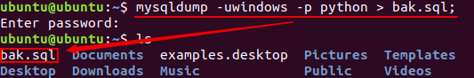

## 连接查询

#### 分类

- 内连接
  - 等值连接
  - 非等值连接
  - 自连接
- 外连接
  - 左外连接
  - 右外连接
  - 全外连接
- 交叉连接：就是笛卡尔积

#### 语法

```sql
SELECT 查询列表
FROM 表1 AS 别名
连接类型 表2 AS 别名
ON 连接条件
WHERE
GROUP BY
HAVING
ORDER BY

连接类型
内连接：INNER JOIN，可以省略 INNER
左外连接：LEFT JOIN
右外连接：RIGHT JOIN
全外连接：FULL JOIN
交叉连接：CROSS JOIN
```

**例子**

```sql
SELECT last_name, department_name
FROM employees AS e
INNER JOIN department AS d
ON e.department_id = d.department_id;
```

### 分页查询

#### LIMIT的使用

- 放在全部SQL语句最后

- LIMIT 开始索引，条目个数

- 如果开始索引是0，则可以省略


#### 分页通用写法

```sql
SELECT 查询列表
FROM 表
LIMIT (页码-1) * 每页条目个数, 每页条目个数;
```

### 联合查询

- 将多条查询语句的结果集合并为一个结果集
- 关键字：UNION

**例如**

```sql
SELECT * FROM employees WHERE email LIKE '%a%'
UNION
SELECT * FROM employees WHERE department_id > 90;
```

**注意事项**

- 要求多条查询语句的查询结果列数相同
- UNION关键字默认去重，如果不想去重则 UNION ALL可以包含重复项


## 高级操作

本节实验中我们将学习并实践数据库的其他基本操作：索引、视图，导入和导出，备份和恢复等。

这些概念对于数据库管理员而言都非常重要，请仔细理解并完成所有实验操作。

作为基础篇，不会涉及到关于索引和视图的高级应用和核心概念，但是基本操作大家会了解，尤其是关于索引的内容，学会建立恰当的索引可以大大提高数据库的查询效率，更高级的应用我们会在进阶篇详细讲解。

**知识点**

- 索引
- 视图
- 导入和导出
- 备份和恢复

### 准备

> 注：进入本节进行学习的，请先删除上一节建立的数据库`python`，删除语句为`DROP DATABASE python;`。

在开始之前,将`sql资料` 文件夹下的 `advanced_operation.sql` 拷贝到桌面

代码会搭建好一个名为 `python` 的数据库(有三张表：department，employee，project)，并向其中插入数据。

输入命令开启 `MySQL` 服务并登录：

```sql
# 打开 MySQL 服务
sudo service mysql start

# 使用 root 用户登录
mysql -u root
```

 `advanced_operation.sql` 和 `in.txt`，其中第一个文件用于创建数据库并向其中插入数据，第二个文件用于测试数据导入功能。

如果你是接着上一个实验操作的话，首先把 `python` 数据库删掉：

```
mysql> drop database python;
```

输入命令运行第一个文件，搭建数据库并插入数据：

```
mysql> source /home/ubuntu/Desktop/advanced_operation.sql
```


### 索引

索引是一种与表有关的结构，它的作用相当于书的目录，可以根据目录中的页码快速找到所需的内容。

当表中有大量记录时，若要对表进行查询，没有索引的情况是全表搜索：将所有记录一一取出，和查询条件进行一一对比，然后返回满足条件的记录。这样做会消耗大量数据库系统时间，并造成大量磁盘 I/O 操作。

而如果在表中已建立索引，在索引中找到符合查询条件的索引值，通过索引值就可以快速找到表中的数据，可以**大大加快查询速度**。

对一张表中的某个列建立索引，有以下两种语句格式：

```sql
ALTER TABLE 表名字 ADD INDEX 索引名 (列名);
CREATE INDEX 索引名 ON 表名字 (列名);
```

我们用这两种语句分别建立索引：

```sql
ALTER TABLE employee ADD INDEX idx_id (id);  # 在employee表的id列上建立名为idx_id的索引
CREATE INDEX idx_name ON employee (name);    # 在employee表的name列上建立名为idx_name的索引
```

索引的效果是加快查询速度，当表中数据不够多的时候是感受不出它的效果的。这里我们使用命令 **SHOW INDEX FROM 表名字;** 查看刚才新建的索引：


在使用 SELECT 语句查询的时候，语句中 WHERE 里面的条件，会**自动判断有没有可用的索引**。

比如有一个用户表，它拥有用户名( `username` )和个人签名( `note` )两个字段。其中用户名具有唯一性，并且格式具有较强的限制，我们给用户名加上一个唯一索引；个性签名格式多变，而且允许不同用户使用重复的签名，不加任何索引。

这时候，如果你要查找某一用户，使用语句 `select * from user where username=?` 和 `select * from user where note=?` 性能是有很大差距的，对 **建立了索引的用户名** 进行条件查询会比 **没有索引的个性签名** 条件查询快几倍，在数据量大的时候，这个差距只会更大。

一些字段不适合创建索引，比如性别，这个字段存在大量的重复记录无法享受索引带来的速度加成，甚至会拖累数据库，导致数据冗余和额外的 CPU 开销。

### 视图

视图是从一个或多个表中导出来的表，是一种 **虚拟存在的表** 。它就像一个窗口，通过这个窗口可以看到系统专门提供的数据，这样，用户可以不用看到整个数据库中的数据，而只关心对自己有用的数据。

注意理解视图是虚拟的表：

- 数据库中只存放了视图的定义，而没有存放视图中的数据，这些数据存放在原来的表中；
- 使用视图查询数据时，数据库系统会从原来的表中取出对应的数据；
- 视图中的数据依赖于原来表中的数据，一旦表中数据发生改变，显示在视图中的数据也会发生改变；
- 在使用视图的时候，可以把它当作一张表。

创建视图的语句格式为：

```sql
CREATE VIEW 视图名(列a,列b,列c) AS SELECT 列1,列2,列3 FROM 表名字;
```

可见创建视图的语句，后半句是一个 SELECT 查询语句，所以**视图也可以建立在多张表上**，只需在 SELECT 语句中使用**子查询**或**连接查询**，这些在之前的实验已经进行过。

现在我们创建一个简单的视图，名为 **v_emp**，包含**v_name**，**v_age**，**v_phone**三个列：

```sql
CREATE VIEW v_emp (v_name,v_age,v_phone) AS SELECT name,age,phone FROM employee;
```

### 备份

数据库中的数据十分重要，出于安全性考虑，在数据库的使用中，应该注意使用备份功能。

> 备份与导出的区别：导出的文件只是保存数据库中的数据；而备份，则是把数据库的结构，包括数据、约束、索引、视图等全部另存为一个文件。

`mysqldump` 是 `MySQL` 用于备份数据库的实用程序。它主要产生一个 `SQL` 脚本文件，其中包含从头重新创建数据库所必需的命令 CREATE TABLE INSERT 等。

使用 `mysqldump` 备份的语句：

```shell
mysqldump -u root 数据库名>备份文件名;        # 备份整个数据库
mysqldump -u root 数据库名 表名字>备份文件名;  # 备份整个表
```

> mysqldump 是一个备份工具，因此该命令是在终端中执行的，而不是在 mysql 交互环境下

我们尝试备份整个数据库 `python`，将备份文件命名为 `bak.sql`，先 `Ctrl+D` 退出 MySQL 控制台，再打开 Xfce 终端，在终端中输入命令：

```shell
cd /home/ubuntu/
mysqldump -u root python > bak.sql;
```

使用命令 “ls” 可见已经生成备份文件 `bak.sql`：



> 你可以用 gedit 查看备份文件的内容，可以看见里面不仅保存了数据，还有所备份的数据库的其他信息。

### 恢复

用备份文件恢复数据库，其实我们早就使用过了。在本次实验的开始，我们使用过这样一条命令：

```shell
source /home/ubuntu/Desktop/advanced_operation.sql
```

这就是一条恢复语句，它把 advanced_operation-06.sql 文件中保存的`python` 数据库恢复。

还有另一种方式恢复数据库，但是在这之前我们先使用命令新建一个**空的数据库 test**：

```shell
mysql -u root -p         # 因为在上一步已经退出了MySQL，现在需要重新登录
CREATE DATABASE test;    # 新建一个名为test的数据库
```

再次 **Ctrl+D** 退出 MySQL，然后输入语句进行恢复，把刚才备份的 **bak.sql** 恢复到 **test**数据库：

```
mysql -u root test < bak.sql
```

我们输入命令查看 test 数据库的表，便可验证是否恢复成功：

```shell
mysql -u root -p          # 因为在上一步已经退出了MySQL，现在需要重新登录
use test                  # 连接数据库test
SHOW TABLES;              # 查看test数据库的表
```

可以看见原数据库的 4 张表和 1 个视图，现在已经恢复到 test 数据库中：


再查看 employee 表的恢复情况：


我们实践了下面几个基本概念：

1. 索引：可以加快查询速度
2. 视图：是一种虚拟存在的表
3. 导入：从文件中导入数据到表
4. 导出：从表中导出到文件中
5. 备份：`mysqldump` 备份数据库到文件
6. 恢复：从文件恢复数据库

我们将学习 MySQL 服务安装及命令使用 。


## 总结

**查询的完整格式  不要被吓到 其实很简单 !**

```sql
SELECT select_expr [,select_expr,...] [      
      FROM tb_name
      [WHERE 条件判断]
      [GROUP BY {col_name | postion} [ASC | DESC], ...] 
      [HAVING WHERE 条件判断]
      [ORDER BY {col_name|expr|postion} [ASC | DESC], ...]
      [ LIMIT {[offset,]rowcount | row_count OFFSET offset}]
]
```

- 完整的select语句

```sql
select distinct *
from 表名
where ....
group by ... having ...
order by ...
limit start,count
```

- 执行顺序为：
  - from 表名
  - where ....
  - group by ...
  - select distinct *
  - having ...
  - order by ...
  - limit start,count
- 实际使用中，只是语句中某些部分的组合，而不是全部

## 附录

### 导出数据

mysqldump 命令导出

```bash
>> mysqldump -u 用户名 -p 数据库名 表名 > 导出文件路径

mysqldump -u root -p python student > student.sql

mysqldump -u root 数据库名 > 备份文件名;        # 备份整个数据库
mysqldump -u root -p python > python.sql
```

select ... into outfile命令导出

```mysql
SELECT * 
FROM 表名
INTO OUTFILE 导出文件路径
```


### 导入数据

mysql 命令导入

```mysql
>> mysql -u 用户名 -p 数据库 < /home/abc/源.sql

mysql -u root -p python < python.sql
```

source 命令导入

```sql
mysql> source /home/abc/源.sql
```

