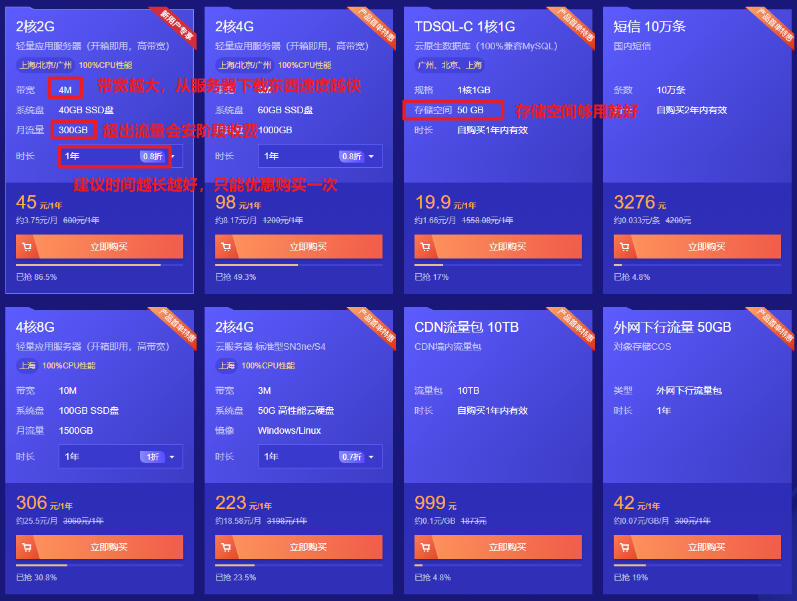
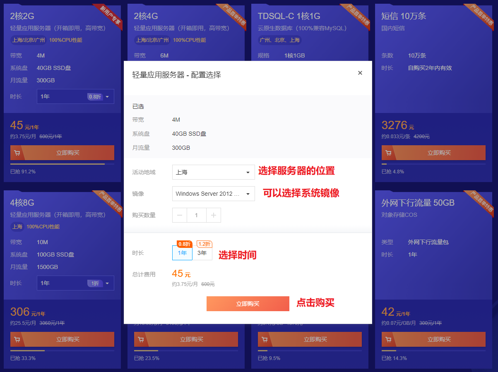
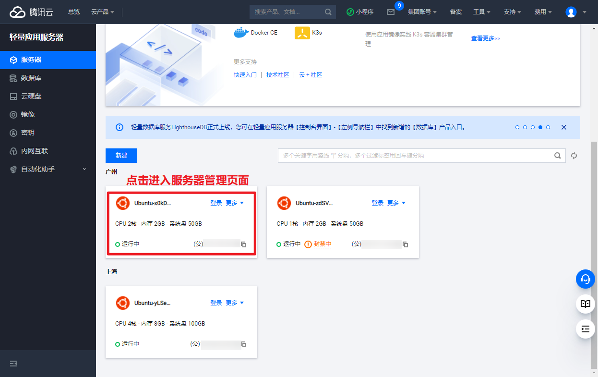
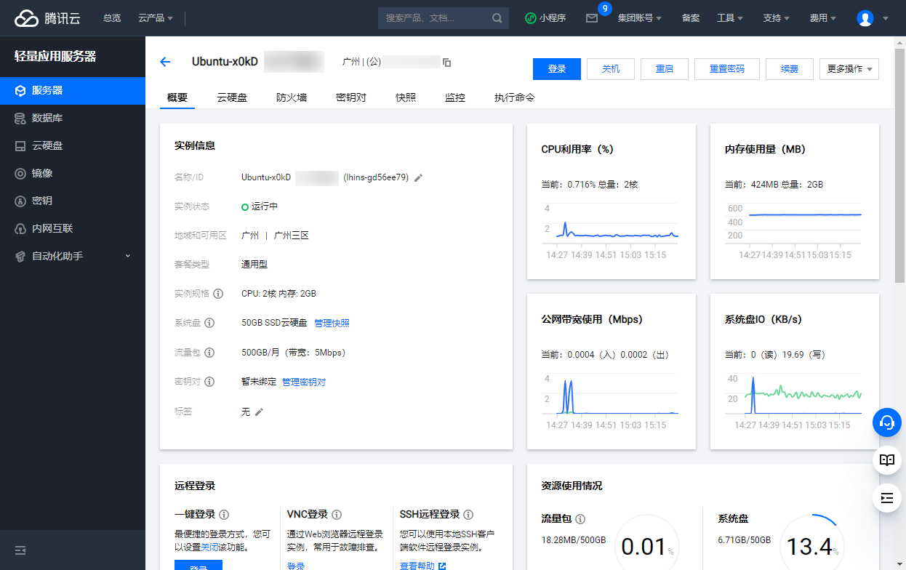
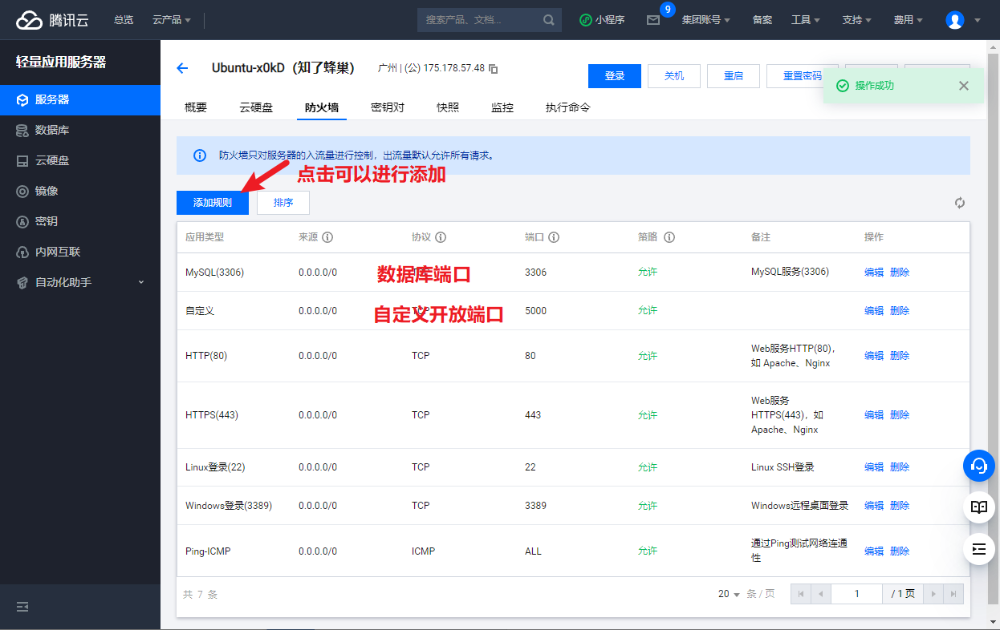

## 云服务器

国内有腾讯云、阿里云、华为云等一系列的云服务器提供商，并且还有很多小服务器提供商。当然也可以选择自己搭建服务器，但是那样对于小公司来说只会得不偿失。

自己搭建需要一个需要一台服务器，需要一个固定IP，需要 7*24 小时不断电，同时使用短信发送、静态资源存储、数据库服务器的时候不是特别方便

常用的服务器分两种，一种是轻量级服务器，还有一种是标准的云服务器。

|          | 轻量级服务器           | 云服务器          |
| -------- | ---------------------- | ----------------- |
| 面向用户 | 中小企业、开发者       | 所有用户          |
| 网络计费 | 高性价比流量包模式     | 固定带宽/流量费用 |
| 应用管理 | 官方应用镜像及应用管理 | 镜像市场          |

### 应用场景

**网站搭建** 

使用轻量应用服务器 Lighthouse 提供的精品镜像（例如 WordPress、Discuz! Q 等），可快速创建满足您业务诉求的网站，例如企业官网、个人展示网站、博客、论坛、电商、外贸网站等。腾讯云将持续提供更多类型的应用镜像，方便您快速构建各种类型的网站。

**Web 应用服务** 
通过使用预置常用 Web 开发平台（如 LAMP 堆栈、Node.js 等）的镜像，可快速部署 Web 应用程序，简单高效上线各类业务应用。

**快速搭建开发测试环境** 
提供多种预置 LAMP、Node.js、http://ASP.NET 等常用开发环境的应用镜像，帮助开发者随时随地在生产环境之外构建开发测试环境。

**云端学习环境** 
为您提供触手可及的云端学习环境，如 Ubuntu、CentOS 等常用 Linux 系统和 Windows Server 系统。您可以随时创建、随时销毁环境。

### 购买服务器

【腾讯云】热门云产品首单特惠秒杀，2核2G云服务器45元/年 [点击购买](https://cloud.tencent.com/act/cps/redirect?redirect=1077&cps_key=9734b44a7903e5882c56c156c73537ac&from=console) 

点击链接之后，可以选择轻量级云服务或者是云服务器直接进行购买

配置参数解释：

cpu: 1核1G 就够用了。

带宽：带宽越大，打开网页、从服务器下载东西的速度越快

系统盘：够用就好，一般静态资源、数据库、缓存都是存到其他地方去

月流量：这个够用就好，300G 小公司网站都用不完，后续上 CDN 就更用不完了。在能够承受范围内，越大越好。

时长：优惠购买只能一次，能承受范围内，时长越长越好，配置越高越好。

点击立即购买，然后提交订单并且付费就可以了。

然后从腾讯云点击进入轻量应用服务器进入管理页面

在各个页面中，防火墙页面需要开发一些端口，一些外部应用才能够被访问

如果是第一次使用，记得点击右上角的重置密码，设置一下登录密码。