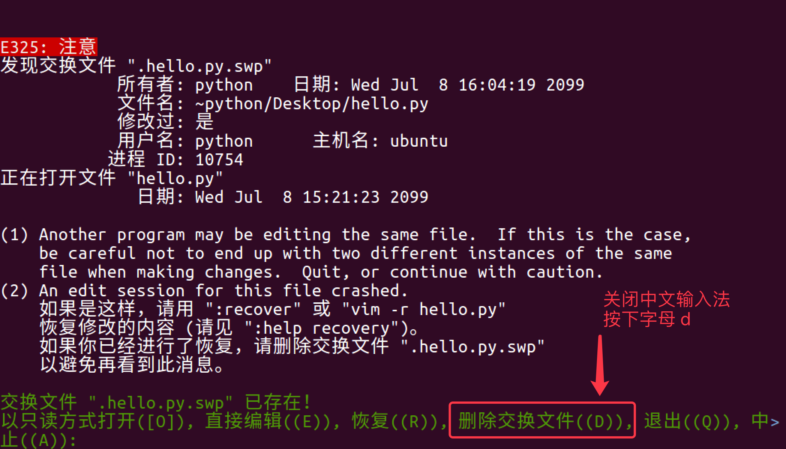

# vim

学习 `vim` 的目的

- 在工作中，要对 服务器 上的文件进行 简单 的修改，可以使用 `ssh` 远程登录到服务器上，并且使用 `vim` 进行快速的编辑即可
- 常见需要修改的文件包括：
  - 源程序 
  - 配置文件，例如 `ssh` 的配置文件 `~/.ssh/config` 

> 在没有图形界面的环境下，要编辑文件，`vim` 是最佳选择！
>
> 每一个要使用 Linux 的程序员，都应该或多或少的学习一些 `vim` 的常用命令

## vi 和 vim

### vi

- `vi` 是 `Visual interface` 的简称，是 `Linux` 中 最经典 的文本编辑器
- `vi` 的核心设计思想 —— 让程序员的手指始终保持在键盘的核心区域，就能完成所有的编辑操作 


- `vi` 的特点：
  - 没有图形界面 的 功能强大 的编辑器
  - 只能是编辑 文本内容，不能对字体、段落进行排版
  - 不支持鼠标操作 
  - 没有菜单  
  - 只有命令 
- `vi` 编辑器在 系统管理、服务器管理 编辑文件时，其功能永远不是图形界面的编辑器能比拟的 

### `vim` 

vim = vi improved 

- `vim` 是从 `vi` 发展出来的一个文本编辑器，支持 代码补全、编译 及 错误跳转 等方便编程的功能特别丰富，在程序员中被广泛使用，被称为 编辑器之神 

### 打开和新建文件

- 在终端中输入 `vim` 在后面跟上文件名 即可

```bash
$ vim 文件名
```

- 如果文件已经存在，会直接打开该文件
- 如果文件不存在，会新建一个文件

#### 打开文件并且定位行

- 在日常工作中，有可能会遇到 打开一个文件，并定位到指定行 的情况
- 例如：在开发时，知道某一行代码有错误，可以 快速定位 到出错代码的位置
- 这个时候，可以使用以下命令打开文件

```bash
$ vim 文件名 +行数
```

> 提示：如果只带上 `+` 而不指定行号，会直接定位到文件末尾

#### 异常处理

- 如果 `vim` 异常退出，在磁盘上可能会保存有 交换文件 
- 下次再使用 `vim` 编辑该文件时，会看到以下屏幕信息，按下字母 `d` 可以 删除交换文件 即可

> 提示：按下键盘时，注意关闭输入法



## 三种工作模式

`vim` 有三种基本工作模式：

1. 命令行模式(Command line mode)

   - 在命令行模式中可以输入会被解释成并执行的文本。例如执行命令（`:`键），搜索（`/`和`?`键）或者过滤命令（`!`键）。在命令执行之后，Vim返回到命令行模式之前的模式，通常是普通模式。
   - 打开文件首先进入命令模式，是使用 `vim` 的 入口
   - 通过 命令 对文件进行常规的编辑操作，例如：定位、翻页、复制、粘贴、删除……
   - 在其他图形编辑器下，通过 快捷键 或者 鼠标 实现的操作，都在 命令模式 下实现

2. 末行模式 —— 执行 保存、退出 等操作 

   - 要退出 `vim` 返回到控制台，需要在末行模式下输入命令
   - 末行模式 是 `vim` 的 出口

3. 编辑模式 —— 正常的编辑文字

   - 在这个模式中，大多数按键都会向文本缓冲中插入文本。大多数新用户希望文本编辑器编辑过程中一直保持这个模式。

     在插入模式中，可以按`ESC`键回到普通模式。


### 进入vim

使用vim命令进入vim界面

vim后面加上你要打开的已存在的文件名或者不存在（则作为新建文件）的文件名。 打开终端，输入以下命令

```
$ vim practice_1.txt
```

直接使用vim也可以打开vim编辑器，但是不会打开任何文件。

```
$ vim
```

进入命令行模式后输入`:e 文件路径` 同样可以打开相应文件。

### 命令行模式

#### 末行模式命令

| 命令 |     英文     | 功能                           |
| :--: | :----------: | ------------------------------ |
|  w   |    write     | 保存                           |
|  q   |     quit     | 退出，如果没有保存，不允许退出 |
|  q!  |     quit     | 强行退出，不保存退出           |
|  wq  | write & quit | 保存并退出                     |
|  x   |              | 保存并退出                     |

#### 游标移动（基本）

> 学习提示

1. `vi` 的命令较多，不要期望一下子全部记住，个别命令忘记了，只是会影响编辑速度而已
2. 在使用 `vim` 命令时，注意 关闭中文输入法

要熟练使用 `vi`，首先应该学会怎么在 命令模式 下样快速移动光标

编辑操作命令，能够和 移动命令 结合在一起使用

1) 上、下、左、右

| 命令 | 功能 |  手指  |
| :--: | ---- | :----: |
|  h   | 向左 |  食指  |
|  j   | 向下 |  食指  |
|  k   | 向上 |  中指  |
|  l   | 向右 | 无名指 |


2) 行内移动（了解）

| 命令 | 英文 | 功能                           |
| :--: | :--: | ------------------------------ |
|  w   | word | 向后移动一个单词               |
|  b   | back | 向前移动一个单词               |
|  0   |      | 行首                           |
|  ^   |      | 行首，第一个不是空白字符的位置 |
|  $   |      | 行尾                           |

3) 行数移动（了解）

|  命令  | 英文 | 功能                 |
| :----: | :--: | -------------------- |
|   gg   |  go  | 文件顶部             |
|   G    |  go  | 文件末尾             |
| 数字gg |  go  | 移动到 数字 对应行数 |
| 数字G  |  go  | 移动到 数字 对应行数 |
| :数字  |      | 移动到 数字 对应行数 |

4) 屏幕移动（了解）

|   命令   |  英文   | 功能     |
| :------: | :-----: | -------- |
| Ctrl + b |  back   | 向上翻页 |
| Ctrl + f | forward | 向下翻页 |
|    H     |  Head   | 屏幕顶部 |
|    M     | Middle  | 屏幕中间 |
|    L     |   Low   | 屏幕底部 |

#### 进入插入模式（可视模式）

- 学习 `复制` 命令前，应该先学会 怎么样选中 要复制的代码
- 在 `vi` 中要选择文本，需要先使用 `Visual` 命令切换到 可视模式
- `vi` 中提供了 三种 可视模式，可以方便程序员选择 选中文本的方式
- 按 `ESC` 可以放弃选中，返回到 命令模式

|   命令   | 模式       | 功能                               |
| :------: | ---------- | ---------------------------------- |
|    v     | 可视模式   | 从光标位置开始按照正常模式选择文本 |
|    V     | 可视行模式 | 选中光标经过的完整行               |
| Ctrl + v | 可视块模式 | 垂直方向选中文本                   |

可视模式下，可以和 移动命令 连用，例如：`ggVG` 能够选中所有内容

#### 插入命令

在 `vim` 中除了常用的 `i` 进入 编辑模式 外，还提供了以下命令同样可以进入编辑模式：

| 命令 |  英文  | 功能                   |  常用  |
| :--: | :----: | ---------------------- | :----: |
|  i   | insert | 在当前字符前插入文本   |  常用  |
|  I   | insert | 在行首插入文本         | 较常用 |
|  a   | append | 在当前字符后添加文本   |        |
|  A   | append | 在行末添加文本         | 较常用 |
|  o   |        | 在当前行后面插入一空行 |  常用  |
|  O   |        | 在当前行前面插入一空行 |  常用  |


#### 撤销和恢复撤销

在学习编辑命令之前，先要知道怎样撤销之前一次 错误的 编辑动作！

|   命令   | 英文 | 功能           |
| :------: | :--: | -------------- |
|    u     | undo | 撤销上次命令   |
| CTRL + r | redo | 恢复撤销的命令 |


#### 删除文本(命令行模式)

|    命令     |  英文  | 功能                              |
| :---------: | :----: | --------------------------------- |
|      x      |  cut   | 删除光标所在字符，或者选中文字    |
| d(移动命令) | delete | 删除移动命令对应的内容            |
|     dd      | delete | 删除光标所在行，可以 ndd 复制多行 |
|      D      | delete | 删除至行尾                        |

> 提示：如果使用 可视模式 已经选中了一段文本，那么无论使用 `d` 还是 `x`，都可以删除选中文本

- 删除命令可以和 移动命令 连用，以下是常见的组合命令：

```
* dw        # 从光标位置删除到单词末尾
* d0        # 从光标位置删除到一行的起始位置
* d}        # 从光标位置删除到段落结尾
* ndd       # 从光标位置向下连续删除 n 行
* d代码行G   # 从光标所在行 删除到 指定代码行 之间的所有代码
* d'a       # 从光标所在行 删除到 标记a 之间的所有代码
```


#### 复制、粘贴

`vi` 中提供有一个 被复制文本的缓冲区

- 复制 命令会将选中的文字保存在缓冲区 
- 删除 命令删除的文字会被保存在缓冲区
- 在需要的位置，使用 粘贴 命令可以将缓冲区的文字插入到光标所在位置

|    命令     | 英文  | 功能                        |
| :---------: | :---: | --------------------------- |
| y(移动命令) | copy  | 复制                        |
|     yy      | copy  | 复制一行，可以 nyy 复制多行 |
|      p      | paste | 粘贴                        |

提示

- 命令 `d`、`x` 类似于图形界面的 剪切操作 —— `CTRL + X`
- 命令 `y` 类似于图形界面的 复制操作 —— `CTRL + C`
- 命令 `p` 类似于图形界面的 粘贴操作 —— `CTRL + V`
- `vi` 中的 文本缓冲区同样只有一个，如果后续做过 复制、剪切 操作，之前缓冲区中的内容会被替换

注意

- `vi` 中的 文本缓冲区 和系统的 剪贴板 不是同一个
- 所以在其他软件中使用 `CTRL + C` 复制的内容，不能在 `vi` 中通过 `P` 命令粘贴
- 可以在 编辑模式 下使用 鼠标右键粘贴


#### 退出vim

从普通模式输入`:`进入命令行模式，输入`wq`回车，保存并退出编辑

以下为其它几种退出方式：

| 命令               | 说明             |
| ------------------ | ---------------- |
| `:q!`              | 强制退出，不保存 |
| `:q`               | 退出             |
| `:wq!`             | 强制保存并退出   |
| `:w <文件路径>`    | 另存为           |
| `:saveas 文件路径` | 另存为           |
| `:x`               | 保存并退出       |
| `:wq`              | 保存并退出       |

#### 替换

| 命令 |  英文   | 功能                   | 工作模式 |
| :--: | :-----: | ---------------------- | -------- |
|  r   | replace | 替换当前字符           | 命令模式 |
|  R   | replace | 替换当前行光标后的字符 | 替换模式 |

- `R` 命令可以进入 替换模式，替换完成后，按下 `ESC` 可以回到 命令模式
- 替换命令 的作用就是不用进入 编辑模式，对文件进行 轻量级的修改

#### 缩排和重复执行

| 命令 | 功能         |
| :--: | ------------ |
|  >>  | 向右增加缩进 |
|  <<  | 向左减少缩进 |
|  .   | 重复上次命令 |

- 缩排命令 在开发程序时，统一增加代码的缩进 比较有用！
  - 一次性在选中代码前增加 4 个空格，就叫做增加缩进
  - 一次性在选中代码前删除 4 个空格，就叫做减少缩进
- 在可视模式下，缩排命令只需要使用一个 `>` 或者 `<` 

> 在程序中，缩进 通常用来表示代码的归属关系
>
> 前面空格越少，代码的级别越高
>
> 前面空格越多，代码的级别越低


### 查找

#### 常规查找 

| 命令 | 功能     |
| :--: | -------- |
| /str | 查找 str |

- 查找到指定内容之后，使用 `Next` 查找下一个出现的位置：
  - `n`: 查找下一个
  - `N`: 查找上一个
- 如果不想看到高亮显示，可以随便查找一个文件中不存在的内容即可

#### 单词快速匹配

| 命令 | 功能                     |
| :--: | ------------------------ |
|  *   | 向后查找当前光标所在单词 |
|  #   | 向前查找当前光标所在单词 |

- 在开发中，通过单词快速匹配，可以快速看到这个单词在其他什么位置使用过

#### 查找并替换

- 在 `vim` 中查找和替换命令需要在 末行模式 下执行
- 记忆命令格式：

```
:%s///g
```

1) 全局替换

- 一次性替换文件中的 所有出现的旧文本
- 命令格式如下：

```
:%s/旧文本/新文本/g
```

2) 可视区域替换

- 先选中 要替换文字的 范围
- 命令格式如下：

```
:s/旧文本/新文本/g
```

3) 确认替换

- 如果把末尾的 `g` 改成 `gc` 在替换的时候，会有提示！推荐使用！

```
:%s/旧文本/新文本/gc
```

1. `y` - `yes` 替换
2. `n` - `no` 不替换
3. `a` - `all` 替换所有
4. `q` - `quit` 退出替换
5. `l` - `last` 最后一个，并把光标移动到行首
6. `^E` 向下滚屏
7. `^Y` 向上滚屏


### 演练

#### 演练 1 —— 编辑命令和数字连用

在开发中，可能会遇到连续输入 `N` 个同样的字符

> 在 `Python` 中有简单的方法，但是其他语言中通常需要自己输入

- 例如：`` 连续 10 个星号

要实现这个效果可以在 命令模式 下

1. 输入 `10`，表示要重复 10 次
2. 输入 `i` 进入 编辑模式
3. 输入 `*` 也就是重复的文字
4. 按下 `ESC` 返回到 命令模式，返回之后 `vim` 就会把第 `2、3` 两步的操作重复 `10` 次

> 提示：正常开发时，在 进入编辑模式之前，不要按数字

#### 演练 2 —— 利用 可视块 给多行代码增加注释

- 在开发中，可能会遇到一次性给多行代码 增加注释 的情况

> 在 `Python` 中，要给代码增加注释，可以在代码前增加一个 `# `

要实现这个效果可以在 命令模式 下

1. 移动到要添加注释的 第 1 行代码，按 `^` 或者 `gg`来到行首
2. 按 `CTRL + v` 进入 可视块 模式
3. 使用 `j` 向下连续选中要添加的代码行
4. 输入 `I` 进入 编辑模式，并在 行首插入，注意：一定要使用 I
5. 输入 `# ` 也就是注释符号
6. 按下 `ESC` 返回到 命令模式，返回之后 `vi` 会在之前选中的每一行代码 前 插入 `# `


### 末行命令扩展

末行命令 主要是针对文件进行操作的：保存、退出、保存&退出、搜索&替换、另存、新建、浏览文件

|   命令    | 英文  | 功能                                           |
| :-------: | :---: | ---------------------------------------------- |
|   :e .    | edit  | 会打开内置的文件浏览器，浏览要当前目录下的文件 |
| :n 文件名 |  new  | 新建文件                                       |
| :w 文件名 | write | 另存为，但是仍然编辑当前文件，并不会切换文件   |

> 提示：切换文件之前，必须保证当前这个文件已经被保存！

- 已经学习过的 末行命令：

|   命令   |     英文     | 功能                           |
| :------: | :----------: | ------------------------------ |
|    :w    |    write     | 保存                           |
|    :q    |     quit     | 退出，如果没有保存，不允许退出 |
|   :q!    |     quit     | 强行退出，不保存退出           |
|   :wq    | write & quit | 保存并退出                     |
|    :x    |              | 保存并退出                     |
| :%s///gc |              | 确认搜索并替换                 |

> 在实际开发中，可以使用 `w` 命令 阶段性的备份代码


## 常用命令速查图


### vimrc

`vimrc` 是 `vim` 的配置文件，可以设置 vim 的配置，包括：热键、配色、语法高亮、插件 等

`Linux` 中 `vimrc` 有两个位置，家目录下的配置文件优先级更高 

```
/etc/vim/vimrc
~/.vimrc
```

常用的插件有：

- 代码补全
- 代码折叠
- 搜索
- Git 集成
- ……

网上有很多高手已经配置好的针对 `python` 开发的 `vimrc` 文件，可以下载过来直接使用，或者等大家多 `Linux` 比较熟悉后，再行学习！

