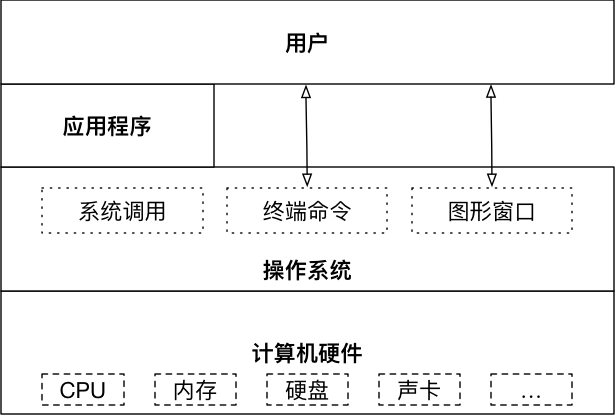

## Linux 介绍

### 操作系统

 **操作系统**（英语：operating system，[缩写](https://baike.baidu.com/item/%E7%BC%A9%E5%86%99)作 **OS**）是管理[计算机](https://baike.baidu.com/item/%E8%AE%A1%E7%AE%97%E6%9C%BA)[硬件](https://baike.baidu.com/item/%E7%A1%AC%E4%BB%B6)与[软件](https://baike.baidu.com/item/%E8%BD%AF%E4%BB%B6)资源的[计算机程序](https://baike.baidu.com/item/%E8%AE%A1%E7%AE%97%E6%9C%BA%E7%A8%8B%E5%BA%8F)，同时也是计算机系统的内核与基石。操作系统需要处理如管理与配置[内存](https://baike.baidu.com/item/%E5%86%85%E5%AD%98)、决定系统资源供需的优先次序、控制输入与输出设备、操作[网络](https://baike.baidu.com/item/%E7%BD%91%E7%BB%9C)与管理[文件系统](https://baike.baidu.com/item/%E6%96%87%E4%BB%B6%E7%B3%BB%E7%BB%9F)等基本事务。操作系统也提供一个让用户与系统交互的操作界面。



没有安装操作系统的计算机，通常被称为裸机

- 如果想在裸机上运行自己所编写的程序，就必须用机器语言书写程序
- 如果计算机上安装了操作系统，就可以在操作系统上安装支持的高级语言环境，用高级语言开发程序

### 不同应用领域的主流操作系统

##### 桌面操作系统

- Windows 系列 
  - 用户群体大 
- macOS
  - 适合于开发人员
- Linux
  - 应用软件少

##### 服务器操作系统

- Linux
  - 安全、稳定、免费
  - 占有率高
- Windows Server
  - 付费
  - 占有率低

##### 嵌入式操作系统

- Linux

##### 移动设备操作系统

- iOS
- Android（基于 `Linux` ）


### 虚拟机


虚拟机（Virtual Machine）指通过软件模拟的具有完整硬件系统功能的、运行在一个完全隔离环境中的完整计算机系统

- 虚拟系统通过生成现有操作系统的全新虚拟镜像，具有真实操作系统完全一样的功能
- 进入虚拟系统后，所有操作都是在这个全新的独立的虚拟系统里面进行，可以独立安装运行软件，保存数据，拥有自己的独立桌面，不会对真正的系统产生任何影响
- 而且能够在现有系统与虚拟镜像之间灵活切换的一类操作系统

### 操作系统发展史

只有硬件没有软件的计算机系统被称之为“裸机”，我们很难用“裸机”来完成计算机日常的工作（如存储和运算），所以必须用特定的软件来控制硬件的工作。最靠近计算机硬件的软件是系统软件，其中最为重要的就是“操作系统”。“操作系统”是控制和管理整个计算机系统的硬件和软件资源，合理的分配资源和调配任务，为系统用户和其他软件提供接口和环境的程序的集合。

#### 没有操作系统（手工操作）

在计算机诞生之初没有操作系统的年代，人们先把程序纸带（或卡片）装上计算机，然后启动输入机把程序和送入计算机，接着通过控制台开关启动程序运行。当程序执行完毕，打印机输出计算的结果，用户卸下并取走纸带（或卡片）。第二个用户上机，重复同样的步骤。在整个过程中用户独占机器，CPU等待手工操作，资源利用率极低。下图是IBM生产的书写 Fortran 程序的80栏打孔卡，当然这个已经是比较先进的打孔卡了。


#### 批处理系统

首先启动计算机上的一个监督程序，在监督程序的控制下，计算机能够自动的、成批的处理一个或多个用户的作业。完成一批作业后，监督程度又从输入机读取作业存入磁带机。按照上面的步骤重复处理任务。监督程序不停的处理各个作业，实现了作业的自动转接，减少了作业的建立时间和手工操作时间，提高了计算机资源的利用率。 批处理系统又可以分为单道批处理系统、多道批处理系统、联机批处理系统、脱机批处理系统。

#### 分时系统和实时系统

分时系统是把处理器的运行时间分成很短的时间片，按时间片轮流把处理机分配给各联机作业使用。 若某个作业在分配给它的时间片内不能完成其计算，则该作业暂时中断，把处理机让给另一作业使用，等待下一轮调度时再继续其运行。由于计算机速度很快，作业运行轮转得很快，给每个用户的感觉是他独占了一台计算机。而每个用户可以通过自己的终端向系统发出各种操作控制命令，在充分的人机交互情况下，完成作业的运行。为了解决分时系统不能及时响应用户指令的情况，又出现了能够在在严格的时间范围内完成事件处理，及时响应随机外部事件的实时系统。

#### 通用操作系统

1. 1960s：IBM的System/360系列的机器有了统一的操作系统OS/360。

2. 1965年：AT&T的贝尔实验室加入GE和MIT的合作计划开始开发MULTICS。

   1965 年之前的时候，电脑并不像现在一样普遍，它可不是一般人能碰的起的，除非是军事或者学院的研究机构，而且当时大型主机至多能提供30台终端（30个键盘、显示器)，连接一台电脑。

   

3. 1969年：Ken Tompson为了玩“Space Travel”游戏用汇编语言在PDP-7上开发了Unics。

4. 

5. 1970年~1971年：Ken Tompson 和 Dennis Ritchie 用B语言在PDP-11上重写了Unics，并在Brian Kernighan的建议下将其更名为Unix。

   

6. 1972年~1973年：Dennis Ritchie发明了C语言来取代可移植性较差的B语言，并开启了用C语言重写Unix的工作。

7. 1974年：Unix推出了里程碑意义的第5版，几乎完全用C语言来实现。

8. 1979年：从Unix第7版开始，**AT&T** 发布新的使用条款，**将Unix私有化**。

9. 1987年：Andrew S. Tanenbaum 教授为了能在课堂上教授学生操作系统运作的细节，决定在不使用任何 AT&T 的源代码前提下，自行开发与Unix兼容的操作系统，以避免版权上的争议并将其命名为 **Minix** 。

10. 1991年：`Linus Torvalds` 就读于芬兰赫尔辛基大学期间，尝试在 `Minix` 上做一些开发工作，但因为 `Minix` 只是作为教学用途的操作系统，功能并不强大，为了方便在学校的主机的新闻组和邮件系统中读写和下载文件，Linus 编写了磁盘驱动程序和文件系统，这些成为了 **Linux系统内核** 的雏形。


### Linux

1991 年 **林纳斯（Linus）** 就读于赫尔辛基大学期间，对 Unix 产生浓厚兴趣，尝试着在 `Minix` 上做一些开发工作

因为 **`Minix`** 只是教学使用，因此功能并不强，**林纳斯** 经常要用他的终端 **仿真器（Terminal Emulator）** 去访问大学主机上的新闻组和邮件，为了方便读写和下载文件，他自己编写了磁盘驱动程序和文件系统，这些在后来成为了 Linux 第一个内核的雏形，当时，他年仅 21 岁！

林纳斯利用 GNU 的 bash 当做开发环境，gcc 当做编译工具，编写了 Linux 内核，一开始 Linux 并不能兼容 Unix

- 即 Unix 上跑的应用程序不能在 Linux 上跑，即应用程序与内核之间的接口不一致
- 一开始 Linux 只适用于 386，后来经过全世界的网友的帮助，最终能够兼容多种硬件


### Linux 内核版本

内核（kernel）是系统的心脏，是运行程序和管理像磁盘和打印机等硬件设备的核心程序，它提供了一个在裸设备与应用程序间的抽象层

Linux 内核版本又分为稳定版和开发版，两种版本是相互关联，相互循环

- **稳定版**：具有工业级强度，可以广泛地应用和部署。新的稳定版相对于较旧的只是修正一些 bug 或加入一些新的驱动程序
- **开发版**：由于要试验各种解决方案，所以变化很快

内核源码网址：<http://www.kernel.org> 

> 所有来自全世界的对 Linux 源码的修改最终都会汇总到这个网站，由 Linus 领导的开源社区对其进行甄别和修改最终决定是否进入到 Linux 主线内核源码中


### Linux 发行版本

Linux 发行版（也被叫做 GNU/Linux 发行版）通常包含了包括桌面环境、办公套件、媒体播放器、数据库等应用软件

常见的发行版本如下：
- Ubuntu
- Redhat
- Fedora
- openSUSE
- Linux Mint
- Debian
- Manjaro
- Mageia
- CentOS
- Arch

### Linux 的应用领域

#### 服务器领域

Linux 在服务器领域的应用是其重要分支

Linux 免费、稳定、高效等特点在这里得到了很好的体现

- 早期因为维护、运行等原因同样受到了很大的限制
- 近些年来 Linux 服务器市场得到了飞速的提升，尤其在一些高端领域尤为广泛

#### 嵌入式领域

近些年来 Linux 在嵌入式领域的应用得到了飞速的提高

Linux 运行稳定、对网络的良好支持性、低成本，且可以根据需要进行软件裁剪，内核最小可以达到几百 KB 等特点，使其近些年来在嵌入式领域的应用得到非常大的提高

> 主要应用：**机顶盒**、**数字电视**、**网络电话**、**程控交换机**、**手机**、等都是其应用领域，得到了 Google、三星、摩托罗拉、NEC 等公司的大力推广 

#### 个人桌面领域

此领域是传统 Linux 应用最薄弱的环节

传统 Linux 由于界面简单、操作复杂、应用软件少的缺点，一直被 Windows 所压制

近些年来随着 **Ubuntu**、**Fedora** 等优秀桌面环境的兴起，同时各大硬件厂商对其支持的加大，Linux 在个人桌面领域的占有率在逐渐的提高


## 软件安装与更新

### APT包管理器(Advanced Packaging Tool)

使用deb包不方便的地方

+ 作为底层工具，不能处理决依赖关系

+ APT是上层工具，可以解决负责依赖关系，自动安装

**优点** 

+ 自动下载、配置、安装二进制或源码包

+ 工作在客户端/服务器模式

+ 服务器：保存最新Linux软件包，在Ubuntu中称为源，APT分析每个软件包头信息并存放在下载列表中 /etc/apt/sources.list

+ 客户端：本机软件与下载列表对比，确定哪些软件(及其依赖包)需要下载、哪些需要升级。若要安装的软件在源中没有对应版本，就需要自己添加源或者手动下载了


### apt 终端命令

+ 检查依赖性：apt check

+ 安装：apt install
+ 更新本地数据库：apt update
+ 软件升级：apt upgrade
+ 卸载：apt remove/autoremove
+ 清除本地已经下载并安装的包：apt clean


常用命令如下：

```bash
# 更新可用软件包列表
$ sudo apt update

# 更新已安装的包
$ sudo apt upgrade 

# 安装软件
$ sudo apt install 软件名

# 卸载软件
$ sudo apt remove 软件名
```


#### 1) 软件更新和升级

通常安装完 ubuntu 之后，可以先使用 `upgrade` 更新一下当前系统中可以升级的的软件包

```bash
$ sudo apt update

$ sudo apt upgrade
```

**提示** 如果增加、更换了软件源，通常需要使用 `update` 更新一下本地缓存


#### 2) 安装常用工具

**提示** apt 安装命令的格式是不需要记忆的，如果在终端中输入的软件没有安装，系统会提示 **apt 命令** 的使用格式 

```bash
sudo apt install openssh-server
```

安装之后，才可以在其他系统中，通过 ssh 工具远程登陆


#### 3) 扩展：`apt` 和 `apt-get` 

- `apt` 和 `apt-get` 都是 ubuntu 下常用的安装软件的命令
- **早期** 使用 `apt-get`，从 ununtu 16 开始，官方建议使用 `apt` 
- 这两个命令的 **使用方式非常类似** 


### 配置软件源

- 如果希望在 `ubuntu` 中安装软件，**更加快速**，可以通过设置 **镜像源** ，选择一个访问网速更快的服务器，来提供软件下载／安装服务
- 提示：更换服务器之后，需要一个相对比较长时间的更新过程，需要耐心等待。更新完成后，再安装软件都会从新设置的服务器下载软件了

> 所谓镜像源，就是**所有服务器的内容是相同的（镜像）**，但是根据所在位置不同，国内服务器通常速度会更快一些！


ubuntu18.04修改镜像源： https://blog.csdn.net/qq_41822647/article/details/85122467

## Shell 基本命令


Shell是操作系统的用户界面，提供了用户和内核进行交互操作的一种接口。

Shell实际上就是一个命令解释器，它接受、解释用户输入的命令并把它送到内核执行。

Shell作为命令语言，能交互地解释和执行用户输入的命令

作为程序设计语言，定义各种变量和参数、提供循环、分支等控制结构

对shell的使用熟练程序直观地反映出你对 Linux 使用的熟练程度

### Shell是什么？

工作模式

- 交互式：一条一条地解释执行用户的命令
- 批处理：一次性执行脚本里的命令

几种常见的shell

+ bash：linux默认使用的shell
+ sh：Steve bourne开发，最初的Unix shell
+ ash：由Kenneth Almquist编写，只有24个命令
+ csh：以William Joy为代表47位作者编写
+ ksh：Korn shell的缩写

## 使用命令帮助

在linux终端，面对命令不知道怎么用，或不记得命令的拼写及参数时，我们需要求助于系统的帮助文档； linux系统内置的帮助文档很详细，通常能解决我们的问题，我们需要掌握如何正确的去使用它们；

- 在只记得部分命令关键字的场合，我们可通过man -k来搜索；
- 需要知道某个命令的简要说明，可以使用whatis；而更详细的介绍，则可用info命令；
- 查看命令在哪个位置，我们需要使用which；
- 而对于命令的具体参数及使用方法，我们需要用到强大的man；

下面介绍这些命令；


### 命令格式

```bash
command [-options] [parameter]
```

说明：
- `command`：命令名，相应功能的英文单词或单词的缩写
- `[-options]`：选项，可用来对命令进行控制，也可以省略
- `parameter`：传给命令的参数，可以是 **零个**、**一个** 或者 **多个** 

> `[]` 代表可选

**终端实用技巧** 

自动补全

在敲出文件／目录／命令的前几个字母之后，按下`tab`键

- 如果输入的没有歧义，系统会自动补全
- 如果还存在其他 `文件`／`目录`／`命令`，再按一下 `tab` 键，系统会提示可能存在的命令

曾经使用过的命令

- 按 `上`／`下` 光标键可以在曾经使用过的命令之间来回切换
- 如果想要退出选择，并且不想执行当前选中的命令，可以按 `ctrl + c` 


### 命令使用

查看命令的简要说明

简要说明命令的作用（显示命令所处的man分类页面）:
```
$whatis command
```
正则匹配:
```
$whatis -w "loca*"
```
更加详细的说明文档:
```
$info command
```

### 使用man

查询命令command的说明文档:
```
$man command
eg：man date
```
使用 page up 和 page down 来上下翻页

在 man 的帮助手册中，将帮助文档分为了9个类别，对于有的关键字可能存在多个类别中， 我们就需要指定特定的类别来查看；（一般我们查询bash命令，归类在1类中）；

man页面所属的分类标识(常用的是分类1和分类3)
```
(1)、用户可以操作的命令或者是可执行文件
(2)、系统核心可调用的函数与工具等
(3)、一些常用的函数与数据库
(4)、设备文件的说明
(5)、设置文件或者某些文件的格式
(6)、游戏
(7)、惯例与协议等。例如Linux标准文件系统、网络协议、ASCⅡ，码等说明内容
(8)、系统管理员可用的管理条令
(9)、与内核有关的文件
```

前面说到使用whatis会显示命令所在的具体的文档类别，我们学习如何使用它
```
eg:
$whatis printf
printf               (1)  - format and print data
printf               (1p)  - write formatted output
printf               (3)  - formatted output conversion
printf               (3p)  - print formatted output
printf [builtins]    (1)  - bash built-in commands, see bash(1)
```


### 查看路径

查看程序的binary文件所在路径:
```
$which command
```

eg:查找make程序安装路径:
```
$which make
/opt/app/openav/soft/bin/make install
```

查看程序的搜索路径:
```
$whereis command
```

当系统中安装了同一软件的多个版本时，不确定使用的是哪个版本时，这个命令就能派上用场；