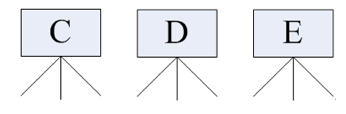

## 文件及目录管理

单用户操作系统和多用户操作系统（科普）

**单用户操作系统**：指一台计算机在同一时间 **只能由一个用户** 使用，一个用户独自享用系统的全部硬件和软件资源

Windows XP 之前的版本都是单用户操作系统

**多用户操作系统**：指一台计算机在同一时间可以由 **多个用户** 使用，多个用户共同享用系统的全部硬件和软件资源

**Unix** 和 **Linux** 的设计初衷就是多用户操作系统 

### `Win` 和 `Linux` 区别

`Windows` 下的文件系统

在 `Windows` 下，打开 “计算机”，我们看到的是一个个的驱动器盘符：


- 每个驱动器都有自己的根目录结构，这样形成了多个树并列的情形，如图所示：



`Linux` 下的文件系统

在 `Linux` 下，我们是看不到这些驱动器盘符，我们看到的是文件夹（目录）：


`Ubuntu` 没有盘符这个概念，只有一个根目录 `/`，所有文件都在它下面


#### 用户目录

位于 `/home/user`，称之为用户工作目录或家目录，表示方式：

```bash
/home/user
```

### `Linux` 主要目录速查表

- /：根目录，
  一般根目录下只存放目录
  在 linux 下有且只有一个根目录，所有的东西都是从这里开始
  当在终端里输入 `/home`，其实是在告诉电脑，先从 `/`（根目录）开始，再进入到 `home` 目录
- /bin、/usr/bin：可执行二进制文件的目录，如常用的命令 ls、tar、mv、cat 等
- /boot：放置 linux 系统启动时用到的一些文件，如 linux 的内核文件：`/boot/vmlinuz`，系统引导管理器：`/boot/grub` 
- /dev：存放 linux 系统下的设备文件，访问该目录下某个文件，相当于访问某个设备，常用的是挂载光驱 `mount /dev/cdrom /mnt` 
- /etc：系统配置文件存放的目录，不建议在此目录下存放可执行文件，重要的配置文件有
  - /etc/inittab
  - /etc/fstab
  - /etc/init.d
  - /etc/X11
  - /etc/sysconfig
  - /etc/xinetd.d
- /home：系统默认的用户家目录，新增用户账号时，用户的家目录都存放在此目录下
  - `~` 表示当前用户的家目录
  - `~edu` 表示用户 `edu` 的家目录
- /lib、/usr/lib、/usr/local/lib：系统使用的函数库的目录，程序在执行过程中，需要调用一些额外的参数时需要函数库的协助
- /lost+fount：系统异常产生错误时，会将一些遗失的片段放置于此目录下
- /mnt: /media：光盘默认挂载点，通常光盘挂载于 /mnt/cdrom 下，也不一定，可以选择任意位置进行挂载
- /opt：给主机额外安装软件所摆放的目录
- /proc：此目录的数据都在内存中，如系统核心，外部设备，网络状态，由于数据都存放于内存中，所以不占用磁盘空间，比较重要的文件有：/proc/cpuinfo、/proc/interrupts、/proc/dma、/proc/ioports、/proc/net/* 等
- /root：系统管理员 root 的家目录
- /sbin、/usr/sbin、/usr/local/sbin：放置系统管理员使用的可执行命令，如 fdisk、shutdown、mount 等。与 /bin 不同的是，这几个目录是给系统管理员 root 使用的命令，一般用户只能"查看"而不能设置和使用
- /tmp：一般用户或正在执行的程序临时存放文件的目录，任何人都可以访问，重要数据不可放置在此目录下
- /srv：服务启动之后需要访问的数据目录，如 www 服务需要访问的网页数据存放在 /srv/www 内
- /usr：应用程序存放目录
  - /usr/bin：存放应用程序
  - /usr/share：存放共享数据
  - /usr/lib：存放不能直接运行的，却是许多程序运行所必需的一些函数库文件
  - /usr/local：存放软件升级包
  - /usr/share/doc：系统说明文件存放目录
  - /usr/share/man：程序说明文件存放目录

- /var：放置系统执行过程中经常变化的文件
  - /var/log：随时更改的日志文件
  - /var/spool/mail：邮件存放的目录
  - /var/run：程序或服务启动后，其 PID 存放在该目录下

## 文件和目录常用命令

文件管理不外乎文件或目录的创建、删除、查询、移动，有 mkdir/rm/mv 

文件查询是重点，用 find 来进行查询；find 的参数丰富，也非常强大；

查看文件内容是个大的话题，文本的处理有太多的工具供我们使用，在本章中只是点到即止，后面会有专门的一章来介绍文本的处理工具；

有时候，需要给文件创建一个别名，我们需要用到ln，使用这个别名和使用原文件是相同的效果；

在职场中，作为后端程序员，必须要或多或少的掌握一些 Linux 常用的终端命令

Linux 发行版本的命令大概有 200 多个，但是常用的命令只有 10 多个而已

> 学习终端命令的技巧：
>
> - 不需要死记硬背，对于常用命令，用的多了，自然就记住了
> - 不要尝试一次学会所有的命令，有些命令是非常不常用的，临时遇到，临时百度就可以

**常用 Linux 命令** 

| 序号 | 命令           | 对应英文             | 作用                     |
| :--- | :------------- | :------------------- | :----------------------- |
| 01   | ls             | list                 | 查看当前文件夹下的内容   |
| 02   | pwd            | print wrok directory | 查看当前所在文件夹       |
| 03   | cd [目录名]    | change directory     | 切换文件夹               |
| 04   | touch [文件名] | touch                | 如果文件不存在，新建文件 |
| 05   | mkdir [目录名] | make directory       | 创建目录                 |
| 06   | rm [文件名]    | remove               | 删除指定的文件名         |
| 07   | clear          | clear                | 清屏                     |

> 小技巧
>
> - `ctrl + shift + =` **放大**终端窗口的字体显示
> - `ctrl + -` **缩小**终端窗口的字体显示


### 查看目录内容

#### ls 命令说明
- `ls` 是英文单词 **list** 的简写，其功能为列出目录的内容，是用户最常用的命令之一，类似于 **DOS** 下的 `dir` 命令 

**Linux 下文件和目录的特点** 
- Linux **文件** 或者 **目录** 名称最长可以有 `256` 个字符
- 以 `.` 开头的文件为隐藏文件，需要用 -a 参数才能显示
- **.** 代表当前目录
- **..** 代表上一级目录

#### ls 常用选项 

| 参数 | 含义                                         |
| :--- | :------------------------------------------- |
| -a   | 显示指定目录下所有子目录与文件，包括隐藏文件 |
| -l   | 以列表方式显示文件的详细信息                 |
| -h   | 配合 -l 以人性化的方式显示文件大小           |

计算机中文件大小的表示方式（科普）

| 单位 | 英文           | 含义                                            |
| :--- | :------------- | :---------------------------------------------- |
| 字节 | B（Byte）      | 在计算机中作为一个数字单元，一般为 8 位二进制数 |
| 千   | K（Kibibyte）  | 1 KB = 1024 B，千字节 （1024 = 2 ** 10）        |
| 兆   | M（Mebibyte）  | 1 MB = 1024 KB，百万字节                        |
| 千兆 | G（Gigabyte）  | 1 GB = 1024 MB，十亿字节，千兆字节              |
| 太   | T（Terabyte）  | 1 TB = 1024 GB，万亿字节，太字节                |
| 拍   | P（Petabyte）  | 1 PB = 1024 TB，千万亿字节，拍字节              |
| 艾   | E（Exabyte）   | 1 EB = 1024 PB，百亿亿字节，艾字节              |
| 泽   | Z（Zettabyte） | 1 ZB = 1024 EB，十万亿亿字节，泽字节            |
| 尧   | Y（Yottabyte） | 1 YB = 1024 ZB，一亿亿亿字节，尧字节            |


### 目录切换

- 找到文件/目录位置：cd
- 切换到上一个工作目录： cd -
- 切换到home目录： cd or cd ~
- 显示当前路径: pwd
- 更改当前工作路径为 path: $cd path

#### `cd` 
`cd` 是英文单词 **change directory** 的简写，其功能为更改当前的工作目录，也是用户最常用的命令之一

> 注意：Linux 所有的 **目录** 和 **文件名** 都是大小写敏感的

| 命令  | 含义                                   |
| :---- | :------------------------------------- |
| cd    | 切换到当前用户的主目录(/home/用户目录) |
| cd ~  | 切换到当前用户的主目录(/home/用户目录) |
| cd .  | 保持在当前目录不变                     |
| cd .. | 切换到上级目录                         |
| cd -  | 可以在最近两次工作目录之间来回切换     |

#### 相对路径和绝对路径

**相对路径** 在输入路径时，最前面不是 **/** 或者 **~**，表示相对 **当前目录** 所在的目录位置

**绝对路径** 在输入路径时，最前面是 **/** 或者 **~**，表示从 **根目录/家目录** 开始的具体目录位置

### 创建和删除操作

- 创建：mkdir
- 删除：rm
- 删除非空目录：rm -rf file 目录
- 删除日志 `rm log (等价: $find ./ -name “log” -exec rm {} ;)` 
- 移动：mv
- 复制：cp (复制目录：cp -r )

查看当前目录下文件个数:
```
$find ./ | wc -l
```

复制目录:

```
$cp -r source_dir  dest_dir
```


#### `touch` 

创建文件或修改文件时间

- 如果文件 **不存在**，可以创建一个空白文件
- 如果文件 **已经存在**，可以修改文件的末次修改日期

#### `mkdir` 

创建一个新的目录
| 选项 | 含义             |
| :--- | :--------------- |
| -p   | 可以递归创建目录 |

> **新建目录的名称** 不能与当前目录中 **已有的目录或文件** 同名

#### `rm` 

删除文件或目录
> 使用 `rm` 命令要小心，因为文件删除后不能恢复

| 选项 | 含义                                                  |
| :--- | :---------------------------------------------------- |
| -f   | 强制删除，忽略不存在的文件，无需提示                  |
| -r   | 递归地删除目录下的内容，**删除文件夹** 时必须加此参数 |


### 查看文件内容

查看文件：cat vi head tail more 

| 序号 | 命令                 | 对应英文    | 作用                                                 |
| :--- | :------------------- | :---------- | :--------------------------------------------------- |
| 01   | cat 文件名           | concatenate | 查看文件内容、创建文件、文件合并、追加文件内容等功能 |
| 02   | more 文件名          | more        | 分屏显示文件内容                                     |
| 03   | grep 搜索文本 文件名 | grep        | 搜索文本文件内容                                     |

#### `cat`  
- `cat` 命令可以用来 **查看文件内容**、**创建文件**、**文件合并**、**追加文件内容** 等功能
- `cat` 会一次显示所有的内容，适合 **查看内容较少** 的文本文件

| 选项 | 含义               |
| :--- | :----------------- |
| -b   | 对非空输出行编号   |
| -n   | 对输出的所有行编号 |

> Linux 中还有一个 `nl` 的命令和 `cat -b` 的效果等价

显示时同时显示行号:
```
$cat -n
```

按页显示列表内容:
```
$ls -al | more
```

只看前10行:
```
$head - 10 **
```

显示文件第一行:
```
$head -1 filename
```

显示文件倒数第五行:
```
$tail -5 filename
```

查看两个文件间的差别:
```
$diff file1 file2
```

动态显示文本最新信息:
```
$tail -f crawler.log
```

#### `more` 
- `more` 命令可以用于分屏显示文件内容，每次只显示一页内容
- 适合于 **查看内容较多**的文本文件

使用 `more` 的操作键：
| 操作键   | 功能                 |
| :------- | :------------------- |
| 空格键   | 显示手册页的下一屏   |
| Enter 键 | 一次滚动手册页的一行 |
| b        | 回滚一屏             |
| f        | 前滚一屏             |
| q        | 退出                 |
| /word    | 搜索 **word** 字符串 |

#### `grep` 

- Linux 系统中 `grep` 命令是一种强大的文本搜索工具
- `grep` 允许对文本文件进行 **模式**查找，所谓模式查找，又被称为正则表达式

| 选项 | 含义                                     |
| :--- | :--------------------------------------- |
| -n   | 显示匹配行及行号                         |
| -v   | 显示不包含匹配文本的所有行（相当于求反） |
| -i   | 忽略大小写                               |

- 常用的两种模式查找

| 参数 | 含义                         |
| :--- | :--------------------------- |
| ^a   | 行首，搜寻以 **a** 开头的行  |
| ke$  | 行尾，搜寻以 **ke** 结束的行 |

### 其他
- 批处理命令连接执行，使用 |
- 串联: 使用分号 ;
- 前面成功，则执行后面一条，否则，不执行:&&
- 前面失败，则后一条执行: ||

#### echo 文字内容
- `echo` 会在终端中显示参数指定的文字，通常会和 **重定向** 联合使用

#### 重定向 `>` 和 `>>` 
- Linux 允许将命令执行结果 **重定向**到一个 **文件** 
- 将本应显示在**终端上的内容** **输出／追加** 到**指定文件中** 

其中
- `>` 表示输出，会覆盖文件原有的内容
- `>>` 表示追加，会将内容追加到已有文件的末尾

#### 管道 `|` 
- Linux 允许将 **一个命令的输出** 可以**通过管道** 做为 **另一个命令的输入** 
- 可以理解现实生活中的管子，管子的一头塞东西进去，另一头取出来，这里 `|` 的左右分为两端，左端塞东西（写），右端取东西（读）

常用的管道命令有：
- `more`：分屏显示内容
- `grep`：在命令执行结果的基础上查询指定的文本


### 拷贝和移动文件

| 序号 | 命令                         | 对应英文 | 作用                                 |
| :--- | :--------------------------- | :------- | :----------------------------------- |
| 01   | tree [目录名]                | tree     | 以树状图列出文件目录结构             |
| 02   | cp 源文件 目标文件           | copy     | 复制文件或者目录                     |
| 03   | mv 路径/源文件 路径/目标文件 | move     | 移动文件或者目录／文件或者目录重命名 |

#### `tree` 
 `tree` 命令可以以树状图列出文件目录结构

| 选项 | 含义       |
| :--- | :--------- |
| -d   | 只显示目录 |

#### `cp` 
 `cp` 命令的功能是将给出的 **文件** 或 **目录** 复制到另一个 **文件** 或 **目录** 中，相当于 **DOS** 下的 `copy` 命令

| 选项 | 含义                                                         |
| :--- | :----------------------------------------------------------- |
| -i   | 覆盖文件前提示                                               |
| -r   | 若给出的源文件是目录文件，则 cp 将递归复制该目录下的所有子目录和文件，目标文件必须为一个目录名 |

```shell
cp -r  原始文件/目录  目标文件/目录

cp python/day1/code01.py python/day2/   # 将文件复制到目录里面
cp python/day1/code01.py python/day2/code02.py   # 复制文件并重命名
cp -r python/day2/ python/day3/   # 复制目录
cp -r python/day2/ python/day3/day2_back   # 复制目录并且重命名
```

#### `mv`
 `mv` 命令可以用来 **移动** **文件** 或 **目录**，也可以给 **文件或目录重命名** 
| 选项 | 含义           |
| :--- | :------------- |
| -i   | 覆盖文件前提示 |

```
mv -r  原始文件/目录  目标文件/目录
```

### 总结

- 查看目录内容
  - `ls` 
- 切换目录
  - `cd` 
- 创建和删除操作
  - `touch` 
  - `rm` 
  - `mkdir` 
- 拷贝和移动文件
  - `cp` 
  - `mv` 
- 查看文件内容
  - `cat` 
  - `more` 
  - `grep` 
- 其他
  - `echo` 
  - 重定向 `>` 和 `>>` 
  - 管道 `|` 

## 打包压缩

- **打包压缩** 是日常工作中备份文件的一种方式
- 在不同操作系统中，常用的打包压缩方式是不同的
  - `Windows` 常用 `rar` 
  - `Mac` 常用 `zip` 
  - `Linux` 常用 `tar.gz` 

#### 打包 ／ 解包

- `tar` 是 Linux 中最常用的 **备份**工具，此命令可以 **把一系列文件** 打包到 **一个大文件中**，也可以把一个 **打包的大文件恢复成一系列文件**
- `tar` 的命令格式如下：

```bash
# 打包文件
tar -cvf 打包文件.tar 被打包的文件／路径...

# 解包文件
tar -xvf 打包文件.tar
```

- `tar` 选项说明

| 选项 | 含义                                                         |
| :--- | :----------------------------------------------------------- |
| c    | 生成档案文件，创建打包文件                                   |
| x    | 解开档案文件                                                 |
| v    | 列出归档解档的详细过程，显示进度                             |
| f    | 指定档案文件名称，f 后面一定是 .tar 文件，所以必须放选项最后 |

> 注意：`f` 选项必须放在最后，其他选项顺序可以随意

#### 打包解包演练

1. 删除桌面下的所有内容
2. 在桌面下新建三个空白文件 `01.py`、`02.py`、`03.py`
3. 将这三个文件打一个 `py.tar` 的包
4. 新建 `tar` 目录，并且将 `py.tar` 移动到 `tar` 目录下
5. 解包 py.tar


### 压缩／解压缩

#### 1) `gzip`
- tar与gzip命令结合可以使用实现文件
  打包和压缩

  - `tar` 只负责打包文件，但不压缩
  - 用 `gzip` 压缩 `tar` 打包后的文件，其扩展名一般用 `xxx.tar.gz`

> 在 `Linux` 中，最常见的压缩文件格式就是 `xxx.tar.gz`

- 在 `tar` 命令中有一个选项 **-z** 可以调用 `gzip`，从而可以方便的实现压缩和解压缩的功能
- 命令格式如下：

```bash
# 压缩文件
tar -zcvf 打包文件.tar.gz 被压缩的文件／路径...

# 解压缩文件
tar -zxvf 打包文件.tar.gz

# 解压缩到指定路径
tar -zxvf 打包文件.tar.gz -C 目标路径
```

| 选项 | 含义                                           |
| :--- | :--------------------------------------------- |
| -C   | 解压缩到指定目录，注意：要解压缩的目录必须存在 |

#### 2) `bzip2(two)` 

- `tar` 与 `bzip2` 命令结合可以使用实现文件 **打包和压缩**（用法和 `gzip` 一样）
  - `tar` 只负责打包文件，但不压缩，
  - 用 `bzip2` 压缩 `tar` 打包后的文件，其扩展名一般用 `xxx.tar.bz2` 
- 在 `tar` 命令中有一个选项 **-j** 可以调用 `bzip2`，从而可以方便的实现压缩和解压缩的功能
- 命令格式如下：
```bash
# 压缩文件
tar -jcvf 打包文件.tar.bz2 被压缩的文件／路径...

# 解压缩文件
tar -jxvf 打包文件.tar.bz2
```

