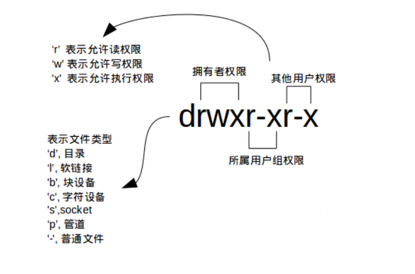
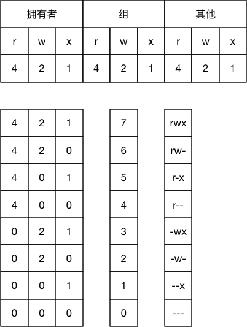
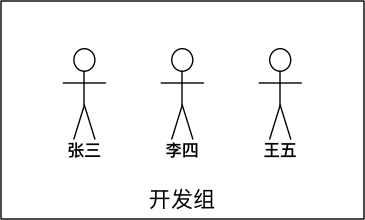
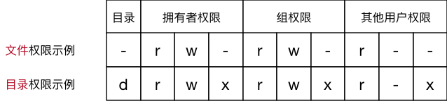
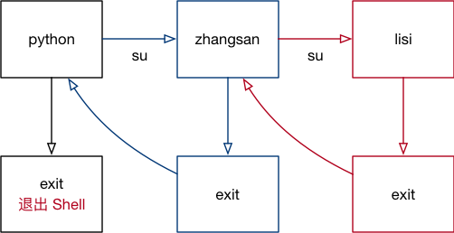

## 文件权限

文件权限就是文件的访问控制权限，即哪些用户和组群可以访问文件以及可以执行什么样的操作。

Unix/Linux 系统是一个典型的多用户系统，不同的用户处于不同的地位，对文件和目录有不同的访问权限。为了保护系统的安全性，Unix/Linux 系统除了对用户权限作了严格的界定外，还在用户身份认证、访问控制、传输安全、文件读写权限等方面作了周密的控制。

在 Unix/Linux 中的每一个文件或目录都包含有访问权限，这些访问权限决定了谁能访问和如何访问这些文件和目录。

我们之前已经很多次用到 `ls` 命令了，如你所见，我们用它来列出并显示当前目录下的文件，当然这是在不带任何参数的情况下，它能做的当然不止这么多，现在我们就要用它来查看文件权限。

### 文件访问权限

+ 每个文件都有一个所有者
+ 每个文件或目录都有一个指派给它们的组
+ Linux根据文件的所有者和所属组来确定谁可以访问

文件的3种权限 


+ 读：r 
+ 写：w 
+ 执行：x 
+ rwx-xr-r 
+ u-所有者；g-组；o-其它用户；a-所有用户

使用较长格式列出文件：
```bash
ubuntu@ubuntu:~$ ls -l
总用量 57220
drwxr-xr-x  3 ubuntu ubuntu     4096 May 16 12:37 Desktop
drwxr-xr-x  3 ubuntu ubuntu     4096 May 16 06:47 Documents
drwxr-xr-x  2 ubuntu ubuntu     4096 May 15 13:09 Downloads
-rw-r--r--  1 ubuntu ubuntu     8980 Apr 30 02:25 examples.desktop
......
```




#### 修改文件权限

| 序号 | 命令  | 作用       |
| :--- | :---- | :--------- |
| 01   | chown | 修改拥有者 |
| 02   | chgrp | 修改组     |
| 03   | chmod | 修改权限   |

改变文件所属关系

+ chown user:group file

给其它用户添加写权限

+ chmod a+x file
+ chmod 666 file

命令格式如下：

```bash
# 修改文件|目录的拥有者
chown 用户名 文件名|目录名

# 递归修改文件|目录的组
chgrp -R 组名 文件名|目录名

# 递归修改文件权限
chmod -R 755 文件名|目录名
```

- `chmod` 在设置权限时，可以简单地使用三个数字分别对应 拥有者 ／ 组 和 其他 用户的权限

```bash
# 直接修改文件|目录的 读|写|执行 权限，但是不能精确到 拥有者|组|其他
chmod +/-rwx 文件名|目录名
```



- 常见数字组合有（u表示用户／g示组／o表示其他）：
  - `777` ===> `u=rwx,g=rwx,o=rwx`
  - `755` ===> `u=rwx,g=rx,o=rx`
  - `644` ===> `u=rw,g=r,o=r`

#### chmod 演练目标

1. 将 `01.py` 的权限修改为 `u=rwx,g=rx,o=r`
2. 将 `123.txt` 的权限修改为 `u=rw,g=r,o=-`
3. 将 `test` 目录以及目录下的 所有 文件权限修改为 `u=rwx,g=rwx,o=rx`


## 用户和权限的基本概念

### 基本概念

- 用户 是 Linux 系统工作中重要的一环，用户管理包括 用户 与 组 管理
- 在 Linux 系统中，不论是由本机或是远程登录系统，每个系统都 必须拥有一个账号 ，并且 对于不同的系统资源拥有不同的使用权限  
- 在 Linux 中，可以指定 每一个用户 针对 不同的文件或者目录 的 不同权限 
- 对 文件／目录 的权限包括：

| 序号 | 权限 |  英文  | 缩写 | 数字代号 |
| :--: | :--: | :----: | :--: | :------: |
|  01  |  读  |  read  |  r   |    4     |
|  02  |  写  | write  |  w   |    2     |
|  03  | 执行 | excute |  x   |    1     |

### 用户组

在 Linux 里面每个用户都有一个归属（用户组），用户组简单地理解就是一组用户的集合，它们共享一些资源和权限，同时拥有私有资源，就跟家的形式差不多，你的兄弟姐妹（不同的用户）属于同一个家（用户组），你们可以共同拥有这个家（共享资源），爸妈对待你们都一样（共享权限），你偶尔写写日记，其他人未经允许不能查看（私有资源和权限）。当然一个用户是可以属于多个用户组的，正如你既属于家庭，又属于学校或公司。

在 Linux 里面为了方便用户管理，提出了 组 的概念，如下图所示



- 在实际应用中，可以预先针对 组 设置好权限，然后 将不同的用户添加到对应的组中，从而不用依次为每一个用户设置权限 

- #### groups 

### ls -l 扩展

- `ls -l` 可以查看文件夹下文件的详细信息，从左到右依次是：
  - 权限，第 1 个字符如果是 `d` 表示目录
  - 硬链接数，通俗地讲，就是有多少种方式，可以访问到当前目录／文件
  - 拥有者，家目录下 文件／目录 的拥有者通常都是当前用户
  - 组，在 Linux 中，很多时候，会出现组名和用户名相同的情况，后续会讲
  - 大小  
  - 时间 
  - 名称 



### `chmod` 简单使用（重要）

- `chmod` 可以修改 用户／组 对 文件／目录 的权限
- 命令格式如下：

```bash
chmod +/-rwx 文件名|目录名
```

> 提示：以上方式会一次性修改 `拥有者` / `组` 权限，有关 `chmod` 的高级用法，后续会讲

### 超级用户

- Linux 系统中的 `root` 账号通常 用于系统的维护和管理，对操作系统的所有资源 具有所有访问权限
- 在大多数版本的 Linux 中，都不推荐 直接使用 root 账号登录系统 
- 在 Linux 安装的过程中，系统会自动创建一个用户账号，而这个默认的用户就称为“标准用户”

#### sudo

- `su` 是 `substitute user` 的缩写，表示 使用另一个用户的身份 
- `sudo` 命令用来以其他身份来执行命令，预设的身份为 `root` 
- 用户使用 `sudo` 时，必须先输入密码，之后有 5 分钟的有效期限，超过期限则必须重新输入密码

> 若其未经授权的用户企图使用 `sudo`，则会发出警告邮件给管理员

- `su <user>` 可以切换到用户 user，执行时需要输入目标用户的密码
- `sudo <cmd>` 可以以特权级别运行 cmd 命令，需要当前用户属于 sudo 组，且需要输入当前用户的密码。
- `su - <user>` 命令也是切换用户，同时环境变量也会跟着改变成目标用户的环境变量。

### 组管理终端命令

> 提示：创建组 / 删除组 的终端命令都需要通过 `sudo` 执行

| 序号 | 命令                      | 作用                      |
| :--- | :------------------------ | :------------------------ |
| 01   | groupadd 组名             | 添加组                    |
| 02   | groupdel 组名             | 删除组                    |
| 03   | cat /etc/group            | 确认组信息                |
| 04   | chgrp -R 组名 文件/目录名 | 递归修改文件/目录的所属组 |

> 提示：
>
> - 组信息保存在 `/etc/group` 文件中
> - `/etc` 目录是专门用来保存 系统配置信息 的目录


- 在实际应用中，可以预先针对 组 设置好权限，然后 将不同的用户添加到对应的组中，从而不用依次为每一个用户设置权限

### 用户管理终端命令

> 提示：创建用户 / 删除用户 / 修改其他用户密码 的终端命令都需要通过 `sudo` 执行

### 创建用户／设置密码／删除用户 

| 序号 | 命令                           | 作用         | 说明                                                         |
| :--- | :----------------------------- | :----------- | :----------------------------------------------------------- |
| 01   | adduser -m -g 组 新建用户名    | 添加新用户   | -m 自动建立用户家目录-g 指定用户所在的组，否则会建立一个和同名的组 |
| 02   | passwd 用户名                  | 设置用户密码 | 如果是普通用户，直接用 passwd 可以修改自己的账户密码         |
| 03   | userdel -r 用户名              | 删除用户     | -r 选项会自动删除用户家目录                                  |
| 04   | cat /etc/passwd \| grep 用户名 | 确认用户信息 | 新建用户后，用户信息会保存在 /etc/passwd 文件中              |

> 提示：
>
> - 创建用户时，如果忘记添加 `-m` 选项指定新用户的家目录 —— 最简单的方法就是删除用户，重新创建
> - 创建用户时，默认会创建一个和用户名同名的组名
> - 用户信息保存在 `/etc/passwd` 文件中

### 查看用户信息

| 序号 | 命令        | 作用                       |
| :--- | :---------- | :------------------------- |
| 01   | id [用户名] | 查看用户 UID 和 GID 信息   |
| 02   | who         | 查看当前所有登录的用户列表 |
| 03   | whoami      | 查看当前登录用户的账户名   |

#### passwd 文件

`/etc/passwd` 文件存放的是用户的信息，由 6 个分号组成的 7 个信息，分别是

1. 用户名
2. 密码（x，表示加密的密码）
3. UID（用户标识）
4. GID（组标识）
5. 用户全名或本地帐号
6. 家目录
7. 登录使用的 Shell，就是登录之后，使用的终端命令，`ubuntu` 默认是 `bash` 

#### usermod

- `usermod` 可以用来设置 用户 的 主组 ／ 附加组 和 登录 Shell，命令格式如下：
- 主组：通常在新建用户时指定，在 `etc/passwd` 的第 4 列 GID 对应的组 
- 附加组：在 `etc/group` 中最后一列表示该组的用户列表，用于指定 用户的附加权限

> 提示：设置了用户的附加组之后，需要重新登录才能生效！

```bash
# 修改用户的主组（passwd 中的 GID）
usermod -g 组 用户名

# 修改用户的附加组
usermod -G 组 用户名

# 修改用户登录 Shell
usermod -s /bin/bash 用户名
```

> 注意：默认使用 `useradd` 添加的用户是没有权限使用 `sudo` 以 `root` 身份执行命令的，可以使用以下命令，将用户添加到 `sudo` 附加组中

```bash
usermod -G sudo 用户名
```

#### which（重要）

> 提示
>
> - `/etc/passwd` 是用于保存用户信息的文件
> - `/usr/bin/passwd` 是用于修改用户密码的程序

- `which` 命令可以查看执行命令所在位置，例如：

```bash
which ls

# 输出
# /bin/ls

which useradd

# 输出
# /usr/sbin/useradd
```

##### `bin` 和 `sbin` 

- 在 `Linux` 中，绝大多数可执行文件都是保存在 `/bin`、`/sbin`、`/usr/bin`、`/usr/sbin`
- `/bin`（`binary`）是二进制执行文件目录，主要用于具体应用
- `/sbin`（`system binary`）是系统管理员专用的二进制代码存放目录，主要用于系统管理
- `/usr/bin`（`user commands for applications`）后期安装的一些软件
- `/usr/sbin`（`super user commands for applications`）超级用户的一些管理程序

> 提示：
>
> - `cd` 这个终端命令是内置在系统内核中的，没有独立的文件，因此用 `which` 无法找到 `cd` 命令的位置


#### 删除用户

```python
sudo deluser user_name --remove-home
```


### 切换用户

| 序号 | 命令        | 作用                   | 说明                                     |
| :--- | :---------- | :--------------------- | :--------------------------------------- |
| 01   | su - 用户名 | 切换用户，并且切换目录 | - 可以切换到用户家目录，否则保持位置不变 |
| 02   | exit        | 退出当前登录账户       |                                          |

- `su` 不接用户名，可以切换到 `root`，但是不推荐使用，因为不安全
- `exit` 示意图如下：


