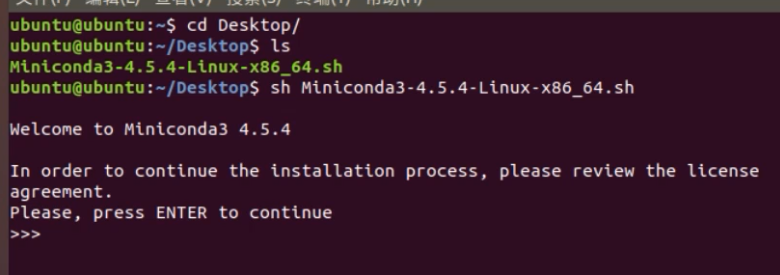
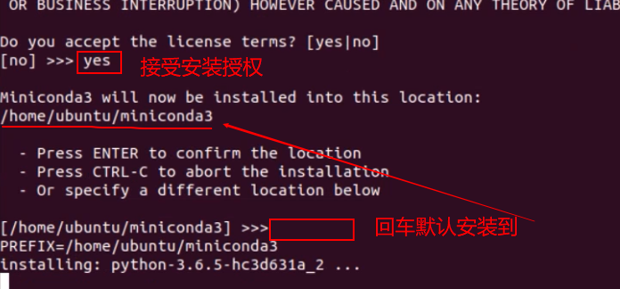
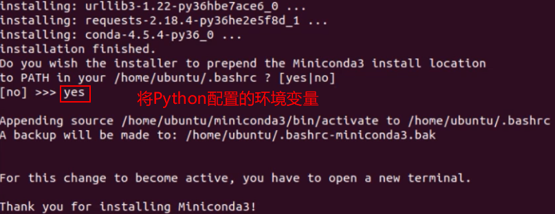
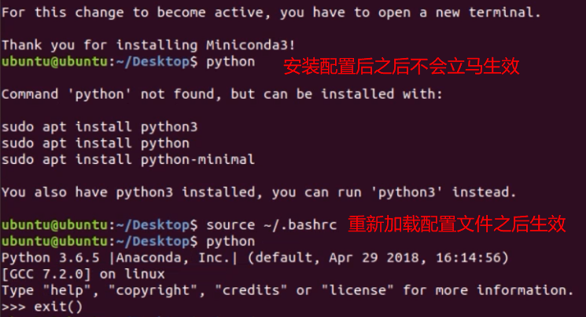

关于anaconda与miniconda

miniconda是anaconda的删减版，很多不常用的工具都没有内置到环境中去。anaconda有600多兆，而miniconda只有60多兆

下载地址：https://github.com/conda/conda-docs/blob/master/docs/source/miniconda.rst

miniconda版本选择： https://repo.anaconda.com/miniconda/


### 使用命令下载安装包

我们可以在 `Linux` 平台下使用 `wget` 指令

```
ubuntu@ubuntu:~$ wget https://repo.anaconda.com/miniconda/Miniconda3-py38_4.9.2-Linux-x86_64.sh
```

1. 使用 sh 指令运行安装包文件



2. 回车之后会进入查看安装授权的文件，按 `q` 退出之后会提示是否接受授权，我们敲 `yes` ，之后会问我们安装到那个目录，我选择默认安装的目录。



3. 之后就弹出问你是否配置到系统变量，我们输入 `yes` 之后就安装完成了。



4. 安装完之后，配置并不会直接生效，需要使用 `source` 使修改之后的 `path` 生效才能正常使用。




### pycharm安装：

pycharm 是 Python 很好用的 IDE，但是专业版需要付费，所以开始安装；

1. 首先在官网下载pycharm专业版，网址：<http://www.jetbrains.com/pycharm/download/#section=linux>

   百度云2018.3版本：链接:<https://pan.baidu.com/s/1AL_mPQBUksxX9raiFBcpvg> 密码:7d6o

2. 通过右键提取到此处，可以解压缩（.tar.gz格式相当于Windows下的.rar/.zip)，或者通过命令行解压缩（先cd 到文件所在的位置）：

```
tar -xzvf filename.tar.gz //解压tar.gz
```

3. 更改hosts文件（ etc/hosts ），添加一行代码：0.0.0.0 account.jetbrains.com

   两种更改方式：（推荐新手第二种，如果没有gedit，还是老老实实使用第一种）

   第一种：使用命令

     `sudo vi /etc/hosts`

   下面的截图是之前截取的，因为普通用户权限不够，所以要使用sudo来更改。


- 编辑完成后，按键盘左上角esc建退出编辑状态，使用下面的代码来保存修改：

```
:wq
```

第二种方法：推荐新手使用这种方法，使用以下代码打开一个可视化的编辑界面：

`sudo gedit /etc/hosts`

　　这会打开一个类似于Windows下记事本的软件，直接编辑就好了，ctrl+s保存一下就好了。

ok ,到这里已经离成功很近了，之后就可以按照之前的方式进行破解了。先cd到安装包的bin文件下，然后运行：

```
sh pycharm.sh
```

不出意外你已经完成了安装了。

Ubuntu系统当软件运行时，右键左边状态栏的图标可以锁定，下次轻松打开。

在Linux下面为了方便，不用每次进安装目录启动，顺手做了个别名，在/etc/profile文件最后增加一行

```
alias pyc="sh ~/pycharm/pycharm.sh &"
```

每次启动PyCharm只要敲别名pyc就行了。

### 配置文件加载顺序

> https://www.cnblogs.com/zhaojiedi1992/p/zhaojiedi_linux_010.html

登陆式SHELLL配置文件加载顺序:/etc/profile > .bash_profile > .bash_login > .profile > .bash_logout.

非登录式SHELL配置文件加载顺序:/etc/bash.bashrc > .bashrc

> 注： 先加载的配置文件的配置，可能会被后加载的配置所覆盖

下面一张图展示下加载顺序， A >B1>B2>B2>C


