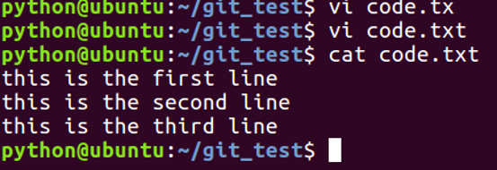
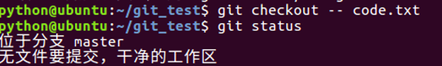
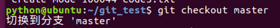
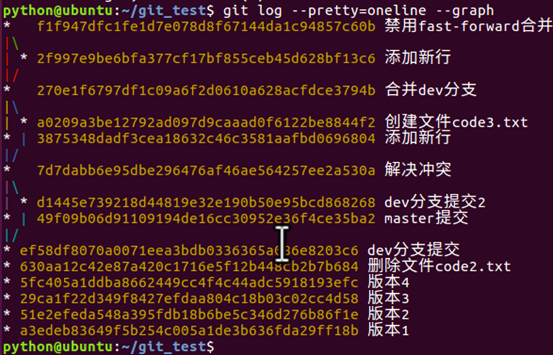
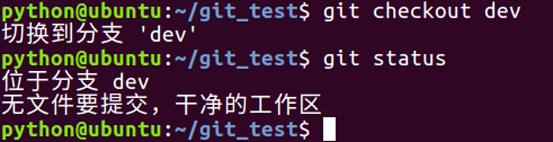
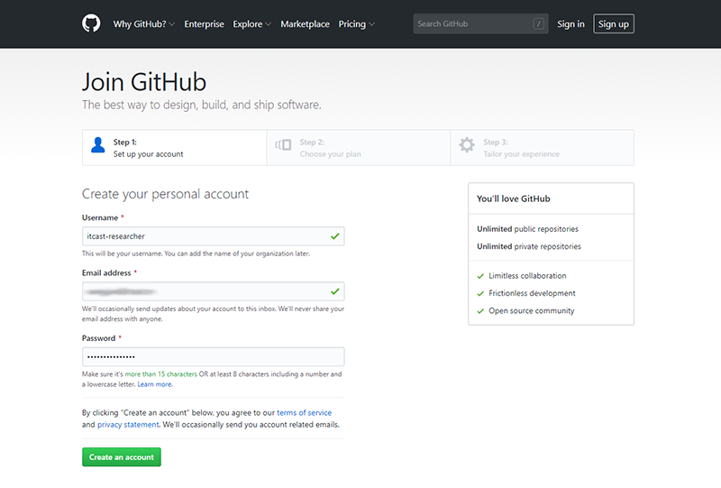
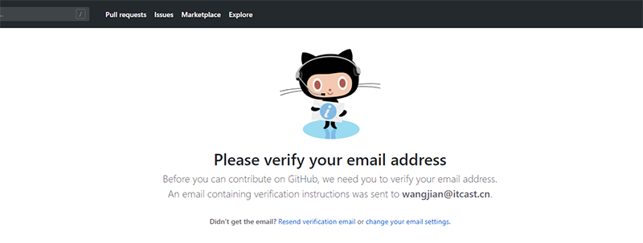
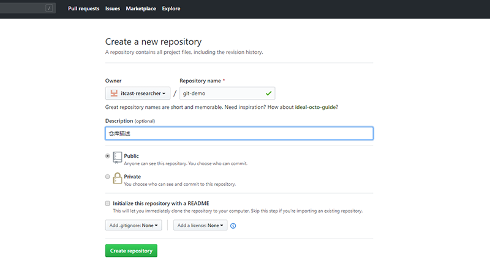

## Git基础

### 版本管理

#### 什么是版本管理

版本管理是一种记录文件变化的方式，以便将来查阅特定版本的文件内容。


#### 人为维护文档版本的问题

1. 文档数量多且命名不清晰导致文档版本混乱

2. 每次编辑文档需要复制，不方便

3. 多人同时编辑同一个文档，容易产生覆盖


### Git 是什么

Git是一个版本管理控制系统（缩写VCS），它可以在任何时间点，将文档的状态作为更新记录保存起来，也可以在任何时间点，将更新记录恢复回来。


**Git 的两大特点** 

版本控制：可以解决多人同时开发的代码问题，也可以解决找回历史代码的问题。

分布式：Git 是分布式版本控制系统，同一个 Git 仓库，可以分布到不同的机器上。首先找一台电脑充当服务器的角色，每天24小时开机，其他每个人都从这个“服务器”仓库克隆一份到自己的电脑上，并且各自把各自的提交推送到服务器仓库里，也从服务器仓库中拉取别人的提交。可以自己搭建这台服务器，也可以使用 GitHub 网站。

### Git 安装

[下载地址](https://git-scm.com/downloads) 

在安装的过程中，所有选项使用默认值即可。

linux 安装

```
sudo apt-get install git
```


### Git 基本工作流程

| git仓库          | 暂存区             | 工作目录            |
| ---------------- | ------------------ | ------------------- |
| 用于存放提交记录 | 临时存放被修改文件 | 被Git管理的项目目录 |


### Git 的使用

#### Git 使用前配置

在使用 git 前，需要告诉 git 你是谁，在向 git 仓库中提交时需要用到。

1. 配置提交人姓名：`git config --global user.name 提交人姓名`
2. 配置提交人姓名：`git config --global user.email 提交人邮箱` 
3. 查看 git 配置信息：`git config --list`   

**注意**

1. 如果要对配置信息进行修改，重复上述命令即可。
2. 配置只需要执行一次。

#### 提交步骤

1. `git init` 初始化git仓库
2. `git status` 查看文件状态
3. `git add 文件列表` 追踪文件
4. `git commit -m 提交信息`  向仓库中提交代码
5. `git log` 查看提交记录

## 版本创建与回退

### 使用

(1)  在git_test目录下创建一个文件code.txt，编辑内容如下：

(2)  使用如下两条命令可以创建一个版本：
```
git add code.txt
git commit –m '版本1'
```

(3)  使用如下命令可以查看版本记录：

```
git log
```

(4)  继续编辑 code.txt，在里面增加一行。

(5)  然后添加到版本记录里面, 再创建一个版本并查看版本记录：
```
git add code.txt
git commit -m '版本2'
```

(6)  现在若想回到某一个版本，可以使用如下命令：
```
git reset --hard HEAD^
```
其中 HEAD 表示当前最新版本，HEAD^ 表示当前版本的前一个版本, HEAD^^ 表示当前版本的前前个版本，也可以使用 HEAD~1 表示当前版本的前一个版本, HEAD~100 表示当前版本的前100版本。

执行命令后使用 git log 查看版本记录，发现现在只能看到版本1的记录，cat code.txt 查看文件内容，现在只有一行，也就是第一个版本中 code.txt 的内容。

(7)  假如我们现在又想回到版本2，这个时候怎么办？

可以使用如下命令：
```
git reset --hard 版本号
```
使用 `git log` 可以看到版本2的版本号为：

(8)  在终端执行 `git reset --hard 版本2的版本号` , 版本2又回来了。可以cat code.txt查看其里面的内容与之前的是一样的

(9)  假如说上面的终端已经关了改怎么回退版本。

先执行 `git reset --hard HEAD^ ` 回退到版本1。

下面把终端关了，然后再打开终端，发现之前版本2的版本号看不到了。

那么怎么再回到版本2呢？git reflog命令可以查看我们的操作记录。

```
git reflog
```

可以看到版本2的版本号，我们再使用如下命令进行版本回退，版本重新回到了版本2。

### 工作区和暂存区

#### 工作区(Working Directory)

电脑中的目录，比如我们的git_test，就是一个工作区。

#### 版本库(Repository)

工作区有一个隐藏目录.git，这个不是工作区，而是git的版本库。

git的版本库里存了很多东西，其中最重要的就是称为stage(或者叫index)的暂存区，还有git为我们自动创建的第一个分支master，以及指向master的一个指针叫HEAD。

因为我们创建git版本库时，git自动为我们创建了唯一一个master分支，所以，现在，git commit就是往master分支上提交更改。

你可以简单理解为，需要提交的文件修改通通放到暂存区，然后，一次性提交暂存区的所有修改。


前面讲了我们把文件往git版本库里添加的时候，是分两步执行的：

第一步是用git add把文件添加进去，实际上就是把文件修改添加到暂存区；

第二步是用git commit提交更改，实际上就是把暂存区的所有内容提交到当前分支。

(1)  下面在git_test目录下再创建一个文件code2.txt，然后编辑内容如下：


(2)  然后再次编辑code.txt内容，在其中加入一行，编辑后内容如下：



(3)  使用如下命令查看当前工作树的状态：

git status


上面提示我们code.txt被修改，而code2.txt没有被跟踪。

(4)  我们使用如下命令把code.txt和code2.txt加入到暂存区，然后再执行git status命令，结果如下：


所有git add命令是把所有提交的修改存放到暂存区。

(5)  然后，执行git commit就可以一次性把暂存区的所有修改提交到分支创建一个版本。


(6)  一旦提交后，如果你又没有对工作区做任何修改，那么工作区就是“干净”的。执行如下命令可以发现：


现在我们的版本库变成了这样：


### 管理修改

git管理的文件的修改，它只会提交暂存区的修改来创建版本。

(1)  编辑code.txt，并使用git add 命令将其添加到暂存区中。


(2)  继续编辑code.txt，并在其中添加一行。


(3)  git commit创建一个版本，并使用git status查看，发现第二次修改code.txt内容之后，并没有将其添加的工作区，所以创建版本的时候并没有被提交。


### 撤销修改

(1) 继续上面的操作，提示我们可以使用 git checkout -- <文件> 来丢弃工作区的改动。执行如下命令，发现工作区干净了，第二次的改动内容也没了。


(2)  我们继续编辑code.txt，并在其中添加如下内容，并将其添加的暂存区。


(3)git同样告诉我们，用命令git reset HEAD file可以把暂存区的修改撤销掉，重新放回工作区。


(4)现在若想丢弃code.txt的修改，执行如下命令即可。


现在，如果你不但改错了东西，还从暂存区提交到了版本库，则需要进行版本回退。

**小****结：**

场景1：当你改乱了工作区某个文件的内容，想直接丢弃工作区的修改时，用命令git checkout -- file。

场景2：当你不但改乱了工作区某个文件的内容，还添加到了暂存区时，想丢弃修改，分两步，第一步用命令git reset HEAD file，就回到了场景1，第二步按场景1操作。

场景3：已经提交了不合适的修改到版本库时，想要撤销本次提交，参考[版本回退](https://www.liaoxuefeng.com/wiki/0013739516305929606dd18361248578c67b8067c8c017b000/0013744142037508cf42e51debf49668810645e02887691000)一节。

### 对比文件的不同

**对比工作区和某个版本中文件的不同：**

(1)  继续编辑文件code.txt，在其中添加一行内容。


(2)  现在要对比工作区中code.txt和HEAD版本中code.txt的不同。使用如下命令：


(3)  使用如下命令丢弃工作区的改动。



**对比两个版本间文件的不同：**

(1)  现在要对比HEAD和HEAD^版本中code.txt的不同，使用如下命令：


### 删除文件

(1) 我们把目录中的code2.txt删除。


这个时候，git知道删除了文件，因此，工作区和版本库就不一致了，git status命令会立刻提示哪些文件被删除了。


(2)  现在你有两个选择，一是确实要从版本库中删除该文件，那就用命令git rm删掉，并且git commit：


另一种情况是删错了，可以直接使用git checkout – code2.txt,这样文件code2.txt又回来了。

**小结：**

命令git rm用于删除一个文件。如果一个文件已经被提交到版本库，那么你永远不用担心误删，但是要小心，你只能恢复文件到最新版本，你会丢失**最近一次提交后你修改的内容**。


## 分支管理

### 概念

分支就是科幻电影里面的平行宇宙，当你正在电脑前努力学习Git的时候，另一个你正在另一个平行宇宙里努力学习SVN。

如果两个平行宇宙互不干扰，那对现在的你也没啥影响。不过，在某个时间点，两个平行宇宙合并了，结果，你既学会了git又学会了SVN！


分支在实际中有什么用呢？假设你准备开发一个新功能，但是需要两周才能完成，第一周你写了50%的代码，如果立刻提交，由于代码还没写完，不完整的代码库会导致别人不能干活了。如果等代码全部写完再一次提交，又存在丢失每天进度的巨大风险。

现在有了分支，就不用怕了。你创建了一个属于你自己的分支，别人看不到，还继续在原来的分支上正常工作，而你在自己的分支上干活，想提交就提交，直到开发完毕后，再一次性合并到原来的分支上，这样，既安全，又不影响别人工作。


为了便于理解，大家暂时可以认为分支就是当前工作目录中代码的一份副本。

使用分支，可以让我们从开发主线上分离出来，以免影响开发主线。


#### 分支细分

1. 主分支（master）：第一次向 git 仓库中提交更新记录时自动产生的一个分支。

   

2. 、开发分支（develop）：作为开发的分支，基于 master 分支创建。

   

3. 功能分支（feature）：作为开发具体功能的分支，基于开发分支创建

   

**功能分支 -> 开发分支 -> 主分支**

#### 分支命令

- `git branch` 查看分支
- `git branch 分支名称` 创建分支
- `git checkout 分支名称` 切换分支
- `git merge 来源分支` 合并分支
- `git branch -d 分支名称` 删除分支（分支被合并后才允许删除）（-D 强制删除）

### 创建与合并分支 

git 把我们之前每次提交的版本串成一条时间线，这条时间线就是一个分支。截止到目前只有一条时间线，在 git 里，这个分支叫主分支，即 master 分支。HEAD 严格来说不是指向提交，而是指向master，master 才是指向提交的，所以，HEAD 指向的就是当前分支。

(1) 一开始的时候，master 分支是一条线，git 用 master 指向最新的提交，再用 HEAD 指向 master ，就能确定当前分支，以及当前分支的提交点：


每次提交，master 分支都会向前移动一步，这样，随着你不断提交，master 分支的线也越来越长。

(2)当我们创建新的分支，例如 dev 时，git 新建了一个指针叫 dev，指向 master 相同的提交，再把HEAD 指向 dev，就表示当前分支在 dev 上：


git创建一个分支很快，因为除了增加一个dev指针，改变HEAD的指向，工作区的文件都没有任何变化。

(3)不过，从现在开始，对工作区的修改和提交就是针对dev分支了，比如新提交一次后，dev指针往前移动一步，而master指针不变：


(4)假如我们在dev上的工作完成了，就可以把dev合并到master上。git怎么合并呢？最简单的方法，就是直接把master指向dev的当前提交，就完成了合并：


git合并分支也很快，就改改指针，工作区内容也不变。

(5)合并完分支后，甚至可以删除dev分支。删除dev分支就是把dev指针给删掉，删掉后，我们就剩下了一条master分支：


案例：

(1)执行如下命令可以查看当前有几个分支并且看到在哪个分支下工作。


(2)下面创建一个分支dev并切换到其上进行工作。


(3)下面我们修改code.txt内容，在里面添加一行，并进行提交。


(4)dev分支的工作完成，我们就可以切换回master分支：


查看code.txt，发现添加的内容没有了。因为那个提交是在dev分支上，而master分支此刻的提交点并没有变：

(5)现在，我们把dev分支的工作成果合并到master分支上：


git merge命令用于合并指定分支到当前分支。合并后，再查看code.txt的内容，就可以看到，和dev分支的最新提交是完全一样的。


注意到上面的Fast-forward信息，Git告诉我们，这次合并是“快进模式”，也就是直接把master指向dev的当前提交，所以合并速度非常快。


(6)合并完成后，就可以放心地删除dev分支了，删除后，查看branch，就只剩下master分支了。


小结：

查看分支：`git branch`

创建分支：`git branch <name>`

切换分支：`git checkout <name>`

创建+切换分支：`git checkout -b <name>`

合并某分支到当前分支：`git merge <name>`

删除分支：`git branch -d <name>`


### 解决冲突

合并分支往往也不是一帆风顺的。

(1)再创建一个新分支dev。


(2)修改code.txt内容，并进行提交。


(3)切换回master分支。


(4)在master的code.txt添加一行内容并进行提交。


现在，master分支和dev分支各自都分别有新的提交，变成了这样：


这种情况下，git无法执行“快速合并”，只能试图把各自的修改合并起来，但这种合并就可能会有冲突。

(5)执行如下命令尝试将dev分支合并到master分支上来。


git告诉我们，code.txt文件存在冲突，必须手动解决冲突后再提交。

(6)git status也可以告诉我们冲突的文件：


(7)查看code.txt的内容。


(8)git用<<<<<<<，=======，>>>>>>>标记出不同分支的内容，我们修改如下后保存：


(9)再提交。

(10) 现在，master分支和dev分支变成了下图所示：

****

(11)用带参数的git log也可以看到分支的合并情况：

****

(12)最后工作完成，可以删除dev分支。

****

### 分支管理策略

通常，合并分支时，如果可能，git会用fast forward模式，但是有些快速合并不能成而且合并时没有冲突，这个时候会合并之后并做一次新的提交。但这种模式下，删除分支后，会丢掉分支信息。

(1)创建切换到dev分支下。

****

(2)新建一个文件code3.txt编辑内容如下，并提交一个commit。


(3)切换回master分支，编辑code.txt并进行一个提交。




(4)合并dev分支的内容到master分支。


(5)出现如下提时，这是因为这次不能进行快速合并，所以git提示输入合并说明信息，输入之后合并内容之后git会自动创建一次新的提交。


 


(6)使用分支命令查看分支信息。


(7)删除dev分支。


如果要强制禁用fast forward模式，git就会在merge时生成一个新的commit，这样，从分支历史上就可以看出分支信息。

(1)创建并切换到dev分支。


(2)修改code.txt内容，并提交一个commit。

****

(3)切换回master分支。

****

(4)准备合并dev分支，请注意--no-ff参数，表示禁用Fast forward：

****

因为本次合并要创建一个新的commit，所以加上-m参数，把commit描述写进去。

(5)合并后，我们用git log看看分支历史：

可以看到，不使用Fast forward模式，merge后就像这样：



****

 

### Bug分支

软件开发中，bug就像家常便饭一样。有了bug就需要修复，在git中，由于分支是如此的强大，所以，每个bug都可以通过一个新的临时分支来修复，修复后，合并分支，然后将临时分支删除。

(1)当你接到一个修复一个代号001的bug的任务时，很自然地，你想创建一个分支bug-001来修复它，但是，等等，当前正在dev上进行的工作还没有提交：

****

并不是你不想提交，而是工作只进行到一半，还没法提交，预计完成还需1天时间。但是，必须在两个小时内修复该bug，怎么办？

(2)git还提供了一个stash功能，可以把当前工作现场“储藏”起来，等以后恢复现场后继续工作：

****

(3)首先确定要在哪个分支上修复bug，假定需要在master分支上修复，就从master创建临时分支：

****

(4)现在修复bug,把 the new line删掉，然后提交。

****

(5)修复完成后，切换到master分支，并完成合并，最后删除bug-001分支。


(6)现在bug-001修复完成，是时候接着回到dev分支干活了！



(7)工作区是干净的，刚才的工作现场存到哪去了？用git stash list命令看看：


作现场还在，git把stash内容存在某个地方了，但是需要恢复一下.


**小结：**

修复bug时，我们会通过创建新的bug分支进行修复，然后合并，最后删除；

当手头工作没有完成时，先把工作现场git stash一下，然后去修复bug，修复后，再git stash pop，恢复工作现场。

### 暂时保存更改

在 git 中，可以暂时提取分支上所有的改动并存储，让开发人员得到一个干净的工作副本，临时转向其他工作。

使用场景：分支临时切换

- 存储临时改动：`git stash` 
- 恢复改动：`git stash pop` 

## Github

在版本控制系统中，大约90%的操作都是在本地仓库中进行的：暂存，提交，查看状态或者历史记录等等。除此之外，如果仅仅只有你一个人在这个项目里工作，你永远没有机会需要设置一个远程仓库。

只有当你需要和你的开发团队共享数据时，设置一个远程仓库才有意义。你可以把它想象成一个 “文件管理服务器”，利用这个服务器可以与开发团队的其他成员进行数据交换。

### 注册

1. 访问[github](https://github.com/)首页，点击 Sign up 连接。（注册）

   

2. 填写用户名、邮箱地址、GitHub登陆密码

   

3. 选择计划

   

4. 填写 GitHub 问题

   

5. 验证邮箱

   

6. GitHub 个人中心

   


### 多人协作开发流程

- A在自己的计算机中创建本地仓库
- A在github中创建远程仓库
- A将本地仓库推送到远程仓库
- B克隆远程仓库到本地进行开发
- B将本地仓库中开发的内容推送到远程仓库
- A将远程仓库中的最新内容拉去到本地


### 创建仓库

1. 填写仓库基本信息

   

2. 将本地仓库推送到远程仓库

   

   1. git push 远程仓库地址 分支名称

   2. git push 远程仓库地址别名 分支名称

   3. git push -u 远程仓库地址别名 分支名称

       -u 记住推送地址及分支，下次推送只需要输入git push即可

   4. git remote add 远程仓库地址别名 远程仓库地址

### 拉取操作

#### 克隆仓库

克隆远端数据仓库到本地：`git clone 仓库地址`

#### 拉取远程仓库中最新的版本

拉取远程仓库中最新的版本：`git pull 远程仓库地址 分支名称`

### 解决冲突

在多人同时开发一个项目时，如果两个人修改了同一个文件的同一个地方，就会发生冲突。冲突需要人为解决。

### 跨团队协作

1. 程序员 C fork仓库
2. 程序员 C 将仓库克隆在本地进行修改
3. 程序员 C 将仓库推送到远程
4. 程序员 C 发起pull reqest
5. 原仓库作者审核
6. 原仓库作者合并代码

### ssh免登陆

https协议仓库地址：https://github.com/itcast-frontEnd/git-demo.git


生成秘钥：`ssh-keygen`

秘钥存储目录：C:\Users\用户\\.ssh

公钥名称：id_rsa.pub

私钥名称：id_rsa


### GIT忽略清单

将不需要被git管理的文件名字添加到此文件中，在执行git命令的时候，git就会忽略这些文件。

git忽略清单文件名称：**.gitignore**

将工作目录中的文件全部添加到暂存区：`git add .`


## 附录: 小故事

Linus在1991年创建了开源的Linux，从此，Linux系统不断发展，已经成为最大的服务器系统软件了。Linus虽然创建了Linux，但Linux的壮大是靠全世界热心的志愿者参与的，这么多人在世界各地为Linux编写代码，那Linux的代码是如何管理的呢？事实是，在2002年以前，世界各地的志愿者把源代码文件通过diff的方式发给Linus，然后由Linus本人通过手工方式合并代码！你也许会想，为什么Linus不把Linux代码放到版本控制系统里呢？不是有CVS、SVN这些免费的版本控制系统吗？因为Linus坚定地反对CVS和SVN，这些集中式的版本控制系统不但速度慢，而且必须联网才能使用。有一些商用的版本控制系统，虽然比CVS、SVN好用，但那是付费的，和Linux的开源精神不符。不过，到了2002年，Linux系统已经发展了十年了，代码库之大让Linus很难继续通过手工方式管理了，社区的弟兄们也对这种方式表达了强烈不满，于是Linus选择了一个商业的版本控制系统BitKeeper，BitKeeper的东家BitMover公司出于人道主义精神，授权Linux社区免费使用这个版本控制系统。安定团结的大好局面在2005年就被打破了，原因是Linux社区牛人聚集，不免沾染了一些梁山好汉的江湖习气。开发Samba的Andrew试图破解BitKeeper的协议(这么干的其实也不只他一个)，被BitMover公司发现了(监控工作做得不错！)，于是BitMover公司怒了，要收回Linux社区的免费使用权。Linus可以向BitMover公司道个歉，保证以后严格管教弟兄们，嗯，这是不可能的。实际情况是这样的：Linus花了两周时间自己用C写了一个分布式版本控制系统，这就是Git！一个月之内，Linux系统的源码已经由Git管理了！牛是怎么定义的呢？大家可以体会一下。Git迅速成为最流行的分布式版本控制系统，尤其是2008年，GitHub网站上线了，它为开源项目免费提供Git存储，无数开源项目开始迁移至GitHub，包括jQuery，PHP，Ruby等等。历史就是这么偶然，如果不是当年BitMover公司威胁Linux社区，可能现在我们就没有免费而超级好用的Git了。